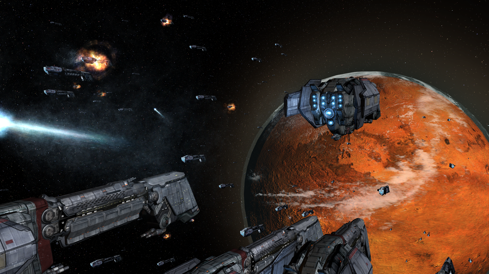
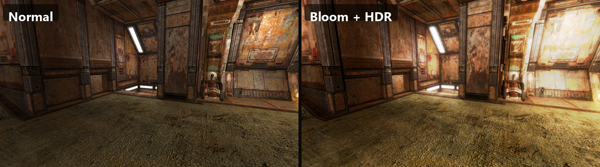
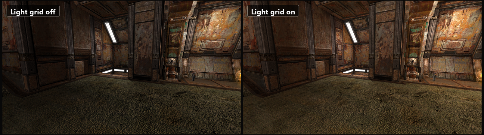
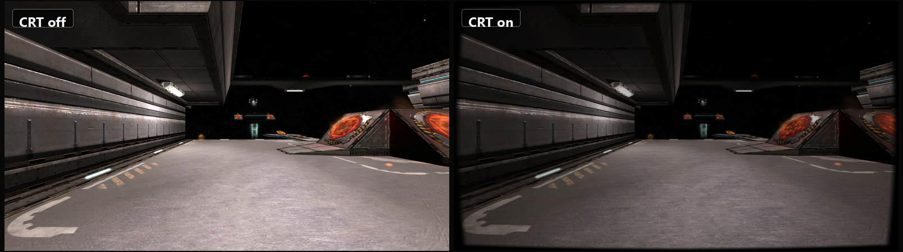
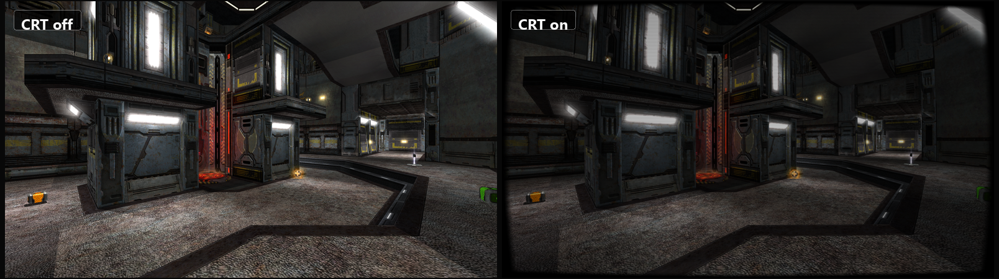

**Play Quake 4 on modern systems with an open-source engine and game-code replacement built around the original retail assets.**

[Get Started](docs/user/getting-started.md) | [Features](#why-players-use-openq4) | [Player Docs](#player-guides) | [Build from Source](BUILDING.md) | [Technical Reference](TECHNICAL.md)

---

  

## What is openQ4?

**openQ4** is an open-source replacement for the Quake 4 engine and game binaries, built to keep the original game playable on modern PCs while improving presentation, audio, controls, packaging, and day-to-day usability.

It is designed for players who want the original Quake 4 experience with a cleaner path to running it on today's hardware.

> [!NOTE]
> openQ4 does **not** include Quake 4 assets. You still need a legitimate Quake 4 copy from Steam or GOG.

---

## Why players use openQ4

- **Modern display support** for widescreen, ultrawide, multi-monitor, borderless, and fullscreen setups.
- **Optional visual upgrades** such as bloom, HDR, anti-aliasing, baked light grids, soft particles, and enhanced shadow options.
- **OpenAL audio** restored to the pre-plan compatibility path by default, with newer voice handling revalidated behind an opt-in gate.
- **Improved input and quality-of-life features** including controller support, better console UX, and modern settings behavior.
- **Single-player and multiplayer in one install** with active compatibility work aimed at the stock game.
- **Cross-platform support** with Windows packages, directly executable Linux AppImages and archives for x86_64 plus preview aarch64, Steam Deck support on Linux, and experimental Apple Silicon/arm64 macOS OpenGL/Metal bridge packages through the signed/notarized DMG lane for credentialed release runs.
- **Open development** with releases, issue tracking, and community feedback all happening in public.

---

## System requirements

You need a legitimate Quake 4 install plus the openQ4 package that matches your operating system and CPU architecture.

| Tier | Practical target |
|---|---|
| **Minimum** | 64-bit CPU, 4 GB RAM, a working OpenGL compatibility driver with ARB2-era vertex/fragment program support, and about 12 GB free for the openQ4 package plus retail Quake 4 assets. Use the `minimum` or `lowpower` performance preset on constrained systems. |
| **Recommended** | Modern quad-core CPU, 8 GB RAM, OpenGL 4.1+ compatibility-class GPU with 2 GB+ VRAM, current graphics drivers, and 15 GB+ free. For high resolutions, `quality`, or `ultra`, 16 GB RAM and 6 GB+ VRAM gives much better headroom. |

Packaged support currently focuses on Windows, Linux x64, Steam Deck/SteamOS, preview Linux ARM64, and experimental Apple Silicon/arm64 macOS. Linux ARM64 requires a desktop OpenGL compatibility driver and remains preview until real-hardware Wayland gameplay, audio, and input signoff is accepted. See the [Getting Started guide](docs/user/getting-started.md#system-requirements) for the platform-specific requirements and caveats.

---

## Renderer showcase

  

Bloom and HDR on mp/q4dm2 from the same loadscreen camera: normal rendering on the left, enhanced post-processing on the right.

  

Baked light-grid indirect diffuse on mp/q4dm2, shown off and on from the same loadscreen camera.

  

CRT post-processing on mp/q4dm8, shown off and on with a clean no-HUD camera.

  

A second CRT comparison on mp/q4dm6 shows the same post-process across a brighter indoor arena.

> **Renderer backends:** OpenGL is the default and only supported renderer. A native **Vulkan** backend is included but **experimental and opt-in** (`r_renderApi vulkan`, applied on engine restart) — it is under active development, may show visual artifacts or instability, and falls back to OpenGL on any failure. See [Display Settings → Renderer Backend](docs/user/display-settings.md#renderer-backend-opengl-default-vulkan-is-experimental).

---

## Quick start

1. Install **Quake 4** from [Steam](https://store.steampowered.com/app/2210/Quake_4/) or [GOG](https://www.gog.com/en/game/quake_4).
2. Download the latest openQ4 build from the [Releases page](https://github.com/themuffinator/openQ4/releases).
3. On Linux, make the matching `x86_64` or `aarch64` AppImage executable and launch it; for an extracted archive, launch `openQ4-client_<arch>` (or `openQ4-steamdeck` on Steam Deck).
4. If openQ4 does not find your Quake 4 install automatically, follow the path setup notes in the [Getting Started guide](docs/user/getting-started.md).

**Need the step-by-step version?** Start with [docs/user/getting-started.md](docs/user/getting-started.md).

---

## Player guides

### Start here

- [Getting Started](docs/user/getting-started.md) - system requirements, installation, first launch, and common setup questions
- [Client Settings Guide](docs/user/client-settings.md) - where to find the most useful in-game settings
- [Server Setup Guide](docs/user/server-setup.md) - basic dedicated server setup and common server variables

### Play and tune

- [Display Settings](docs/user/display-settings.md) - fullscreen, windowed mode, resolution scale, and multi-monitor behavior
- [Input Settings](docs/user/input-settings.md) - keyboard, mouse, controller, and binding help
- [Gameplay Settings](docs/user/gameplay-settings.md) - gameplay and audio toggles for everyday play
- [Steam Deck](docs/user/steam-deck.md) - launcher, controls, and Linux handheld notes
- [Multiplayer Networking](docs/user/multiplayer-networking.md) - multiplayer tuning and lag-comp behavior
- [Shadow Mapping](docs/user/shadow-mapping.md) - optional shadow-map settings and troubleshooting
- [Light Grids](docs/user/light-grids.md) - advanced lighting guide for players and testers
- [DDS Texture Replacements](docs/user/texture-replacements.md) - install and diagnose DXT/BC7 texture packs
- [Level-Load Cache](docs/user/level-load-cache.md) - generated animation cache behavior, controls, and cleanup

### Build and technical docs

- [BUILDING.md](BUILDING.md) - compile openQ4 from source
- [TECHNICAL.md](TECHNICAL.md) - advanced configuration, file layout, compatibility notes, and mod details

---

## Compatibility at a glance

- openQ4 targets the **official Quake 4 retail assets**.
- It ships its **own engine and game modules**.
- It is **not** a drop-in runtime for the original proprietary Quake 4 DLL mods.
- The project is still in **beta development**, so compatibility work is ongoing.

If you run into problems, please use the [issue tracker](https://github.com/themuffinator/openQ4/issues) and include crash logs or setup details when possible. For experimental macOS crashes, use the [macOS support-data guide](docs/user/macos-support-data.md) before filing or updating an issue.

---

## Contributing

Bug reports, compatibility reports, testing feedback, and code contributions are all welcome. If you want to help build the project itself, start with [BUILDING.md](BUILDING.md).

---

## Credits

- **themuffinator** - openQ4 development and maintenance
- **DarkMatter Productions** - project stewardship and website
- **Justin Marshall** - Quake4Doom and early BSE reverse engineering reference work
- **Robert Beckebans** - renderer modernization reference work, including RBDOOM-3-BFG inspiration
- **id Software** and **Raven Software** - Quake 4 and the underlying technology
- **akacross** (Discord user) - Thorough playtesting on Linux and Windows, a huge help moving the project forward!

---

## License and disclaimer

openQ4 engine code is licensed under the [GNU General Public License v3.0](https://www.gnu.org/licenses/gpl-3.0). See [LICENSE](LICENSE) for details.

The game-library code in [openQ4-game](https://github.com/themuffinator/openQ4-game) is derived from the Quake 4 SDK and remains subject to id Software's SDK EULA. Quake 4 assets remain the property of id Software and ZeniMax Media.

openQ4 is an independent project and is not affiliated with, endorsed by, or sponsored by id Software, Raven Software, Bethesda, or ZeniMax Media.

---

[Website](https://www.darkmatter-quake.com) | [Repository](https://github.com/themuffinator/openQ4) | [Game Library](https://github.com/themuffinator/openQ4-game) | [Issues](https://github.com/themuffinator/openQ4/issues) | [Releases](https://github.com/themuffinator/openQ4/releases)

[Back to Top](#top)
