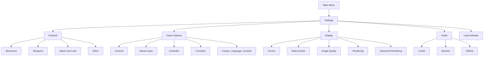
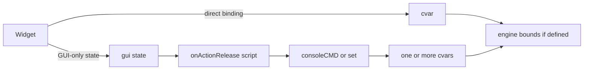
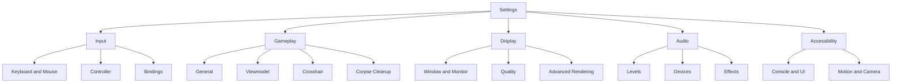

# openQ4 Settings Menu Audit

## Executive summary

openQ4’s settings UI is implemented primarily in a very large `mainmenu.gui` file, with the Game Options pane split into a separate `game.gui` include and additional mouse-hover/click behavior in `game_hovers.gui`. The repo also ships separate GUI string tables for English, French, Italian, and Spanish, plus openQ4-specific string tables layered on top of the original Quake 4 GUI strings. That architecture makes the menu highly modifiable, but it also creates a brittle interaction model: some settings bind directly to cvars, some bind to GUI-only state and then fire scripted `consoleCMD` actions, and some use entirely custom hover widgets rather than standard menu controls. citeturn15view0turn16view0turn17view0turn22view0turn24view0turn21view0

The strongest parts of the current design are breadth and ambition. The Display/System pane exposes newer openQ4 rendering and monitor features such as fullscreen policy, display device selection, multi-display expansion, MSAA, post AA, resolution scale, bloom, SSAO, HDR tonemapping, CRT emulation, and irradiance volumes. The Game Options pane also goes beyond legacy Quake 4 by exposing controller tuning, corpse cleanup/sink behavior, language, and console-access controls. The docs in `docs-user` confirm that openQ4 has substantially expanded display, gameplay, and input/runtime settings over stock behavior. citeturn27view0turn27view1turn27view2turn33view0turn33view1turn33view6turn33view7turn33view8turn33view9turn34view9

The weakest parts are consistency and maintainability. The menu still exposes an Aspect Ratio selector driven by GUI state even though the user documentation says `r_aspectRatio` is deprecated and ignored; several settings use curated UI ranges that do not match engine bounds; custom widgets such as crosshair color rely on hidden hover regions rather than a standard focusable control; and the codebase mixes direct cvar binding with script-driven state translation in ways that are difficult to validate automatically. The result is a menu that is feature-rich but uneven in discoverability, accessibility, and long-term maintainability. citeturn13view1turn27view0turn33view7turn34view3

## Current settings tree

The repo structure shows a classic main menu GUI with a dedicated settings subtree. `mainmenu.gui` is the primary menu file, `guis/menu/settings/game.gui` contains the Game Options pane, and `guis/menu/settings/game_hovers.gui` contains hover/click behavior for mouse-driven custom widgets. The strings needed by this UI are split across legacy GUI language files and openQ4-specific language files. citeturn15view0turn16view0turn17view0turn22view0turn24view0turn21view0

A second important structural trait is that the UI uses two different data paths. Some widgets bind directly to cvars and let the engine handle storage and validation. Others bind to GUI variables or hidden choice state and then translate those values into one or more console commands. That split is the root cause of several of the range mismatches and maintenance risks described later. citeturn13view1turn27view1

## Detailed inventory

The tables below are synthesized from the settings GUI source files, the hover GUI, the GUI language tables, and the newer openQ4 user documentation. “Repo-verified” means the cvar definition or bounds were confirmed in the openQ4 renderer source. “Doc-only” means the behavior/range is documented in `docs-user` but I did not finish a same-repo code-definition confirmation for that exact cvar. “Unverified in this repo” means the menu wiring is visible here, but the underlying cvar definition appears to live elsewhere or was not confidently located in the current repo pass. citeturn17view0turn22view0turn24view0turn26view0turn26view1turn27view0turn27view1turn27view2turn33view0turn33view1turn33view6turn33view7turn33view8turn33view9turn34view0turn34view2turn34view3turn34view4turn34view5turn34view6turn34view9

### Display and audio settings inventory

| Menu path | Setting | Widget | Bound cvar or state | UI range or choices | Cvar bounds status | Localization key | Notes |
|---|---|---|---|---|---|---|---|
| Settings → Display → Advanced Rendering | Renderer Fallback | choice | `r_renderer` | `best, arb2` | Repo-verified player-facing choices; legacy console/config values are still accepted and fall back to ARB2 | `#str_41103` / `#str_41104` | Compatibility rollback selector; no longer advertises removed ARB/NV/R200/Cg/EXP backends |
| Settings → Display → Screen | Screen Size | choice | `r_mode` | dynamic per aspect bucket | Doc-only; tied to available modes | `#str_200145` | Resolution list is aspect-bucketed |
| Settings → Display → Screen | Aspect Ratio | choice | GUI state `r_aspectRatio` | `Other, 16:9, 16:10` | **Mismatch**; docs say deprecated/ignored | `#str_200974` | UI should be removed or replaced |
| Settings → Display → Screen | Fullscreen | choice | `r_fullscreen` | Yes/No | Repo-verified boolean | `#str_200147` | Good direct binding |
| Settings → Display → Screen | Brightness | slider + numeric edit | `r_brightness` | `0.5` to `2.0`, step `0.1` | Repo-verified `0.5..2.0` | `#str_200148` | Menu exposes brightness, not `r_gamma` |
| Settings → Display → Multi-monitor | Fullscreen Policy | choice | `r_fullscreenDesktop` | `Desktop, Exclusive` | Repo-verified boolean | `#str_229910` / `#str_229911` | Aligns with display docs |
| Settings → Display → Multi-monitor | Borderless Window | choice | `r_borderless` | Yes/No | Repo-verified boolean | `#str_229909` | Good match to docs |
| Settings → Display → Multi-monitor | Display Device | choice | `r_screen` | dynamic display list | Doc-only in current pass | `#str_229912` | High-value modern setting |
| Settings → Display → Multi-monitor | Expand Across Displays | choice | `r_multiScreen` | `0, 1` | Unverified in this repo | `#str_229915` / `#str_229916` | Valuable, but needs bounds verification |
| Settings → Display → Image Quality | Enable shadows | choice | `r_shadows` | Yes/No | Unverified in this repo | `#str_200160` | Needs direct definition pass |
| Settings → Display → Image Quality | Enable specular | choice | `r_skipSpecular` | Yes/No, inverted semantics | Repo-verified boolean | `#str_200161` | Choice labels are “Yes/No” but cvar is a skip flag |
| Settings → Display → Image Quality | Enable bump maps | choice | `r_skipBump` | Yes/No, inverted semantics | Repo-verified boolean | `#str_200162` | Same inversion issue |
| Settings → Display → Image Quality | Enable detailed sky | choice | `r_skipSky` | Yes/No, inverted semantics | Repo-verified boolean | `#str_223009` | Same inversion issue |
| Settings → Display → Image Quality | Force ambient light | choice | GUI state → `r_forceAmbient` | Yes/No | Repo-verified target cvar `0.0..1.0` | `#str_223002` | Not directly bound |
| Settings → Display → Image Quality | Ambient brightness | slider + numeric edit | `r_forceAmbient` | `0.025` to `1.0`, step `0.025` | **Mismatch**; repo cvar allows `0.0..1.0` | `#str_223003` | UI cannot select exact `0.0` except via toggle-off path |
| Settings → Display → Rendering | V-Sync | choice | `r_swapInterval` | Yes/No | Repo defines integer without explicit bounds in snippet viewed | `#str_41092` | UI simplifies an integer cvar to boolean |
| Settings → Display → Rendering | MSAA | choice | `r_multiSamples` | `Off, 2x, 4x, 8x, 16x` | **Partial mismatch**; repo definition shown without explicit min/max, docs recommend same curated values | `#str_41093` / `#str_200165` | Good practical UI despite weaker code-side bounds |
| Settings → Display → Rendering | Post AA | choice | `r_postAA` | `0, 1` | Repo-verified `0..1` | `#str_41094` / `#str_41095` | Clean match |
| Settings → Display → Rendering | Resolution Scale | choice | `r_screenFraction` | `75, 85, 100` | **Intentional narrowing**; repo allows `10..100` | `#str_41091` | Curated UI leaves many useful low-end values inaccessible |
| Settings → Display → Advanced Rendering | Bloom | choice | `r_bloom` | Yes/No | Repo-verified boolean | `#str_41082` | Good direct binding |
| Settings → Display → Advanced Rendering | SSAO | choice | `r_ssao` | Yes/No | Repo-verified boolean | `#str_41088` | Good direct binding |
| Settings → Display → Advanced Rendering | HDR Tonemap | choice | `r_hdrToneMap` | Yes/No | Unverified in current repo pass | `#str_41084` | Needs source-definition confirmation |
| Settings → Display → Advanced Rendering | CRT Emulation | choice | `r_crt` | Yes/No | Repo-verified boolean | `#str_41090` | Good direct binding |
| Settings → Display → Advanced Rendering | Irradiance Volumes | choice | `r_useLightGrid` | Yes/No | Repo-verified boolean | `#str_41107` | Good direct binding |
| Settings → Audio → Levels | Volume | slider + numeric edit | `s_volume` | `0` to `1`, step `0.1` | Unverified in current repo pass | `#str_201029` | Numeric edit supports exact decimal entry |
| Settings → Audio → Levels | Music Volume | slider + numeric edit | `s_musicVolume` | `0` to `1`, step `0.05` | Doc-only, plus gameplay docs confirm setting exists and defaults to `0.5` | `#str_201006` | Valuable, modern separation from master volume |
| Settings → Audio → Devices | Sound System | choice | `s_useOpenAL` | `0, 1` | Unverified in current repo pass | `#str_200971` / `#str_200970` | Good setting to expose |
| Settings → Audio → Devices | Sound Device | choice | `s_deviceName` | dynamic runtime list | Unverified in current repo pass | `#str_201005` | Good modern setting |
| Settings → Audio → Effects | EAX Advanced HD | choice | `s_useEAXReverb` | Yes/No | Unverified in current repo pass | `#str_200972` | Legacy hardware-specific feature |
| Settings → Audio → Effects | Surround Speakers | choice | `s_numberOfSpeakers` | `2, 6` | Unverified in current repo pass | `#str_200152` | Exposes only stereo and 5.1 |

### Game Options inventory

| Menu path | Setting | Widget | Bound cvar or state | UI range or choices | Cvar bounds status | Localization key | Notes |
|---|---|---|---|---|---|---|---|
| Settings → Game Options → General | Free Look | choice | `in_freeLook` | Yes/No | Unverified in current repo pass | `#str_200133` | Standard |
| Settings → Game Options → General | Auto Weapon Reload | choice | `ui_autoReload` | Yes/No | Unverified in this repo | `#str_200134` | Likely proxy/UI cvar |
| Settings → Game Options → General | Auto Weapon Switch | choice | `ui_autoSwitch` | Yes/No | Unverified in this repo | `#str_200135` | Likely proxy/UI cvar |
| Settings → Game Options → General | Toggle Zoom | choice | `in_toggleZoom` | Yes/No | Doc-only behavior in input docs | `#str_41108` | Useful accessibility choice |
| Settings → Game Options → General | Show Decals | choice | `g_decals` | Yes/No | Unverified in this repo | `#str_200136` | Gameplay/visual toggle |
| Settings → Game Options → General | Show Gun Model | choice | `ui_showGun` | Yes/No | Unverified in this repo | `#str_200138` | Likely proxy/UI cvar |
| Settings → Game Options → General | Gun Position | choice | GUI state via `applyGunPositionChoice` adapter → `g_gunX/Y/Z` and `g_weaponFovEffect` | 3 presets | Doc-only broader feature area; menu only exposes presets | `#str_223007` / `#str_223008` | Typed menu adapter owns the preset-to-cvar mapping |
| Settings → Game Options → General | Simple Items | choice | `g_simpleItems` | Yes/No | Unverified in this repo | `#str_223000` | Standard competitive option |
| Settings → Game Options → General | Force Pro Skins | choice | GUI state via `applyForceModelChoice` adapter → force-model cvars | Yes/No | Unverified in this repo | `#str_223006` | Typed menu adapter owns the pro-skin model mapping and clears cvars when disabled |
| Settings → Game Options → Mouse Input | Invert Mouse | choice | `m_pitch` | `0.022` / `-0.022` | Unverified in current repo pass | `#str_200139` | Uses numeric sign flip instead of a boolean cvar |
| Settings → Game Options → Mouse Input | Smooth Mouse | slider + numeric edit | `m_smooth` | `1..8`, step `1` | Doc-only input coverage | `#str_200140` | UI forbids `0`, which may surprise advanced users |
| Settings → Game Options → Mouse Input | Mouse Sensitivity | slider + numeric edit | `sensitivity` | `0.01..30`, step `0.01` | Doc-only input coverage | `#str_200141` | Good modern precision |
| Settings → Game Options → Mouse Input | Mouse CPI | slider + numeric edit | `m_cpi` | `0..32000`, step `50` | Doc-only input coverage | `#str_229936` | Strong modern addition |
| Settings → Game Options → Mouse Input | View Filter | slider + numeric edit | `m_filter` | `0..31`, step `1` | Doc-only input coverage | `#str_229937` | Needs clearer user-facing description |
| Settings → Game Options → Mouse Input | Mouse Accel | slider + numeric edit | `cl_mouseAccel` | `-5..5`, step `0.01` | Doc-only input coverage | `#str_229938` | Powerful but advanced |
| Settings → Game Options → Mouse Input | Accel Offset | slider + numeric edit | `cl_mouseAccelOffset` | `0..50`, step `0.1` | Doc-only input coverage | `#str_229939` | Advanced |
| Settings → Game Options → Mouse Input | Accel Curve | slider + numeric edit | `cl_mouseAccelPower` | `1..8`, step `0.05` | Doc-only input coverage | `#str_229940` | Advanced |
| Settings → Game Options → Mouse Input | Sensitivity Cap | slider + numeric edit | `cl_mouseSensCap` | `0..100`, step `0.1` | Doc-only input coverage | `#str_229941` | Advanced |
| Settings → Game Options → Controller | Controller Enabled | choice | `in_joystick` | Yes/No | Doc-only input coverage | `#str_229925` | Good exposure |
| Settings → Game Options → Controller | Stick Layout | choice | `in_joystickSouthpaw` | `Regular/Southpaw` | Doc-only input coverage | `#str_229930` / `#str_229934` | Good console-style option |
| Settings → Game Options → Controller | Stick Dead Zone | slider + numeric edit | `in_joystickDeadZone` | `0..0.95`, step `0.01` | Doc-only input coverage | `#str_229926` | Good precision |
| Settings → Game Options → Controller | Look Sensitivity | slider + numeric edit | `in_joystickLookSensitivity` | `0.1..4.0`, step `0.05` | Doc-only input coverage | `#str_229931` | Good precision |
| Settings → Game Options → Controller | Look Curve | slider + numeric edit | `in_joystickLookCurve` | `1.0..3.0`, step `0.05` | Doc-only input coverage | `#str_229932` | Advanced but useful |
| Settings → Game Options → Controller | Invert Look | choice | `in_joystickInvertLook` | Yes/No | Doc-only input coverage | `#str_229933` | Good exposure |
| Settings → Game Options → Controller | Trigger Press | slider + numeric edit | `in_joystickTriggerThreshold` | `0..1.0`, step `0.01` | Doc-only input coverage | `#str_229927` | Good precision |
| Settings → Game Options → Controller | Rumble | choice | `in_joystickRumble` | Yes/No | Doc-only input coverage | `#str_229928` | Good exposure |
| Settings → Game Options → Controller | Rumble Strength | slider + numeric edit | `in_joystickRumbleScale` | `0..2.0`, step `0.05` | Doc-only input coverage | `#str_229929` | Good exposure |
| Settings → Game Options → Crosshair | Crosshair preset | choice | `g_crosshairCustom` | named preset list | Unverified in current repo pass | `#str_200307` / `#str_200296` | Exact preset names come from a localized choice list |
| Settings → Game Options → Crosshair | Crosshair Size | choice | `g_crosshairSize` | `16, 24, 32, 40, 48` | Unverified in current repo pass | `#str_201010` / `#str_201022` | Block contains duplicate `cvar` lines; should be cleaned |
| Settings → Game Options → Crosshair | Crosshair Color | custom palette | `g_crosshairColor` | 8 fixed presets | Unverified in current repo pass | `#str_200299` | Implemented through custom hover windows, not a standard widget |
| Settings → Game Options → Gameplay | Corpse Sink | choice | `g_corpseSink` | `0, 1, 2` | Doc-only; docs describe meanings | `#str_229917` / `#str_229921` | Good match between docs and menu concept |
| Settings → Game Options → Gameplay | Corpse Time | choice | GUI choice → `g_corpseRemoveDelaySP/MP` | Default / Never / `5, 10, 15, 30, 60` sec buckets | Doc-only; docs define target cvars | `#str_229918` / `#str_229919` | Scripted mapping, mode-aware for SP vs MP |
| Settings → Game Options → Gameplay | Language | choice | `sys_lang` | English / Spanish / French / Italian | Repo-verified locale availability | `#str_229907` / `#str_229908` | No RTL locale present |
| Settings → Game Options → Gameplay | Console Access | choice | `con_allowConsole` | off/on | Unverified in this repo | `#str_229922` / `#str_229923` | Nice security/usability toggle |

### Controls inventory

The Controls pane is a key-binding screen rather than a cvar screen. It is organized into four subgroups—Movement, Weapons, Attack/Look, and Other—and implemented with `bindDef` widgets. The settings are: Movement (`_forward`, `_back`, `_moveleft`, `_moveright`, `_moveUp`, `_moveDown`, `_left`, `_right`, `_strafe`, `_speed`); Weapons (blaster/gauntlet, machinegun, shotgun, hyperblaster, grenade launcher, nailgun, rocket launcher, railgun, lightning gun, dark matter gun, napalm launcher, buy menu); Attack/Look (`_attack`, previous weapon, next weapon, `_impulse13` reload, `_lookUp`, `_lookDown`, `_mlook`, `centerview`, `_zoom`); Other (quick save, quick load, screenshot, chat, team chat, spectate, vote yes, vote no, objectives/scores, multiplayer statistics). The localized action labels come from the legacy GUI table in the same menu order: `#str_200094–#str_200103`, `#str_200104–#str_200113`, `#str_200114–#str_200122`, and `#str_200123–#str_200132`. citeturn26view0turn28view0

The notable omission here is controller/button rebinding. The repo’s default config includes rich gamepad bindings for shoulder buttons, face buttons, triggers, D-pad, stick clicks, and touchpad, but the settings tree itself exposes only controller tuning—not per-action controller remapping. That is the clearest controls-coverage gap in the current menu. citeturn28view0

## Findings

### Coverage

Coverage is strong for rendering and input tuning, but it is not complete. The display docs expose several important user-facing settings that are missing from the current menu, including custom window width and height, custom fullscreen width and height, refresh rate selection, explicit window position management, `ui_aspectCorrection`, and several first-person weapon/viewmodel controls such as `cl_gunfov`, `cl_gunfov_adjust`, and `cl_gun_x/y/z`. Likewise, the gameplay docs document `g_autoSkipCinematics`, but that toggle is not exposed in the current menu. citeturn27view0turn27view1

The highest-value missing settings are the ones already documented for end users: UI aspect correction, custom resolution/window controls, refresh-rate/display-mode visibility, viewmodel FOV/offset controls, and automatic cinematic skipping. Those are low-friction additions because they already exist conceptually and are documented; the menu is simply lagging the feature surface of the engine. citeturn27view0turn27view1

### Layout and navigation flow

The overall hierarchy is understandable: a left-hand selection rail, a right-hand content pane, and tab-like categories within Controls and Display. That gives the menu a familiar Quake-era structure and prevents the user from being dumped into a single giant list. At the same time, several panes rely on long vertical scrolling with sparse section headers, which makes the newer display and advanced mouse/controller settings feel denser than they need to be. Because the Display pane now spans both legacy and modern graphics features, it has outgrown the original layout assumptions. citeturn17view0turn22view0turn27view0turn27view2

The most serious discoverability problem is conceptual drift between what the menu says and what the engine actually does. The clearest example is the Aspect Ratio selector: the session/menu code still populates aspect choices into GUI state, but the display docs explicitly say `r_aspectRatio` is deprecated and ignored because aspect/FOV behavior is now derived automatically from render size. That means the user can still see and change a control whose underlying purpose has effectively disappeared. citeturn13view1turn27view0

### Widget suitability and implementation quality

Standard `choiceDef`, `sliderDef`, `editDef`, and `bindDef` widgets are mostly used appropriately. Discrete choices such as SSAO, bloom, fullscreen, and language are well-served by choice widgets, while analog controller and mouse parameters use sliders with paired numeric edits. That combination works well for both quick adjustment and more exact tuning. citeturn27view2turn27view0

The weaker implementations are the scripted pseudo-settings and the custom hover-only widgets. Crosshair Color is the most obvious case: it is implemented through custom hover regions in `game_hovers.gui` rather than a normal focusable choice widget, which strongly suggests worse keyboard/controller accessibility and poorer discoverability than the rest of the menu. Several other settings also route through GUI state and `consoleCMD` translation instead of direct binding, which increases the chance of drift, duplicated logic, and silent mismatch. The file sizes themselves reinforce the maintainability concern: `mainmenu.gui` is 27,678 lines, `game.gui` is 2,061 lines, and `game_hovers.gui` is 1,041 lines. citeturn17view0turn22view0turn24view0

### Value-range and bounds verification

The clearest verified matches are `r_postAA` and the newer post-processing toggles. `r_postAA` is defined with explicit `0..1` bounds, and the UI also exposes exactly those values. `r_bloom`, `r_ssao`, `r_crt`, and `r_useLightGrid` are plain boolean toggles, which is also a clean UI fit. citeturn33view1turn33view6turn33view6turn34view9turn33view6

The most important mismatches are these. First, `r_aspectRatio` is still surfaced in the UI even though the docs say it is deprecated/ignored. Second, the Force Ambient slider exposes `0.025..1.0` while the renderer cvar itself allows `0.0..1.0`. Third, Resolution Scale exposes only `75`, `85`, and `100`, while `r_screenFraction` is actually bounded `10..100`, meaning the UI hides a large part of the valid performance-oriented range. Fourth, MSAA’s UI values line up with the documentation, but the cvar definition shown in the renderer source does not include explicit hard bounds in the same way that `r_postAA` and `r_screenFraction` do. citeturn27view0turn13view1turn34view3turn33view7turn33view0turn33view1

There is also an important semantic mismatch in several “Enable X” toggles. `Enable specular`, `Enable bump maps`, and `Enable detailed sky` are wired to `r_skipSpecular`, `r_skipBump`, and `r_skipSky`, which are negative-logic cvars. That can work, but it makes the UI-to-engine relationship harder to reason about and easier to break if any choice order or default is changed later. citeturn34view0turn34view1turn34view2

### Localization

Localization coverage is respectable for the current supported languages. The repo includes `*_guis.lang` and `*_openq4.lang` files for English, French, Italian, and Spanish, which means both the original Quake 4 strings and openQ4’s newer settings labels are localizable. citeturn21view0

The main localization risk is fragmentation. Newer settings labels are spread across the openQ4 string table while older labels remain in the original GUI string table, so translators have to touch multiple language files for one menu surface. The current supported locales are all left-to-right, and I did not find any RTL locale in the repo tree, so true RTL readiness is effectively absent today. Also, several choice lists are encoded as semicolon-separated strings rather than structured plural/context-aware messages, which is workable for the current languages but not ideal for broader localization. citeturn21view0turn26view0turn26view1

## Priority changes and implementation plan

The changes below are ordered by user impact and risk reduction.

| Priority | Change | Why it matters | Effort | Acceptance criteria | Testing and localization steps |
|---|---|---|---|---|---|
| High | Remove or replace Aspect Ratio | It is the clearest user-facing behavior mismatch; docs say the cvar is deprecated/ignored | Low | Aspect selector is removed, or replaced with a read-only derived aspect display and help text | Verify no menu path references GUI `r_aspectRatio`; verify resolution list still works; update strings and docs |
| High | Convert scripted pseudo-settings into direct typed bindings where possible | Reduces drift and makes bounds validation automatable | Medium | Gun Position, Force Pro Skins, Corpse Time, and similar settings use a small view-model/data layer instead of ad hoc `consoleCMD` chains | Unit-test mapping helpers; regression-test SP/MP corpse-time behavior; confirm save/load of settings |
| High | Redesign Crosshair Color as a standard focusable widget | Current palette is mouse-centric and inconsistent with the rest of the UI | Medium | Color chooser is reachable by keyboard, mouse, and controller; visible focus state is present; selected state persists correctly | Test mouse, keyboard, controller navigation; test existing colors; add localization for any new labels/help text |
| High | Add missing documented settings | The menu lags the documented feature surface | Medium | Menu exposes `ui_aspectCorrection`, custom resolution/window sizing, refresh/display mode visibility, viewmodel FOV/offset controls, and `g_autoSkipCinematics` | Validate defaults against docs; add restart warnings where needed; update docs and localized labels |
| Medium | Normalize negative-logic and mismatched ranges | Reduces confusion and setup bugs | Medium | “Enable specular/bump/sky” bind to positive view-model state or explicit adapter logic; Force Ambient and Resolution Scale ranges are intentionally documented and enforced | Add automated UI-vs-cvar range checks; verify defaults; test old config migration |
| Medium | Split the monolithic menu source into smaller modules | `mainmenu.gui` is too large for safe maintenance | High | Display, Audio, Controls, and shared widgets each live in separate includes with shared constants/macros | Build/test all menu transitions; compare generated behavior before/after; code review for duplication removal |
| Medium | Introduce a metadata-driven settings registry | Makes inventory, validation, and localization completeness checkable in CI | High | Each setting has a declarative record for path, widget, cvar, UI range, default, restart requirement, localization keys, and accessibility notes | Add CI check for missing loc keys, duplicate cvar declarations, UI-range vs cvar-range mismatches |
| Low | Improve value entry widgets | Small edit fields are fragile for decimal values | Low | Numeric fields format correctly, support decimals where needed, and clamp cleanly | Test keyboard entry, paste, controller step adjustment, and invalid values |
| Low | Audit and remove dead/hidden legacy menu code | Cuts noise and regression risk | Medium | Unused legacy controls and hidden advanced placeholders are documented or deleted | Smoke-test all settings panes and forgotten named events |

A practical execution plan is to do this in three passes. First, fix the behavior mismatches that can confuse players immediately: remove Aspect Ratio, standardize Force Ambient and Resolution Scale handling, and replace Crosshair Color with a proper control. Second, add the missing documented settings so the menu catches up to the engine. Third, modularize the menu source and introduce a settings registry plus a CI validation pass that checks localization coverage and UI/cvar-range consistency. citeturn27view0turn27view1turn27view2turn33view7turn34view3

Implementation status as of June 5, 2026:

- Pass 1 is implemented: the menu no longer exposes the deprecated Aspect Ratio selector, Force Ambient and Resolution Scale ranges match the current renderer behavior, and Crosshair Color is a standard localized picker.
- Pass 2 is implemented for the documented high-priority surface: System now exposes UI Aspect, refresh rate, windowed sizing, and custom exclusive-fullscreen sizing, while Game Options exposes Auto Skip Cinematics and View Weapon FOV/aspect/offset controls.
- The negative-logic normalization item is implemented for the active System menu and dormant advanced popup copies: Specular, Bump Mapping, and Sky now use positive GUI state with explicit `r_skip*` adapter writes, and C++ scroll cvar bounds match the expanded panes.
- The modularization item is implemented for the planned Settings split: the Controls pane lives in `content/baseoq4/pak0/guis/menu/settings/controls.gui`, the System pane lives in `content/baseoq4/pak0/guis/menu/settings/system.gui`, the Audio pane lives in `content/baseoq4/pak0/guis/menu/settings/audio.gui`, and shared Settings popup widgets live in `content/baseoq4/pak0/guis/menu/settings/popups.gui`, leaving `mainmenu.gui` focused on the menu shell, shared events, animations, and global popups.
- The metadata-registry item is implemented for the active refactored Settings surface with `docs-dev/settings-menu-registry.json`: the registry now has 124 records across Controls, Audio, System, and Game Options, including every Controls bind row and every active Game Options value widget. `tools/tests/settings_menu_coverage.py` validates source/widget presence, localization keys, cvar/GUI-state/bind targets, shipped bind defaults, values/ranges, defaults, restart requirements, accessibility notes, duplicate direct cvar bindings, and Game Options value-widget registry completeness; this pass also filled missing French/Italian labels for active System, Controls, and Game Options rows.
- The value-entry cleanup item is implemented for the active numeric rows most affected by the refactor: Audio Volume now matches the engine's `0..1` cvar range and accepts decimal text, Music Volume has a paired numeric edit field, System brightness and display-size edits accept appropriately sized numeric input, and positive Game Options numeric edits reject stray non-numeric characters while signed offset/acceleration fields remain able to accept `-` values.
- The dead/hidden legacy menu audit item is implemented for the current low-risk surface: unreachable System-embedded audio slider copies and their stale reset references were removed, the remaining dormant System/Sound advanced popups and Video Restart path are documented, and `tools/tests/settings_menu_coverage.py` now rejects the removed widget names while checking that the hidden System Advanced entry is not re-exposed.
- The scripted pseudo-settings conversion item is implemented for the named Game Options pseudo-settings: Corpse Time, Gun Position, and Force Model now bind to typed choice state and call C++ adapters for their cvar writes. Force Model now clears the force-model cvars when disabled instead of leaving the old literal `null` sentinel in archived state.

Plan completion stats as of June 5, 2026:

- Complete: 9 of 9 plan rows (100.0%).
- Started or partial: 0 of 9 plan rows (0.0%).
- Not started: 0 of 9 plan rows (0.0%).
- Follow-up target-layout recommendation: in progress with localized section pickers for the two long scroll panes and a grouped Audio pane. Game Options can jump to General, Mouse, Controller, Crosshair, Gameplay, or View Weapon; Display/System can jump to Video, Window, Rendering, Quality, Post FX, or Sizing. Audio is now visibly grouped as Levels, Devices, and Effects without changing underlying setting rows or cvar bindings.

## Suggested target layout

The current menu can remain visually recognizable while becoming easier to maintain and navigate.

The biggest win would be to split the current Game Options pane into **General**, **Mouse Input**, **Controller**, **Crosshair**, and **Gameplay/Accessibility** subsections, and split the current Display pane into **Window and Monitor**, **Image Quality**, and **Advanced Rendering**. That would preserve the existing content while reducing scroll depth and making hidden “power user” settings feel intentional rather than incidental. This recommendation follows directly from how the repo already groups the data internally, but gives those groupings clearer top-level visibility. citeturn27view0turn27view2

Current follow-up implementation status: the Game Options and Display/System panes now have localized section pickers above their scroll areas. They keep the existing long-pane layouts intact but let keyboard, controller, and mouse users jump directly to natural groups; normal scrolling updates each picker state as the pane crosses those group ranges. The Game Options picker now occupies a separate band below the pane title so it does not overlap the scrolled rows, and Settings scrollbar drags apply their content offsets immediately. The Audio pane now follows the target grouping directly as Levels, Devices, and Effects while preserving its existing controls and cvar wiring.

## Open questions and limitations

Some settings visible in the menu appear to target cvars or proxy cvars whose authoritative definitions likely live outside the portions of the repo I could confidently verify in this pass, especially several gameplay-related `g_*`, `ui_*`, and sound/input cvars. I therefore marked those rows as “doc-only” or “unverified in this repo” rather than overstating confidence. citeturn27view1turn27view2

I also found clear source evidence for the large menu files, the newer documented settings, and several renderer-side cvar bounds, but GitHub’s rendering constraints on very large GUI files limited how finely I could line-cite every individual menu row from the GUI source itself in this deliverable. The conclusions above are therefore strongest where repo docs and renderer definitions align, and more tentative where the menu uses scripted GUI-state translation rather than direct cvar definitions. citeturn17view0turn22view0turn24view0turn27view0turn27view1turn27view2turn33view0turn33view1turn33view6turn33view7turn33view8turn33view9turn34view0turn34view2turn34view3turn34view4turn34view5turn34view6turn34view9
