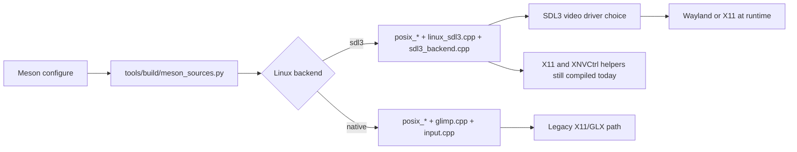

# Linux Compatibility Analysis of themuffinator/openQ4

## Executive summary

openQ4 is already **substantially more Linux-ready than a typical idTech4 fork**. The repository has a first-class Meson/Ninja build, documents Linux and macOS setup explicitly, defaults Linux to an SDL3 backend, packages Linux desktop integration assets, ships a Steam Deck launcher, and uses POSIX-specific signal, thread, file, socket, and dynamic-loading layers rather than trying to force Windows abstractions onto Unix. The release workflow also builds Linux archives for both x86_64 and ARM64. citeturn16view0turn40view0turn41view1turn42view0turn43view0turn19view3turn19view6

The repository’s Linux risk is **not spread evenly across gameplay code**. It is concentrated in a small set of low-level surfaces: `meson.build`, `.github/workflows/*`, `tools/build/meson_sources.py`, `tools/validation/*`, `src/sys/{posix,linux,sdl3}`, and `src/framework/FileSystem.cpp`. Those are the files that define platform source selection, compiler behavior, runtime probing, process/thread lifetime, file lookup semantics, and packaging shape. citeturn21view0turn18view0turn18view1turn18view2turn24view0turn24view1turn24view2turn24view3turn24view4turn24view6turn36view0

The most important Linux problems are concentrated in seven areas. The **highest-priority** ones are: Linux release packages are intentionally built with Meson `buildtype=debug`; the Linux SDL3 path still hard-couples build and runtime behavior to X11-era assumptions; the networking layer is still IPv4-only and uses obsolete name-resolution APIs; thread teardown depends on `pthread_cancel`; elapsed-time accounting uses `gettimeofday()` instead of a monotonic clock; Linux ARM64 is packaged but not validated in the normal push matrix; and filesystem case handling is only partially corrected on case-sensitive filesystems. None of these require an architectural rewrite, but several of them should be treated as release blockers if the target is “mainstream modern Linux” rather than “developer Linux.” citeturn16view0turn20view1turn42view0turn29view3turn31view0turn33view0turn33view1turn33view3turn27view4turn25view0turn19view2turn19view3turn38view0

A note on method: the requested GitHub connector was not exposed to the runtime in this session, so I used GitHub’s official repository tree/blob/raw views as the primary corpus, then checked Linux/POSIX behavior against primary documentation from man7, the Open Group, SDL’s own docs, and X.org.

## Method and Linux architecture

The repository presents **one documented build system**: Meson with Ninja, plus wrapper scripts for Windows and POSIX shells. `meson.build` defines the project as C11/C++20, requires Meson `>=1.2.0`, and maps host systems to `windows`, `linux`, and `darwin`. `BUILDING.md` likewise presents Meson/Ninja as the build path for Linux and macOS. The repository also maps `x86_64` to `x64` and `aarch64` to `arm64`, but explicitly warns that non-x64 builds are still considered experimental, even though release packaging includes Linux ARM64 artifacts. citeturn40view0turn41view1turn16view0turn19view3turn19view6

On Linux, platform source selection is driven by `tools/build/meson_sources.py`. For `platform_backend=sdl3`, Linux pulls in `sys/posix/posix_main.cpp`, `posix_net.cpp`, `posix_signal.cpp`, `posix_threads.cpp`, `sys/linux/linux_sdl3.cpp`, `sys/linux/main.cpp`, `sys/linux/stack.cpp`, and `sys/linux/libXNVCtrl/NVCtrl.c`. For `platform_backend=native`, it instead selects the older X11/GLX path through `sys/linux/glimp.cpp`, `sys/linux/input.cpp`, and the same POSIX support files. That split is sensible, but it also makes clear where Linux compatibility actually lives. citeturn21view0

The build dependency model is modern but still opinionated. Third-party dependencies are resolved through Meson dependencies with subproject fallbacks for GLEW, `stb_vorbis`, OpenAL, and SDL3. However, Linux currently unconditionally adds `threads`, `dl`, `x11`, `xext`, and `GL`, and then conditionally adds `xxf86vm` only for the non-SDL3 backend. In other words, **even the SDL3 Linux path still requires X11/Xext/OpenGL libraries at configure time**. The SDL3 dependency itself is required only when `platform_backend=sdl3`, with a version floor of `>=3.4.4`. The non-MSVC toolchain path also globally adds `-fpermissive`, which is a practical legacy-compatibility choice but also a signal that the codebase still relies on older, weakly-typed C/C++ behavior. citeturn42view0turn41view2

At runtime, the Linux surfaces are a mixed story. There are good Unix-native pieces: `sigaction(..., SA_SIGINFO)` is used for signal handling, `SIGPIPE` is ignored, `dlopen(..., RTLD_NOW)` / `dlsym` wrappers are present for module loading, `nanosleep()` is used for sleeping, and an instance-lock file is placed under `XDG_RUNTIME_DIR`, `TMPDIR`, or `/tmp` and held with `fcntl(F_SETLK)`, using `O_CLOEXEC` when available. Networking uses blocking and nonblocking BSD sockets with `select()`, `recvfrom()`, `fcntl(O_NONBLOCK)`, and classic `sockaddr_in` handling. The weak part is that the SDL3 path is **not actually independent of Linux’s historical X11 assumptions**, and the filesystem layer still documents only a partial answer to case-sensitive path resolution. citeturn32view7turn32view8turn26view5turn28view3turn26view3turn25view8turn25view9turn33view5turn33view6turn38view0

The repository’s packaging and documentation are thoughtful. Linux install staging places desktop entries under `share/applications`, installs hicolor icons, and generates an `openQ4-steamdeck` launcher. `BUILDING.md` also documents a helper to install a desktop shortcut and supports a `--basepath` override when Quake 4 cannot be autodetected. Those are solid Linux-distribution-facing touches. The problem is that some of the surrounding assumptions—especially the X11-coupled SDL3 path and debug-built release artifacts—undercut that polish. citeturn43view0turn16view0



That architecture diagram matches the repository’s actual source-selection and dependency logic: Linux has a modern SDL3-facing route, but it is still partially anchored to older Linux/X11 helpers and link-time requirements. citeturn21view0turn42view0turn31view0

## Prioritized compatibility issues

The table below compares current behavior with Linux-friendlier behavior and gives concrete impact points.

| Issue | Severity | Current behavior | Expected Linux-friendly behavior | Affected files and lines | Reproduction |
|---|---|---|---|---|---|
| Linux release artifacts are built as debug binaries | High | `BUILDING.md` explicitly says public release packages intentionally use Meson `buildtype=debug`, and the manual release workflow configures Linux/macOS with `--buildtype=debug`. That is excellent for crash symbol fidelity, but it is the wrong default for end-user Linux release performance. citeturn16view0turn20view1 | Ship `debugoptimized` or `release` Linux binaries plus separate debug-symbol artifacts. | `BUILDING.md` lines discussing public packages and Linux archives; `.github/workflows/manual-release.yml` build step for Linux/macOS. citeturn16view0turn20view1 | Package a Linux archive from the current workflow and compare frame time / binary size / startup cost against a local `--buildtype=debugoptimized` build. |
| SDL3 Linux path still hard-depends on X11-era helpers | High | Linux Meson deps always include `x11`, `xext`, and `GL`, even for `platform_backend=sdl3`. `linux_sdl3.cpp` still includes X11/NVCtrl support and falls back to `/proc/dri/0/umm`, while the SDL3 backend separately detects whether the active video driver is Wayland or X11 at runtime. On a pure Wayland session with no `DISPLAY`, VRAM probing falls all the way back to a hardcoded 64 MB low-end default. citeturn42view0turn29view3turn31view0 | SDL3/Wayland should build and run without mandatory X11 helper dependencies, and VRAM probing should be optional/backend-aware rather than X11-coupled. | `meson.build` Linux dependency block. `src/sys/linux/linux_sdl3.cpp` includes and VRAM probe path. `src/sys/sdl3/sdl3_backend.cpp` Wayland/X11 driver profiling. citeturn42view0turn29view3turn31view0 | Try `meson setup builddir . -Dplatform_backend=sdl3` in a Linux dev image with SDL3/EGL/OpenAL but without X11 dev packages; configure fails. Then run in a Wayland session with `DISPLAY` unset and observe the VRAM fallback path. |
| Networking is IPv4-only and uses obsolete name resolution | High | `posix_net.cpp` is built around `sockaddr_in`, `AF_INET`, and `gethostbyname()`. There is no `AF_INET6`, `sockaddr_in6`, or `getaddrinfo()` path in the inspected networking layer. POSIX removed `gethostbyname()` in POSIX.1-2008 and recommends `getaddrinfo()`, and `gethostbyname()` also does not handle IPv6. citeturn33view0turn33view1turn33view3turn33view5turn45search12turn45search15 | Use `getaddrinfo()` plus `sockaddr_storage`, support `AF_UNSPEC`, and preserve dual-stack behavior for dedicated-server and client paths. | `src/sys/posix/posix_net.cpp` address conversion and DNS resolution paths. citeturn33view3turn33view5 | Attempt to resolve or connect to an AAAA-only hostname or an IPv6 literal such as `::1`; current code has no path to represent it. |
| Thread shutdown depends on `pthread_cancel()` | Medium | `Sys_DestroyThread()` explicitly comments that the target thread “must have a cancellation point,” then calls `pthread_cancel()` followed by `pthread_join()`. POSIX/Open Group semantics make deferred cancellation effective only at cancellation points, so a long-running loop without one can stall shutdown. citeturn27view4turn27view8turn45search0turn45search2turn45search21 | Prefer cooperative stop flags, or at minimum ensure long-lived loops call `pthread_testcancel()` at safe points. | `src/sys/posix/posix_threads.cpp` thread create/destroy paths. citeturn27view4turn27view8 | Add or instrument a worker loop that never blocks and never reaches a cancellation point, then tear it down; `pthread_join()` can hang behind a pending cancel request. |
| Elapsed-time accounting is non-monotonic | Medium | `Sys_Milliseconds()` uses `gettimeofday()`, which Linux man pages explicitly note is affected by discontinuous wall-clock jumps; the same man pages recommend `clock_gettime()` when a monotonic clock is needed. Sleep already uses `nanosleep()`, so the timebase is the legacy outlier. citeturn25view0turn28view3turn46search0turn46search9 | Use `clock_gettime(CLOCK_MONOTONIC, ...)` for elapsed timing. | `src/sys/posix/posix_main.cpp` time and sleep paths. citeturn25view0turn28view3 | Run the engine, then step the system clock forward or backward; elapsed-time deltas can jump. |
| Linux ARM64 is packaged, but not validated on normal pushes | Medium | Push verification covers Ubuntu x64 and macOS, while manual release packages both Linux x64 and Linux ARM64. `meson.build` simultaneously warns that non-x64 builds are still experimental. Commit validation mostly checks script syntax and dry-runs. That means Linux ARM64 regressions can survive until manual release time. citeturn19view2turn19view3turn19view6turn18view0turn41view1 | Add Linux ARM64 build and smoke coverage to push/PR CI, and validate at least one runtime startup path. | `.github/workflows/push-verification.yml`, `.github/workflows/commit-validation.yml`, `.github/workflows/manual-release.yml`, `meson.build`. citeturn19view2turn18view0turn19view3turn41view1 | Add a temporary `#if defined(__aarch64__) #error` in a Linux platform file and observe that push verification still stays green because Linux ARM64 is not in the normal matrix. |
| Native X11 backend deliberately leaks the display connection | Medium | In `GLimp_Shutdown()`, after tearing down context/window state, the code comments that `XCloseDisplay(dpy)` is expected to crash and simply leaves it disabled. That is a real shutdown/resource-lifetime defect in the legacy `platform_backend=native` path. X.org’s own docs describe `XCloseDisplay()` as the normal way to close the connection and destroy client-side resources. citeturn34view7turn46search13 | Root-cause the crash and restore a clean X display close path. | `src/sys/linux/glimp.cpp` shutdown sequence. citeturn34view7 | Build with `-Dplatform_backend=native`, run repeated startup/shutdown or `vid_restart` cycles under Valgrind/ASan, and inspect leaked or stale X11 resources. |
| Case-sensitive directory handling is only partially corrected | Medium | `FileSystem.cpp` documents that case-insensitive search applies only to files, not directories, and says Linux/macOS paths may be forced to lowercase as an assumption. `Sys_ListFiles()` independently comments that directory-path case sensitivity can “screw us up.” This is a real footgun for mixed-case assets, mods, and install paths on Linux. citeturn38view0turn38view1turn26view9 | Resolve path segments case-insensitively on case-sensitive filesystems, or fail early with precise diagnostics rather than relying on lowercase assumptions. | `src/framework/FileSystem.cpp` case-sensitivity design notes; `src/sys/posix/posix_main.cpp` directory listing path. citeturn38view0turn26view9 | Rename an intermediate directory segment in a test asset tree to mixed case and attempt to load a file beneath it; file-level case folding will not fully save the lookup. |

Two findings deserve extra emphasis.

First, the repository’s **Linux positioning and Linux reality diverge most sharply around release engineering**. The docs advertise Linux archives as public release artifacts, including x64 and ARM64, but the same docs and workflow intentionally produce them from `buildtype=debug`. That improves crash analysis, but it is an avoidable performance tax on end users, especially on CPU-bound legacy engines and lower-power ARM64 devices. citeturn16view0turn20view1turn19view3turn19view6

Second, the **SDL3/Wayland story is only half-complete**. The user-facing docs say Linux defaults to SDL3 and describe Wayland/EGL behavior, and the SDL3 backend does track whether the active driver is Wayland or X11. But the build still requires X11/Xext/GL, and the Linux SDL3 host file still carries X11-and-proprietary-driver-centric helpers. That is not fatal on mainstream Ubuntu/Fedora desktops, but it is exactly the kind of coupling that bites headless builders, minimal containers, immutable desktops, and future de-X11 work. citeturn16view0turn31view0turn42view0turn29view3

## Patch-level remediation

The fixes below are intentionally practical. They fit the current architecture instead of trying to redesign the engine.

The first patch addresses the most immediately user-visible Linux issue: release artifacts currently use `--buildtype=debug` in the manual release workflow. citeturn16view0turn20view1

```diff
diff --git a/.github/workflows/manual-release.yml b/.github/workflows/manual-release.yml
@@
- bash tools/build/meson_setup.sh setup --wipe builddir . --backend ninja --buildtype=debug --wrap-mode=forcefallback \
+ bash tools/build/meson_setup.sh setup --wipe builddir . --backend ninja --buildtype=debugoptimized -Db_ndebug=true --wrap-mode=forcefallback \
    -Dplatform_backend=${{ matrix.platform_backend }} \
    -Dversion_track=stable \
    -Dversion_base_override=${{ needs.metadata.outputs.version }}
```

That change should be paired with a symbol-preservation policy for Linux, such as split DWARF / detached debug files uploaded as release-side artifacts, instead of shipping slow “release” binaries. The workflow already treats packaging as a first-class step, so symbol archiving belongs there rather than in user-facing archives. citeturn20view1turn16view0

The second patch is the highest-value code/build refactor: make X11 helpers optional when Linux uses the SDL3 backend. The current Linux dependency block and `linux_sdl3.cpp` show why this matters. citeturn42view0turn29view3

```diff
diff --git a/meson.build b/meson.build
@@
 elif host_system == 'linux'
-  deps += [
-    dependency('threads', required: true),
-    cc.find_library('dl', required: true),
-    dependency('x11', required: true),
-    dependency('xext', required: true),
-    cc.find_library('GL', required: true),
-  ]
-
-  if not use_sdl3_backend
-    deps += [dependency('xxf86vm', required: true)]
-  endif
-
-  if use_sdl3_backend
-    deps += [sdl3_dep]
-  endif
+  deps += [
+    dependency('threads', required: true),
+    cc.find_library('dl', required: true),
+  ]
+
+  if use_sdl3_backend
+    deps += [sdl3_dep]
+    x11_dep = dependency('x11', required: false)
+    xext_dep = dependency('xext', required: false)
+    if x11_dep.found() and xext_dep.found()
+      deps += [x11_dep, xext_dep, cc.find_library('GL', required: true)]
+      shared_cpp_args += ['-DOPENQ4_HAVE_X11_HELPERS=1']
+    endif
+  else
+    deps += [
+      dependency('x11', required: true),
+      dependency('xext', required: true),
+      cc.find_library('GL', required: true),
+      dependency('xxf86vm', required: true),
+    ]
+  endif
```

```diff
diff --git a/src/sys/linux/linux_sdl3.cpp b/src/sys/linux/linux_sdl3.cpp
@@
-extern "C" {
-#include "libXNVCtrl/NVCtrlLib.h"
-}
+#if defined(OPENQ4_HAVE_X11_HELPERS)
+extern "C" {
+#include "libXNVCtrl/NVCtrlLib.h"
+}
+#endif
@@
-  if (queryDisplay == NULL && getenv("DISPLAY") != NULL) {
+  #if defined(OPENQ4_HAVE_X11_HELPERS)
+  if (queryDisplay == NULL && getenv("DISPLAY") != NULL) {
       queryDisplay = XOpenDisplay(NULL);
   }
+  #endif
@@
-  common->Printf("guess failed, return default low-end VRAM setting ( 64MB VRAM )\n");
-  cachedVideoRam = 64;
+  common->Printf("VRAM autodetect unavailable on this backend; use +set sys_videoRam to override.\n");
+  cachedVideoRam = 0;
   return cachedVideoRam;
```

The precise fallback value is a policy decision. The important change is architectural: **do not make an SDL3/Wayland build depend on X11-only helper code**, and do not silently misclassify a modern Linux GPU as a 64 MB device when probing fails. The current code already has the information needed to distinguish Wayland and X11 at runtime. citeturn31view0turn29view3

The third patch modernizes the networking layer. The current code converts between engine addresses and `sockaddr_in`, and DNS resolution uses `gethostbyname()`. That should be replaced by `getaddrinfo()` and `sockaddr_storage`. citeturn33view3turn33view5turn45search12turn45search15

```diff
diff --git a/src/sys/posix/posix_net.cpp b/src/sys/posix/posix_net.cpp
@@
-static bool StringToSockaddr( const char *s, struct sockaddr_in *sadr, bool doDNSResolve ) {
-    struct hostent *h;
-    ...
-    if ( !( h = gethostbyname( buf ) ) ) {
-        return false;
-    }
-    if ( h->h_addrtype != AF_INET || h->h_length < sizeof( sadr->sin_addr ) ) {
-        return false;
-    }
-    ...
-}
+static bool StringToSockaddr( const char *s,
+                              struct sockaddr_storage *ss,
+                              socklen_t *ss_len,
+                              bool doDNSResolve ) {
+    struct addrinfo hints;
+    struct addrinfo *res = NULL;
+    memset(&hints, 0, sizeof(hints));
+    hints.ai_family = AF_UNSPEC;
+    hints.ai_socktype = SOCK_DGRAM;
+    hints.ai_flags = AI_ADDRCONFIG;
+    if (!doDNSResolve) {
+        hints.ai_flags |= AI_NUMERICHOST;
+    }
+
+    if (getaddrinfo(hostPart, portPart, &hints, &res) != 0 || res == NULL) {
+        return false;
+    }
+
+    memcpy(ss, res->ai_addr, res->ai_addrlen);
+    *ss_len = (socklen_t)res->ai_addrlen;
+    freeaddrinfo(res);
+    return true;
+}
```

That helper change needs corresponding call-site updates so UDP/TCP code uses `sockaddr_storage` and preserves family-specific lengths. The payoff is worth it: IPv6 support, modern POSIX compliance, and thread-safe name-resolution behavior. citeturn33view3turn45search12turn45search15

The fourth patch replaces the non-monotonic timebase in `Sys_Milliseconds()`. The current implementation is short and easy to modernize. citeturn25view0turn46search0turn46search9

```diff
diff --git a/src/sys/posix/posix_main.cpp b/src/sys/posix/posix_main.cpp
@@
-int Sys_Milliseconds( void ) {
-    int curtime;
-    struct timeval tp;
-    gettimeofday(&tp, NULL);
-    if (!sys_timeBase) {
-        sys_timeBase = tp.tv_sec;
-        return tp.tv_usec / 1000;
-    }
-    curtime = (tp.tv_sec - sys_timeBase) * 1000 + tp.tv_usec / 1000;
-    return curtime;
-}
+int Sys_Milliseconds( void ) {
+    static uint64_t sys_timeBaseNs = 0;
+    struct timespec ts;
+    if (clock_gettime(CLOCK_MONOTONIC, &ts) != 0) {
+        return 0;
+    }
+
+    const uint64_t nowNs =
+        (uint64_t)ts.tv_sec * 1000000000ull + (uint64_t)ts.tv_nsec;
+
+    if (sys_timeBaseNs == 0) {
+        sys_timeBaseNs = nowNs;
+        return 0;
+    }
+
+    return (int)((nowNs - sys_timeBaseNs) / 1000000ull);
+}
```

The fifth fix is structural rather than purely local, but it should still be made. The current `pthread_cancel()` teardown model should be converted to a cooperative-stop protocol for long-lived engine threads. An illustrative pattern is below. It is not a drop-in patch unless `xthreadInfo` is extended, but it is the right direction. citeturn27view4turn27view8turn45search0turn45search21

```diff
diff --git a/src/sys/posix/posix_threads.cpp b/src/sys/posix/posix_threads.cpp
@@
-void Sys_DestroyThread( xthreadInfo& info ) {
-    if ( pthread_cancel( ( pthread_t )info.threadHandle ) != 0 ) {
-        common->Error( "ERROR: pthread_cancel %s failed\n", info.name );
-    }
-    if ( pthread_join( ( pthread_t )info.threadHandle, NULL ) != 0 ) {
+void Sys_DestroyThread( xthreadInfo& info ) {
+    info.stopRequested.store( true, std::memory_order_release );
+    if ( pthread_join( ( pthread_t )info.threadHandle, NULL ) != 0 ) {
         common->Error( "ERROR: pthread_join %s failed\n", info.name );
     }
 }
```

In practice, this means adding a stop bit or stop callback to `xthreadInfo` and checking it in every long-lived worker loop at well-defined safe points. That change is more work than the timing/network patches, but it removes a whole category of Linux shutdown hangs. citeturn27view4turn27view8turn45search2

## CI and validation hardening

The current CI story is mixed. On the positive side, the repository does run Ubuntu-based validation, packages Linux x64 and ARM64 in the release workflow, and maintains dedicated validation wrappers and test utilities under `tools/validation/` and `tools/tests/`. But the normal push matrix does **not** cover Linux ARM64, the commit-validation workflow is mostly syntax plus dry-run validation, and runtime smoke on Linux is not a required gate in the workflows I inspected. `BUILDING.md` also makes `validate_pr.sh --runtime` optional, which is appropriate for local use but too weak as the main Linux confidence mechanism. citeturn19view2turn19view3turn18view0turn23view1turn23view2turn16view0

A practical Linux validation matrix should look like this:

| Validation dimension | Current repository behavior | Recommended gate |
|---|---|---|
| Push build on Linux x64 | Present on Ubuntu 24.04. citeturn19view2 | Keep. |
| Push build on Linux ARM64 | Not present in push verification, despite Linux ARM64 release packaging. citeturn19view2turn19view3turn19view6 | Add `ubuntu-24.04-arm` (or equivalent) build job on push/PR. |
| Runtime smoke on Linux | Not evident as a required GitHub Actions gate; local docs make `--runtime` optional. citeturn18view0turn16view0 | Run a startup smoke matrix on PRs or nightly. |
| Backend coverage | SDL3 is the default and the native Linux backend remains available, but the workflows do not show a Linux backend matrix for both. citeturn16view0turn21view0 | Add one Linux x64 native-backend job and one SDL3-backend job. |
| Wayland-specific confidence | Docs mention Wayland; no explicit Wayland CI job is visible in the inspected workflows. citeturn16view0turn31view0 | Add a headless Weston or compositor-backed SDL3 smoke job. |
| IPv6 confidence | Not covered by current scripts/workflows. citeturn33view3turn33view5 | Add localhost IPv4 and IPv6 socket tests. |
| Filesystem-case regression tests | Not visible in current workflow/test surfaces. citeturn23view2turn38view0 | Add a mixed-case fixture under Linux and assert expected failure/success semantics. |

The workflow changes I would actually implement are concrete:

1. Add **Linux ARM64** to `push-verification.yml`, not just `manual-release.yml`. The repository already claims Linux ARM64 shippability; CI should match that claim. citeturn19view2turn19view3turn19view6

2. Add a required **Linux runtime smoke** stage that invokes `validate_pr.sh --runtime` or a lighter startup subset. The repository already has renderer/runtime validation utilities; the missing piece is making one of them mandatory in CI. citeturn16view0turn23view2

3. Split Linux jobs into **backend matrix axes**: `platform_backend=sdl3` and `platform_backend=native`. The native backend should remain covered as long as `BUILDING.md` still documents it as a viable fallback. citeturn16view0turn21view0

4. After decoupling SDL3 from X11, add a **Wayland-only build/smoke job** that intentionally omits X11 dev packages and runs under a headless compositor. That turns today’s architectural tension into a testable contract. The SDL docs explicitly describe SDL3 as favoring Wayland by default on Linux, and the repository’s own SDL3 layer is already aware of X11-vs-Wayland driver selection. citeturn46search2turn46search14turn31view0

5. Add an **IPv6 socket test** once `getaddrinfo()` landing work is done, plus a short-lived benchmark check to ensure packaged Linux archives are not accidental debug builds. citeturn45search12turn45search15turn20view1

## Documentation changes and final assessment

The documentation is already better than average, but it should be tightened so that Linux-facing claims match Linux-facing reality.

The most important doc updates are these:

- `BUILDING.md` should either stop describing public Linux release packages as debug binaries, or explicitly label them as “diagnostic builds” and explain the performance tradeoff in plain language. The better answer is to change the workflow and then update the docs accordingly. citeturn16view0turn20view1
- `BUILDING.md` and `TECHNICAL.md` should add a **Linux support matrix** that separates `sdl3+Wayland`, `sdl3+X11`, and `native+X11`, and explicitly notes that non-x64 remains experimental today even though Linux ARM64 artifacts exist. citeturn16view0turn17view0turn41view1turn19view3
- The technical documentation should state the current network posture plainly: **IPv4-oriented today**, IPv6 pending. That is preferable to silently inheriting historical idTech networking assumptions. citeturn33view3turn33view5turn45search12
- The filesystem docs should promote the current warning about directory casing from a buried note into a visible Linux caveat, especially for mods and custom assets. citeturn38view0turn26view9
- Linux docs should add a short “sandboxed/distroless environments” note explaining that instance locking uses `XDG_RUNTIME_DIR`/`TMPDIR`, autodetection scans common Steam paths including the Flatpak Steam layout, and VRAM autodetection may need a manual `sys_videoRam` override on non-X11 sessions until the probing path is modernized. citeturn26view3turn28view3turn37view1turn29view3

The bottom line is straightforward: **openQ4 is already a credible Linux codebase, but not yet a fully modern Linux distribution target**. Its strengths are real—Meson, SDL3 defaulting, Linux packaging, Steam Deck awareness, POSIX-specific support layers, and a repository structure that localizes portability work instead of scattering it. Its remaining weaknesses are also very clear and unusually tractable: debug-built release artifacts, X11 coupling in the SDL3 path, IPv4-only networking, legacy thread/timer idioms, and CI that lags behind the project’s own ARM64 and Wayland ambitions. Fix those, and openQ4 moves from “Linux-capable” to “Linux-solid.” citeturn16view0turn21view0turn42view0turn29view3turn33view3turn27view4turn25view0turn19view2turn19view3