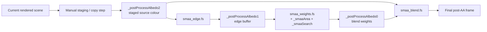

# Post-Antialiasing Audit of openQ4

## Executive summary

I inspected the two repositories you named in the requested order. All of the substantive post-AA implementation I could identify lives in **`themuffinator/openQ4`**: the renderer declares `r_postAA`, ships SMAA lookup-texture validation in renderer code, and defines a three-pass SMAA material/shader stack in `content/baseoq4`. By contrast, **`themuffinator/openQ4-game`** presents itself as a game-libraries repository containing `src/game` and `src/mpgame`, and I did not find postprocess or SMAA-related surface evidence there during inspection. citeturn16view0turn39view0turn34view0turn49view0turn50view0turn50view1turn50view2turn50view3turn50view4

The current post-AA path in `openQ4` is a **material-driven SMAA 1x implementation** built from three fullscreen passes: edge detection, blend-weight calculation, and neighbourhood blending. The material definitions bind three scratch images (`_postProcessAlbedo0`, `_postProcessAlbedo1`, `_postProcessAlbedo2`) plus the SMAA lookup textures (`_smaaArea`, `_smaaSearch`), while the shaders themselves are a compact GLSL port of **luma-based, medium-preset SMAA 1x**. Concretely, the edge shader computes luma from scene colour, the weights shader hard-codes `kMaxSearchSteps = 8.0`, and the blend shader performs only spatial neighbourhood reconstruction. citeturn34view0turn42view0turn42view1turn42view2turn46view6

The most important problems are not exploit-class security flaws; they are **correctness, fragility, and portability risks**. The highest-value fixes are: make the `r_postAA` enable path explicit and auditable; replace the manual scratch-texture choreography with an alias-safe pass graph; bind **actual source texture dimensions** instead of global video-mode dimensions; and define the **colour-space contract** for edge detection instead of implicitly sampling whatever postprocess scene buffer happens to be bound. The current implementation also remains quality-limited by design: it omits colour/depth predication, diagonal/corner handling, and temporal stabilisation, even though upstream SMAA exposes those options. citeturn16view0turn18view0turn18view4turn31view8turn34view0turn42view0turn42view1turn46view4turn46view5turn46view6turn51search6

My overall recommendation is to treat the near-term work as a **two-stage programme**. First, harden the existing SMAA 1x path: explicit mode routing, source-size correctness, alias-safe pass ownership, lookup-texture validation, and modernised shader I/O. Second, once the existing path is trustworthy, add a higher-quality mode, ideally **depth-predicated or colour-edge SMAA**, and only then decide whether the engine should stay with improved SMAA 1x, add a temporal SMAA/TAA path, or adopt a separate low-end fallback such as FXAA or CMAA2. Upstream SMAA, NVIDIA’s FXAA whitepaper, Intel’s CMAA2 paper, and the temporal-AA survey all support that staged decision model. citeturn43search0turn43search1turn51search0turn51search1turn51search6

## Scope and implementation map

This audit assumes **unspecified target platforms, graphics APIs, and performance budgets**, exactly as requested. I therefore treated the path as a **desktop OpenGL renderer** that must remain robust across varying resolutions, render scales, and driver behaviour. The project’s public docs also present optional anti-aliasing, bloom, HDR, and modern display support together, which makes postprocess ordering and colour-space contracts materially important rather than academic. citeturn48search0turn9view0

Inside `openQ4`, the visible implementation surface is spread across four places: renderer cvars in `src/renderer/RenderSystem_init.cpp`; renderer-side lookup-texture validation in `src/renderer/RenderSystem.cpp`; embedded SMAA-related headers under `src/renderer/smaa`; and the actual fullscreen AA materials and GLSL programs under `content/baseoq4/pak0/materials` and `content/baseoq4/pak0/glprogs`. The game-libraries repo, `openQ4-game`, did not expose a corresponding renderer-side post-AA implementation in the inspected scope, so the rest of this report focuses on `openQ4`. citeturn16view0turn39view0turn40view0turn23view0turn34view0turn49view0

The current data flow, reconstructed from the material bindings and recent repository history, looks like this:



That reconstruction is consistent with the current `postprocess_openq4.mtr` bindings and with the project’s late-May 2026 fix history, which explicitly mentions staging the resolved scene into a dedicated postprocess source to avoid render-target feedback regressions. citeturn34view0turn38search0turn38search1

The renderer surface also already contains some useful building blocks for remediation. `RenderSystem.cpp` has a crop-aware depth capture helper, persistent render-image creation, and a validator for the SMAA lookup textures. The project history also suggests an existing automated validation culture, smoke tests, and benchmark runs, which means the recommended regression checks can be added to an existing framework rather than invented from scratch. citeturn37view1turn39view0turn38search1

## Detailed issues

The table below is my prioritised severity/likelihood view. The issue numbers are for reference; the priority order is driven by impact and expected frequency.

| Issue | Short label | Severity | Likelihood | Estimated effort | Remediation risk |
|---|---|---:|---:|---:|---:|
| 1 | Opaque `r_postAA` control path | High | Medium | 6–10 h | Low–Medium |
| 2 | Render-target aliasing and clear-contract fragility | Critical | High | 12–16 h | Medium |
| 3 | Colour-space ambiguity in luma edge detection | High | Medium | 8–12 h | Medium |
| 4 | Texel-size bound to video mode instead of source image | High | Medium | 6–10 h | Low |
| 5 | Quality-limited cut-down SMAA path | Medium | High | 12–20 h near-term | Medium |
| 6 | Legacy GLSL / fixed-function state dependency | Medium | Medium–High | 10–18 h | Medium |
| 7 | Lookup-texture contract is duplicated and under-validated | Medium | Medium | 6–10 h | Low |
| 8 | Multi-pass bandwidth and driver-variance cost | Medium | High | 8–14 h | Low–Medium |

The detailed findings below are grounded in the inspected code and documentation. Where a finding is a **probable bug** or a **structural fragility** rather than a demonstrated frame capture from your build, I say so explicitly. citeturn16view0turn34view0turn42view0turn42view1turn42view2

**1. Opaque or under-wired `r_postAA` control path**

The root cause is that the renderer exposes `r_postAA` as a formal user-facing cvar, but in the inspected engine-side code I found the declaration without an equally obvious explicit consumer. `RenderSystem_init.cpp` defines `r_postAA` as `0 = off, 1 = SMAA 1x`; however, the inspected `RenderSystem.cpp` and `draw_arb2.cpp` do not show an explicit `r_postAA` match, `Material.cpp` likewise did not expose one in the inspected surface, and the SMAA material declarations themselves are not cvar-gated. I cannot prove from this bounded inspection that the cvar is dead globally, but I can say that the **control path is not self-evident**, which is already a correctness and maintenance problem. citeturn16view0turn18view0turn18view4turn31view8turn34view0

The impact is straightforward: settings/UI drift, support ambiguity, and regression-prone behaviour. If the enable path is implicit, users can see “post AA = on” while the pass graph is off, or vice versa; future refactors can silently sever the cvar without compiler help; and QA has no single place to assert “this mode schedules these exact resources and passes”. That is a **high-severity usage pitfall** even before it becomes a frame-level rendering bug. citeturn16view0turn34view0

Recommended remediation tasks:

1. Introduce a single renderer-owned `PostAAMode` enum and a single scheduling function, for example `BuildPostAAPasses(PostAAMode mode, const PostAAInputs& in, PostAAOutputs& out)`.
2. Translate `r_postAA` into that enum once per frame or once per mode change. Do not let materials implicitly decide whether AA exists.
3. Emit one startup/runtime log line that states the **effective** mode, the active source image, the active output image, and whether lookup-texture validation passed.
4. Make the UI/console read back the **effective** mode, not merely the cvar.
5. If the mode is unsupported at runtime, downgrade to `Off` with a warning, rather than silently running a partial chain.

Validation and regression tests to add:

1. A hot-toggle integration test that flips `r_postAA` off/on/off/on across 100 consecutive frames and asserts a non-zero screenshot delta only on “on” frames.
2. A renderer unit test for `TranslatePostAASettings()` so future cvar/UI changes cannot desynchronise from the scheduled mode.
3. A startup self-test that logs `PostAA=Off` or `PostAA=SMAA1x` deterministically on every boot.
4. A CI smoke test that fails if the AA mode is set to “on” but zero post-AA passes are scheduled.

Estimated effort: **6–10 hours**. Risk: **low to moderate**, because the main cost is plumbing and logging rather than shader rework.

**2. Render-target aliasing and pass-order fragility**

The current implementation still carries a structural hazard: the post-AA contract is encoded through **scratch-image names and material ordering**, not through an explicit engine-side no-alias resource graph. The current material file binds `_postProcessAlbedo2` as staged source colour, `_postProcessAlbedo1` as edge input, and `_postProcessAlbedo0` as blend-weight input. Recent project history shows that this path has already regressed once into feedback / black-screen behaviour and had to be patched by staging the resolved scene into a dedicated postprocess source instead of sampling the active render target. That is a confirmed historical failure mode, not a hypothetical one. citeturn34view0turn38search0turn38search1

There is a second, quieter contract hidden inside the shaders: `smaa_edge.fs` discards non-edge pixels rather than writing an explicit zero vector. That means correctness now depends on the destination edge buffer being known-zero before the pass runs. If that clear ever gets reordered away, aliased, or skipped during optimisation, stale edge data can leak forward. The fragility is not that the shader is “wrong”; the fragility is that the **clear requirement is implicit rather than enforced by the pass model**. citeturn42view0

The impact is severe: undefined read/write feedback, driver-specific artefacts, black masks, ghost edge data, and extremely hard-to-debug regressions whenever pass order changes. This is the issue I would treat as the **highest implementation risk**, because it has both historical evidence and an architecture-level root cause. citeturn38search0turn38search1turn42view0

Recommended remediation tasks:

1. Move post-AA scheduling to an explicit pass-resource description, even if the rest of the renderer remains material-driven.
2. Represent the chain with typed handles: `sceneSrc`, `edgeTex`, `weightTex`, `sceneDst`.
3. Add engine assertions for every pass:
   - `sceneSrc != sceneDst`
   - `edgeTex != weightTex`
   - no pass both reads and writes the same texture unless it is explicitly declared read-modify-write and supported.
4. Make the edge pass clear its destination explicitly before draw. Do not rely on external clears or incidental full-coverage writes.
5. Attach debug labels to every post-AA FBO/texture and emit them into GL debug output or RenderDoc captures.
6. Add a “paranoid mode” runtime check in non-release builds that hashes all pass bindings and logs any alias.

A safe target structure is simple:

```cpp
PostAAResources r;
r.sceneSrc  = graph.import(stagedScene);
r.edgeTex   = graph.create2D("SMAA.Edge",   w, h, RG8);
r.weightTex = graph.create2D("SMAA.Weight", w, h, RGBA8);

graph.addPass("SMAA Edge")
    .read(r.sceneSrc)
    .clearWrite(r.edgeTex);

graph.addPass("SMAA Weights")
    .read(r.edgeTex)
    .read(areaTex)
    .read(searchTex)
    .clearWrite(r.weightTex);

graph.addPass("SMAA Blend")
    .read(r.sceneSrc)
    .read(r.weightTex)
    .write(finalScene);
```

This pseudocode is the direct remedy for the material-driven alias contract visible in the current implementation. citeturn34view0turn38search1

Validation and regression tests to add:

1. An alias-injection test that intentionally binds the same texture as source and destination and verifies that the renderer aborts in debug builds.
2. A stale-data test that alternates between an “all edges” frame and an “almost no edges” frame and asserts that the second frame does not retain old edge pixels.
3. A RenderDoc/apitrace capture test in CI or nightly automation that checks the actual source/destination image IDs for each post-AA pass.
4. A hot-resize test across multiple `vid_restart` cycles.

Estimated effort: **12–16 hours**. Risk: **moderate**, because resource ownership changes can flush out hidden dependencies.

**3. Colour-space ambiguity in luma edge detection**

The edge shader computes luma directly from sampled RGB using Rec.709-like weights and no explicit transfer-function handling. Upstream SMAA’s own documentation is explicit that luma and colour edge detection expect **gamma-corrected colour inputs** and a **non-sRGB texture view**. In openQ4, the material chain simply feeds `ColorTex` from the staged postprocess scene; meanwhile the project publicly advertises HDR and bloom alongside anti-aliasing. That means the implementation currently lacks a clearly stated and enforced answer to the most important question in post-AA edge detection: **what colour space is this texture in when thresholding occurs?** citeturn42view0turn46view7turn46view8turn48search0turn34view0

The impact is missed edges in some scenes and false edges in others. If the source is display-encoded, the current thresholds may behave approximately as intended. If the source is linear HDR or otherwise not in the expected perceptual space, the threshold no longer corresponds to what the upstream paper and reference implementation assume. The visible symptoms are scene-dependent: over-detected bloom transitions, under-detected same-brightness material boundaries, and inconsistent behaviour across tone-mapping operators. citeturn42view0turn46view7turn46view8turn43search1

Recommended remediation tasks:

1. Define one explicit contract for the SMAA source:
   - either **post-tonemap, display-encoded LDR**
   - or **scene-linear LDR with a local conversion in the edge pass**
   - but not an ambiguous mix.
2. Add an engine-side flag or enum such as `PostAASourceSpace`.
3. If the chosen source is linear, convert to perceptual luma in shader before thresholding.
4. If the chosen source is already display-encoded, ensure the texture view/sampler path does not apply an extra sRGB decode.
5. Document the insertion point relative to HDR, bloom, colour grading, CRT, and UI composition.

A safe direction is:

1. Bind an explicitly named post-tonemap source buffer for SMAA 1x, **or**
2. add a depth/colour-predicated edge mode so the path does not rely solely on post-tonemap luma.

Validation and regression tests to add:

1. A scene with equal-luma, different-hue geometry edges.
2. A bright HDR scene with bloom halos and emissive signage.
3. A dark interior scene with low-contrast edges.
4. Golden captures under all supported tonemap operators, if multiple operators exist.
5. A small automated histogram/edge-mask test to catch threshold drift after colour-pipeline edits.

Estimated effort: **8–12 hours**. Risk: **moderate**, because this change interacts with the broader post stack.

**4. Texel-size is derived from video mode, not from the actual source image**

The SMAA materials set `invTexSize` from `VideoWidth` and `VideoHeight`, not from the bound source texture. That is a probable correctness bug whenever the source texture size diverges from the display mode, and at minimum it is a clear fragility. The same public settings docs expose `r_screenFraction` scene scaling, and the renderer’s own depth-capture helper sizes persistent images from the **active render crop**, not the display mode. In other words, the engine already knows the difference between “video size” and “current render surface size”, but the post-AA materials do not. citeturn34view0turn9view0turn37view1

The weights shader also partially masks bad bindings instead of failing loudly: it reconstructs `rtSize` by dividing through `invTexSize` and clamps the divisor with a small epsilon. That avoids a divide-by-zero crash, but it also means a broken texel-size contract can degrade into subtly wrong sampling rather than an immediate diagnostic. For a post-AA pass, subtle wrong sampling is the worst outcome: it produces blur, under-detection, or directional bias without a hard failure. citeturn42view1

The impact appears whenever source and output dimensions are not identical: dynamic resolution, supersampling, cropped subviews, vid-restart races, offscreen render targets, or any future render-graph refactor that decouples source and output sizes. The specific visual failure depends on direction: too-small inverse texel size causes under-stepping and missed edges; too-large inverse texel size causes neighbourhood overshoot, softening, and misclassified patterns. citeturn34view0turn42view0turn42view1turn9view0

Recommended remediation tasks:

1. Stop deriving SMAA texel size from global `VideoWidth`/`VideoHeight`.
2. Bind inverse texel size from the **actual bound source image** for each pass.
3. For safety, also bind the integer source size and assert at draw time that it matches the texture object’s upload size.
4. Remove the silent epsilon fallback in the production shader once the binding path is guaranteed correct; keep the fallback only in debug builds if desired.
5. If the material system cannot easily expose per-texture size, add a renderer-owned uniform block or global shader parms that are written just before each post-AA pass.

Validation and regression tests to add:

1. A resolution-scale matrix: `r_screenFraction = 50, 75, 100, 125, 200`.
2. Windowed resize and borderless/fullscreen transitions.
3. Ultrawide, dual-monitor, and high-DPI scenarios.
4. A crop/subview test if any offscreen post-AA path exists.
5. A unit/integration test that compares bound `invTexSize` against actual image dimensions during draw submission.

Estimated effort: **6–10 hours**. Risk: **low**, because the change is local but high leverage.

**5. The shipped SMAA path is intentionally cut down and quality-limited**

The current shaders implement a reduced SMAA 1x profile: luma-only edge detection, `kMaxSearchSteps = 8.0`, and no visible diagonal detection, corner rounding, predication, or temporal reprojection. Upstream SMAA distinguishes medium, high, and ultra presets; offers luma, colour, and depth edge detection; and exposes predication and reprojection hooks. The temporal-AA survey further explains why modern engines lean so heavily on temporal approaches: single-frame spatial filters cannot solve subpixel shimmer by themselves. citeturn42view0turn42view1turn46view4turn46view5turn46view6turn46view9turn51search6

This is not a “bug” in the narrow sense; it is a **design limitation with visible consequences**. Thin diagonals, same-luma colour boundaries, sharp corners, alpha-tested silhouettes, specular crawl, and aliasing generated inside shaders all sit outside the sweet spot of a medium-preset, luma-only, spatial SMAA 1x path. Because the project already exposes MSAA-related controls (`r_multiSamples`, `r_msaaResolveDepth`, `r_msaaAlphaToCoverage`) and already captures resolved depth in other post effects, the omission is not due to a total lack of infrastructure; it is a policy and implementation choice. citeturn16view1turn16view2turn35view5turn37view1

Recommended remediation tasks:

1. Keep the current path as **`SMAA1xMedium`** for safety and reproducibility.
2. Add **`SMAA1xHigh`** and **`SMAA1xUltra`** variants that match upstream search-step and diagonal/corner behaviour more closely.
3. Add an intermediate upgrade path before full TAA:
   - **depth-predicated SMAA**, reusing resolved depth infrastructure already present in the renderer
   - or **colour-edge SMAA** where same-luma, different-hue boundaries matter.
4. Treat any temporal mode (`SMAA T2x` or engine-level TAA) as a **phase-two feature**, not as part of the immediate hardening pass.
5. Expose the quality/performance trade-off explicitly in the renderer rather than burying it in a single cvar value.

Validation and regression tests to add:

1. Fence, grate, and cable scenes for diagonal handling.
2. Same-luma red/green geometry edges for colour-edge coverage.
3. Glossy/specular motion pans for shimmer.
4. Foliage or perforated metal under `r_msaaAlphaToCoverage`.
5. Side-by-side screenshot comparisons across Medium/High/Ultra and off/on resolutions.

Estimated effort: **12–20 hours** for high/ultra/predicated near-term work. Additional temporal work is a **separate 40–80 hour branch** and should not be mixed into the first hardening pass. Risk: **moderate**.

**6. The GLSL path depends on legacy compatibility-profile built-ins and mutable GL state**

The SMAA shaders use `ftransform`, `gl_MultiTexCoord0`, `gl_TexCoord`, `texture2D`, and `gl_FragColor`, all of which are legacy GLSL / compatibility-profile constructs. Repository history also records a recent renderer fix that had to force texture unit 0 selection before preparing legacy stage texturing so that fullscreen/material geometry picked up the correct `gl_TexCoord[0]` values. That is a strong signal that the current post-AA path still depends on a **fragile fixed-function state contract**, not merely on shader code. citeturn42view3turn42view0turn42view1turn42view2turn38search1

The impact is mainly portability and future maintenance. The project advertises modern platforms including macOS, Linux, and Windows; any future move towards stricter GL profiles, backend consolidation, or API abstraction will keep tripping over these compatibility-era assumptions. Even on drivers that support the shaders today, state leakage bugs become easier to reintroduce because the texture coordinate source is not explicit in the shader interface. citeturn48search0turn42view3turn38search1

Recommended remediation tasks:

1. Port the SMAA shaders to explicit modern GLSL variants using `#version 330` or a project-standard level that fits the real backend targets.
2. Replace built-in varyings with explicit `in/out` attributes and a fullscreen triangle or explicit quad vertex format.
3. Replace `texture2D` with `texture`.
4. Remove reliance on “active texture unit 0 must already be selected” for UV correctness.
5. If legacy compatibility must be retained, keep the current shaders as a fallback path but make the modern path the primary, tested one.

Validation and regression tests to add:

1. Shader compile tests on the project’s supported GL targets.
2. A state-poisoning test that intentionally dirties active texture units and verifies post-AA UV correctness.
3. A platform matrix smoke test on the project’s supported operating systems.
4. A RenderDoc capture that checks actual vertex inputs and interpolants in the AA passes.

Estimated effort: **10–18 hours**. Risk: **moderate**, because shader interface changes can uncover hidden assumptions elsewhere in the postprocess material path.

**7. The lookup-texture contract is duplicated and under-validated**

The lookup-texture pipeline has too many sources of truth. `Image_intrinsic.cpp` includes `smaa/AreaTex.h` and `smaa/SearchTex.h`, which implies embedded or code-generated lookup data. `RenderSystem.cpp::ValidateSMAALookupTextures` checks that `_smaaArea` and `_smaaSearch` are present, loaded, and of the expected dimensions. But `smaa_weights.fs` also hard-codes the area/search texture dimensions and packed sizes directly in shader constants. That means the contract is split across headers, runtime validation, and shader numerics. citeturn40view0turn39view0turn42view1

The validation itself is too weak for a critical lookup path. It checks load state and dimensions, but not texture format, swizzle, wrap mode, filter mode, or actual table contents. If those drift—or if future upstream SMAA assets are regenerated from a newer source—the failure mode is not necessarily a crash. It can just be subtly wrong blend weights and very difficult visual debugging. citeturn39view0turn34view0turn42view1

Recommended remediation tasks:

1. Generate shader constants from the same header source that defines the embedded lookup tables, or bind them via uniform constants rather than hand-copying numbers into GLSL.
2. Extend validation to assert:
   - expected texture format
   - expected filter mode
   - expected clamp mode
   - expected upload dimensions
   - optional CRC/hash of the packed lookup contents.
3. If validation fails, forcibly disable post-AA with a warning instead of attempting to run.
4. Add a build-time unit test that validates header-defined dimensions and hashes.
5. Add a runtime self-test in a developer build that samples known lookup coordinates and checks expected values.

Validation and regression tests to add:

1. A unit test over generated area/search metadata.
2. A startup validation log that prints the active area/search texture properties.
3. A test that deliberately swaps filter mode or wrap mode in a debug build and verifies that validation fails loudly.

Estimated effort: **6–10 hours**. Risk: **low**.

**8. The current path pays a non-trivial fullscreen bandwidth cost and may show driver variance**

Even after the late-May staging fix, the current implementation still implies multiple fullscreen passes and an explicit staging relationship. The materials expose edge, weights, and blend passes, plus the staging/copy pattern noted in repository history. The weights shader contains four data-dependent `while` loops for horizontal and vertical search, and the edge shader uses `discard` for non-edge pixels. That is all normal for SMAA-class algorithms, but it still makes the path materially heavier and more driver-sensitive than a simpler fallback like FXAA, and potentially less predictable than a compute-oriented CMAA2-style path on some hardware. citeturn34view0turn42view0turn42view1turn38search1turn51search0turn51search1

The cost issue matters because your target budget was left unspecified. On a modern discrete desktop GPU, this may still be perfectly acceptable. On older hardware, integrated GPUs, or 4K-heavy configurations, the extra texture traffic and divergent loops can become visible in frametime variance even if average frame time remains acceptable. This is therefore a **medium-severity performance risk under unspecified budgets**, not an indictment of SMAA as such. citeturn51search0turn51search1turn43search0

Recommended remediation tasks:

1. Put timer queries around every post-AA pass and record:
   - pass GPU time
   - source/output resolution
   - AA mode
   - MSAA sample count
   - frame timestamp.
2. Add a low-end policy:
   - current or improved SMAA for default desktop targets
   - FXAA or CMAA2 fallback for bandwidth-constrained targets
   - MSAA where forward-rendered geometry edges dominate and sample cost is acceptable.
3. Consider a modernised implementation path later:
   - compute-based weights pass
   - bounded loop specialisations by quality tier
   - merged copy/resolve where safe and measurable.
4. Add pass-level perf counters to automated benchmark scenes so regressions show up before release.

Validation and regression tests to add:

1. Pass timing runs at 1920×1080, 2560×1440, and 3840×2160.
2. A/B runs for `r_postAA off/on`, `r_multiSamples 0/2/4/8`, and `r_screenFraction 50/100/200`.
3. A 1% low frametime metric, not just average GPU milliseconds.
4. Driver-matrix spot checks on at least one NVIDIA, AMD, and integrated GPU configuration.

Estimated effort: **8–14 hours**. Risk: **low to moderate**.

## Alternative technique choices

The table below synthesises the official SMAA materials/paper and reference implementation, the NVIDIA FXAA whitepaper, Intel’s CMAA2 write-up, the temporal-AA survey, and OpenGL multisampling guidance. It is framed specifically around **what fits openQ4 next**, not around which technique is “best” in the abstract. citeturn43search0turn43search1turn51search0turn51search1turn51search6turn51search3

| Technique | Strengths | Weaknesses | Integration cost for openQ4 | Best role here |
|---|---|---|---|---|
| Current SMAA 1x medium | Already present; good single-frame geometric edge cleanup | Misses temporal shimmer, diagonals/corners are limited, luma-only in current port | Low | Baseline path after hardening |
| SMAA 1x high/ultra | Better diagonals and corner handling with modest conceptual change | Still spatial-only; still needs correct colour/depth contracts | Low–Medium | Best near-term quality upgrade |
| SMAA with depth/colour predication | Better edge coverage on difficult boundaries | More inputs and more pipeline discipline | Medium | Strong near-term upgrade if you want to stay with SMAA |
| SMAA T2x | Better subpixel stability than 1x | Needs stable motion/history infrastructure | High | Medium-term option after current path is trustworthy |
| FXAA | Very cheap, simple, catches shader aliasing too | Blurrier, weaker shape reconstruction | Low | Low-end fallback or emergency compatibility mode |
| CMAA2 | Designed to keep images sharper while staying cheap; can coexist with MSAA | Different implementation style; more integration work if you do not already have the right compute/runtime path | Medium–High | Candidate fallback if blur complaints outweigh SMAA wins |
| MSAA + alpha-to-coverage | Best immediate geometry-edge quality in forward paths; complements alpha-tested content | Does not solve shader/specular aliasing and requires resolve management | Medium, but some cvars already exist | Complementary high-end option, not a full replacement |
| TAA | Best long-term temporal stability in modern engines | History validation, ghosting control, motion-vector correctness, larger integration surface | High | Long-term renderer project, not immediate post-AA triage |

For openQ4 specifically, I would **not** jump straight to TAA from the current state. The shortest valuable path is: harden current SMAA, fix colour-space and texel-size contracts, expose high/ultra or predicated variants, and only then compare improved SMAA against a low-end FXAA/CMAA2 fallback and a longer-term temporal branch. The project already exposes MSAA-related controls and depth-copy infrastructure, so a complementary MSAA + improved SMAA story is also realistic on higher-end desktop profiles. citeturn16view1turn16view2turn35view5turn37view1turn43search0turn51search0turn51search1turn51search3turn51search6

## Prioritised action plan

The timeline below assumes one experienced graphics engineer, no major engine-architecture surprises, and the near-term goal of making the existing post-AA path **correct, diagnosable, and regression-resistant** before chasing new features.

| Phase | Timeline | Deliverables | Issues addressed |
|---|---|---|---|
| Hardening pass | Day 1–2 | Explicit `PostAAMode` control path; runtime logging; startup disable-on-validation-failure | 1, 7 |
| Correctness pass | Day 2–4 | Actual source-image texel size binding; remove video-mode dependency; debug asserts on source/output size | 4 |
| Safety pass | Day 4–6 | Explicit alias-safe pass/resource ownership; mandatory clears for sparse-write passes; debug labels | 2 |
| Colour-space pass | Day 6–7 | Defined post-tonemap or perceptual-luma contract; documentation update; golden captures | 3 |
| Portability pass | Day 8–10 | Modern GLSL shader I/O path; explicit fullscreen geometry path; state-poisoning tests | 6 |
| Quality pass | Day 11–13 | High/ultra quality tiers; optional depth/colour predication prototype | 5 |
| Perf pass | Day 13–15 | Pass-level timer queries; benchmark baselines; fallback policy for low-end targets | 8 |

### Implementation checklist

- [x] Hardening pass: explicit `PostAAMode` routing, runtime logging, and SMAA lookup-texture validation hardening.
- [x] Correctness pass: actual SMAA source-image texel size is bound from render-target dimensions, SMAA no longer depends on `VideoWidth`/`VideoHeight`, and per-pass source/output dimensions are asserted with runtime fallback logging.
- [x] Safety pass: SMAA now declares named scene-source, edge/blend, and weights/final render-target roles; every pass validates read/write aliasing before drawing; each output is cleared before use; and render textures/attachments receive persistent GL debug labels when object labels are available.
- [x] Colour-space pass: SMAA now declares and logs its source colour-space contract, passes that contract to the edge shader, preserves the current legacy perceptual-LDR behaviour explicitly, and has an `airdefense1` visual baseline capture.
- [x] Portability pass: SMAA shaders now use explicit GLSL 1.30 inputs/outputs and `texture()` sampling; the renderer draws SMAA material stages through an explicit `attr_Position`/`attr_TexCoord0` fullscreen quad with isolated cull state; and state-poisoning gameplay coverage guards against active texture/client-array leakage.
- [x] Quality pass: `r_postAA` now exposes medium/high/ultra SMAA 1x quality tiers plus a colour-edge prototype, and gameplay benchmark profiles cover each new opt-in mode.
- [x] Black-scene regression follow-up: the explicit SMAA fullscreen quad now draws two-sided while restoring the previous material cull state, and `_postProcessAlbedo2` is registered as an intrinsic render image so the staged source target is part of the renderer's named image set.
- [x] Settings menu follow-up: the Display/Rendering menu now exposes all five `r_postAA` values through localized mode names (`Off`, `SMAA Medium`, `SMAA High`, `SMAA Ultra`, and `Color Edge`) instead of the old two-value `Off/SMAA 1x` list.
- [ ] Perf pass: pass-level timer queries, benchmark baselines, and low-end fallback policy.

### Colour-space contract

The current SMAA 1x path samples `_postProcessAlbedo2` after the forward scene has been resolved into the game-owned post-process chain. That source is an LDR `FMT_RGBA8` render target using `CFM_DEFAULT` with the renderer's current non-sRGB texture decode policy, before blur/CAS/final presentation and before UI composition.

The active contract name is `legacy-perceptual-ldr`. Under this contract, `smaa_edge.fs` treats sampled RGB as the perceptual/display-style values used by the legacy Quake 4 lighting path and applies Rec.709 luma weights directly for edge thresholding. The renderer also exposes a source-space vector to GLSL (`postProcessSourceColorSpace`, currently `(0, 2.2, 0, 0)`) so a future linear-LDR source can switch the contract deliberately instead of changing the threshold semantics by accident.

If SMAA is ever moved to a true linear or HDR source, the scheduler must change the contract to `linear-ldr` or introduce a new explicit mode, update the insertion point documentation, and regenerate visual baselines before comparing quality or thresholds.

### Portability contract

The SMAA material shaders are now the post-AA path's first explicit GLSL I/O shaders. They declare `#version 130`, consume `attr_Position` and `attr_TexCoord0`, pass UVs through `v_TexCoord`, write `fragColor`, and use `texture()` sampling instead of compatibility-only `gl_TexCoord`, `texture2D`, and `gl_FragColor`.

The renderer binds `attr_Position` to generic attribute 0 and `attr_TexCoord0` to generic attribute 8 before linking GLSL material programs. For `smaa_edge.fs`, `smaa_weights.fs`, and `smaa_blend.fs`, the draw path bypasses legacy fullscreen material geometry and submits a fixed four-vertex clip-space triangle strip. Non-SMAA GLSL material stages continue to use the existing legacy material geometry path.

The explicit SMAA fullscreen draw must not inherit fixed-function client array state or material winding assumptions. Before drawing, it disables the fixed vertex/color/normal arrays, disables texture-coordinate arrays across all tracked client texture units, temporarily unbinds the legacy array VBO so the quad's CPU-side generic attribute arrays are interpreted correctly, draws two-sided, and restores the previous cull mode, VBO, and usual unit-0 vertex/texture-coordinate client state afterward. This guards the NVIDIA driver crash found during validation, where a stale fixed-function texture-coordinate array was interpreted as a CPU pointer after the explicit path unbound the array buffer, and the black-scene regression where the explicit fullscreen strip was culled under the inherited front-sided material state.

`r_postAAStatePoisonTest` is off by default. The `postaa-state-poison` gameplay benchmark profile enables `r_postAA 1` and `r_postAAStatePoisonTest 1`, runs `game/airdefense1`, and dirties active texture/client state immediately before SMAA fullscreen draws to keep this contract regression-resistant.

### Quality contract

`r_postAA 1` remains the compatibility/default SMAA 1x medium path. `r_postAA 2` selects `SMAA1xHigh`, which keeps luma edge detection and raises the weights-pass search distance from 8 to 16 steps. `r_postAA 3` selects `SMAA1xUltra`, which keeps luma edge detection, lowers the edge threshold from `0.10` to `0.05`, and raises the search distance to 32 steps.

The renderer passes SMAA quality as a single `postProcessSMAAQuality` vector: `x = edge mode`, `y = edge threshold`, `z = max search steps`, and `w = local contrast adaptation factor`. The SMAA materials bind that vector to the edge and weights shaders so quality selection is visible in the game-owned scheduler, the backend uniform contract, and the runtime log instead of being hidden as shader constants.

`r_postAA 4` is an explicit colour-edge prototype named `SMAA1xColorPrototype`. It reuses the same alias-safe SMAA pass graph, uses the high search distance, and switches the edge shader from Rec.709 luma deltas to max-channel colour deltas. This mode is intended for comparison captures on same-luma/different-hue edges; depth predication remains a future quality experiment rather than part of this pass.

The gameplay benchmark harness now provides `postaa-high`, `postaa-ultra`, and `postaa-color-prototype` profiles. Each profile runs `game/airdefense1` with the corresponding `r_postAA` value so quality-mode scheduling, shader uniform binding, and frame capture are all exercised through the same staged runtime path as normal play.

### Implementation validation

- [x] 2026-06-13 correctness pass validation: `OPENQ4_BUILD_GAMELIBS=1; tools/build/meson_setup.ps1 compile -C builddir`, `tools/build/meson_setup.ps1 install -C builddir --no-rebuild`, and a staged SP `game/airdefense1` smoke with `r_postAA 1` passed. The log `E:\Repositories\openQ4\.home\q4base\logs\openq4_postaa_correctness.log` reported effective `SMAA1x`, source/output size `2560x1334`, matching `_postProcessAlbedo2/_postProcessAlbedo1/_postProcessAlbedo0` target sizes, and no fatal/error/shader-link/SMAA-fallback markers.
- [x] 2026-06-13 safety pass validation: `OPENQ4_BUILD_GAMELIBS=1; tools/build/meson_setup.ps1 compile -C builddir`, `tools/build/meson_setup.ps1 install -C builddir --no-rebuild`, and a staged SP `game/airdefense1` smoke with `r_postAA 1` passed. The log `E:\Repositories\openQ4\.home\q4base\logs\openq4_postaa_safety.log` reported effective `SMAA1x`, matching `2560x1334` SMAA target sizes, and the explicit resource ownership line `sceneSource=_postProcessAlbedo2/source, edgeBlend=_postProcessAlbedo1/edge-blend, weightsFinal=_postProcessAlbedo0/weights-final; pass clears=edge,weights,blend,normalize` with no fatal/error/shader-link/SMAA-fallback markers.
- [x] 2026-06-13 colour-space pass validation: `OPENQ4_BUILD_GAMELIBS=1; tools/build/meson_setup.ps1 compile -C builddir`, `tools/build/meson_setup.ps1 install -C builddir --no-rebuild`, and a staged SP `game/airdefense1` smoke with `r_postAA 1` passed. The log `E:\Repositories\openQ4\.home\q4base\logs\openq4_postaa_colourspace.log` reported effective `SMAA1x`, source/output size `2560x1334`, `sourceSpace=legacy-perceptual-ldr`, matching SMAA target sizes, and no fatal/error/shader-link/SMAA-fallback markers. The visual baseline screenshot was captured at `E:\Repositories\openQ4\.home\baseoq4\screenshots\postaa_colourspace_airdefense1.tga`.
- [x] 2026-06-13 portability pass validation: `OPENQ4_BUILD_GAMELIBS=1; tools/build/meson_setup.ps1 compile -C builddir`, `tools/build/meson_setup.ps1 install -C builddir --no-rebuild`, `python -m py_compile tools/tests/renderer_gameplay_benchmark.py`, a dry run of `renderer_gameplay_benchmark.py --profile postaa-state-poison`, and a staged SP `game/airdefense1` run with `renderer_gameplay_benchmark.py --profile postaa-state-poison --settle-frames 60 --sample-frames 30 --timeout 180 --output-dir .tmp/renderer-gameplay/postaa-portability-state-poison-final` passed. The final log reported all three SMAA GLSL programs loaded, effective `SMAA1x`, `sourceSpace=legacy-perceptual-ldr`, `PostAA state-poison validation active`, a 30-sample renderer benchmark capture, and no fatal/error/shader-compile/program-link/GL-invalid markers. During the pass, an NVIDIA driver access violation was reproduced from stale fixed-function texture-coordinate client arrays; the explicit SMAA draw now disables texcoord arrays across all tracked client texture units before temporarily unbinding the array VBO, and the same state-poison profile passes with that fix.
- [x] 2026-06-13 quality pass validation: `python -m py_compile tools/tests/renderer_gameplay_benchmark.py`, the SMAA legacy-token scan, `OPENQ4_BUILD_GAMELIBS=1; tools/build/meson_setup.ps1 compile -C builddir`, and `tools/build/meson_setup.ps1 install -C builddir --no-rebuild` passed. Staged SP `game/airdefense1` gameplay runs passed for `renderer_gameplay_benchmark.py --profile postaa-high --settle-frames 45 --sample-frames 20 --timeout 180 --output-dir .tmp/renderer-gameplay/postaa-quality-high`, `--profile postaa-ultra --output-dir .tmp/renderer-gameplay/postaa-quality-ultra`, and `--profile postaa-color-prototype --output-dir .tmp/renderer-gameplay/postaa-quality-color-prototype`. The logs reported effective `SMAA1xHigh quality=high-luma`, `SMAA1xUltra quality=ultra-luma`, and `SMAA1xColorPrototype quality=color-edge-prototype`, with the SMAA GLSL programs loaded, benchmark captures passing, and no fatal/shader-link/GL-invalid/SMAA-fallback markers.
- [x] 2026-06-13 black-scene regression validation: reproduced `r_postAA 1` on `game/airdefense1` as a nearly black scene capture (`mean=1.08`, `nonblack>5=1.94%`) while `r_postAA 0` rendered normally (`mean=38.05`, `nonblack>5=54.93%`). After making the explicit SMAA quad two-sided, restoring diagnostic shader/material probes, registering `_postProcessAlbedo2`, rebuilding with `OPENQ4_BUILD_GAMELIBS=1; tools/build/meson_setup.ps1 compile -C builddir`, and staging with `tools/build/meson_setup.ps1 install -C builddir --no-rebuild`, staged SP `game/airdefense1` gameplay runs passed for `r_postAA=1`, `2`, `3`, and `4` into `.tmp/renderer-gameplay/postaa-black-fix-*`. Captures were nonblack for every nonzero mode (`mean=36.25/35.69/35.65/35.84`, `nonblack>5=54.27%/53.55%/51.25%/50.97%`), the logs reported effective `SMAA1xMedium`, `SMAA1xHigh`, `SMAA1xUltra`, and `SMAA1xColorPrototype`, and focused log scans found no fatal/shader-compile/program-link/GL-invalid/PostAA-fallback markers.

That schedule is roughly **68–110 engineering hours** for the near-term hardening and upgrade work, excluding any serious temporal branch. If you later decide to prototype SMAA T2x or full TAA, treat that as a separate project stream rather than extending this schedule. The code and external literature both support that separation. citeturn34view0turn42view0turn42view1turn43search0turn51search6

The immediate order of execution I recommend is:

1. **Make the mode selection explicit** so you can trust toggles, logs, and tests.
2. **Fix texel-size binding** so the current shaders are not sampling on an implicit video-mode assumption.
3. **Eliminate alias/clear ambiguity** so future pass reordering cannot resurrect black-screen or stale-data failures.
4. **Define colour-space semantics** because every later quality comparison depends on that contract.
5. **Modernise shader I/O** to reduce platform and state fragility.
6. **Only then** decide whether the right short-term quality step is improved SMAA, predicated SMAA, or a fallback option like FXAA/CMAA2. citeturn16view0turn34view0turn38search0turn38search1turn42view0turn46view7turn51search0turn51search1

The CI and automated validation additions should be concrete rather than aspirational. The repository history already suggests an existing validation matrix and benchmark habit, so I would extend that system with the following checks:

1. **Shader compile checks**
   - compile the post-AA shaders for every supported GL backend/profile combination
   - fail CI on warnings promoted from compatibility fallbacks.

2. **Startup validation checks**
   - verify `_smaaArea` / `_smaaSearch` dimensions, format, filter, wrap, and hash
   - log the effective AA mode and bound source size.

3. **Behavioural integration checks**
   - hot-toggle `r_postAA`
   - vary `r_screenFraction`
   - vary `r_multiSamples`
   - resize window/borderless/fullscreen
   - run `vid_restart` loops.

4. **Visual regression checks**
   - screenshot diff sets for fences, power lines, same-luma colour edges, HDR emissives, alpha-tested grills, and specular pans
   - compute per-image edge-mask or SSIM-style thresholds rather than plain absolute RGB error.

5. **Performance checks**
   - GPU timer queries per pass
   - 1080p / 1440p / 4K matrices
   - average plus 1% low frame-time thresholds
   - one representative integrated GPU run if available. citeturn38search1turn37view1turn16view1turn16view2turn9view0turn51search3

If you want a single technical recommendation to take away: **keep SMAA, but stop letting it behave like an implicit material trick**. Turn it into an explicit, crop-aware, colour-space-defined, alias-safe renderer feature. That will solve the most serious current problems without forcing a premature jump to a much larger temporal-AA programme. citeturn34view0turn37view1turn42view0turn42view1turn43search0turn51search6
