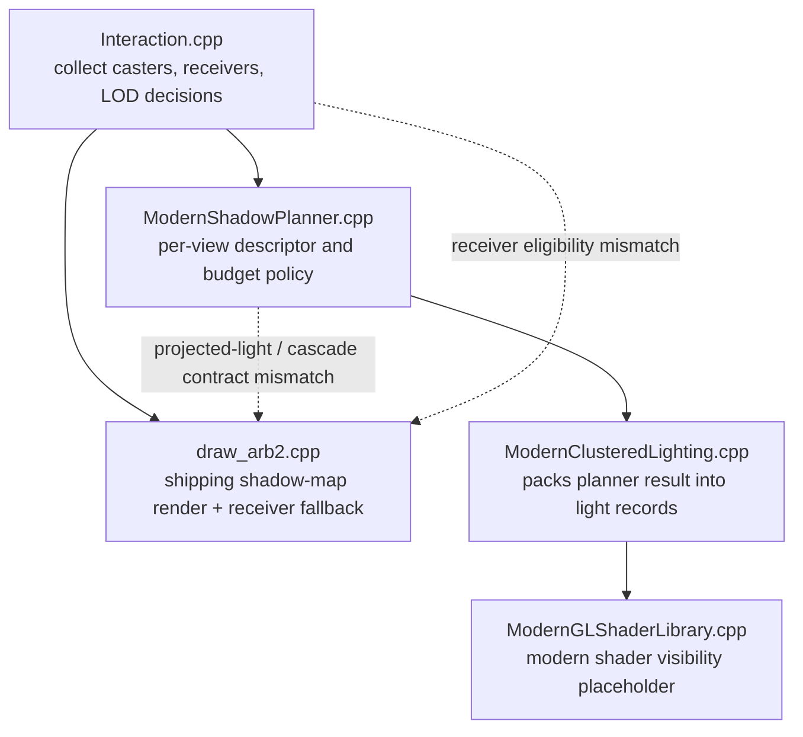
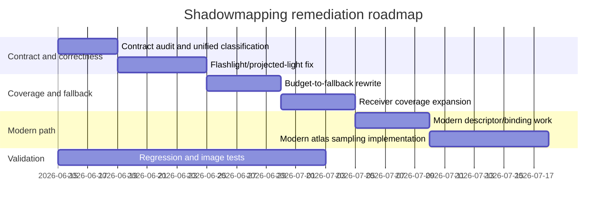

# Shadowmapping Subsystem Review for OpenQ4

## Executive summary

The shadowmapping subsystem in the selected repositories is not a single code path. It is a hybrid system split across: scene-time caster and receiver classification in `Interaction.cpp`; an experimental per-view shadow planner in `ModernShadowPlanner.cpp/.h`; the shipping ARB2 shadow-map renderer and receiver path in `draw_arb2.cpp`; modern clustered/deferred light packing in `ModernClusteredLighting.cpp`; and modern shader-side visibility logic in `ModernGLShaderLibrary.cpp`. The project’s own documentation also frames shadow mapping as experimental, while the ARB2 compatibility bridge remains the default visible shipping path. In the publicly browsable `openQ4-game` tree, I did not find shadowmapping implementation code; the visible `src/renderer` content is header-only, so any gameplay-side flashlight emitter code in that repo is unspecified here. citeturn28view0turn27view0turn11view1turn31view1

The first known issue, that **most shadows are skipped in complex scenes**, has a high-confidence root cause in the planner-driven modern path. `ModernShadowPlanner.cpp` caps mapped lights very aggressively, deriving `maxMappedLights` from `budget.lightBatchTarget / 16` and clamping the result to `1..16`, then budgeting only `tilePixels * maxMappedLights * 2` total shadow pixels. When a candidate light misses that budget, `R_ModernShadowPlanner_SetBudgetMissPolicy()` turns it into `MODERN_SHADOW_POLICY_SKIPPED` whenever `modernReceiverSamplingReady` is false, and `R_ModernShadowPlanner_ModernReceiverSamplingAvailable()` is currently hardcoded to `return false`. In other words, under dense-light scenes, the planner is structurally biased toward “map a few, skip the rest.” citeturn32view0turn34view0turn35view1turn35view3turn36view0

The second known issue, that **flashlight or projected-light shadowing is misaligned or mishandled**, is best explained by a contract mismatch between the planner and the actual ARB2 renderer. The planner marks every non-point light as cascaded whenever `r_shadowMapCSM` is enabled, but the ARB2 path only enables cascades for ordinary projected lights when `r_shadowMapProjectedCSM` is also enabled. The planner also stores the raw `vLight->lightProject[]` planes into `descriptor.shadowMatrix`, whereas the ARB2 renderer builds a different projected-light contract from derived clip planes plus `r_shadowMapProjectionPad` before shading receivers. Those two representations are not equivalent enough to trust interchangeably for projected lights such as flashlights. citeturn36view0turn34view2turn42view1turn42view3turn46view0

There are two additional systemic weaknesses. First, the ARB2 receiver path explicitly excludes custom-GLSL-lit surfaces and generated/skinned character geometry from the mapped receiver path, routing them to fallback handling instead; this is a likely contributor to receiver inconsistency on characters, viewmodels, and special materials. Second, the modern clustered path does not actually sample the shadow atlas yet: `ModernClusterShadowVisibility()` only checks whether a mapped-light descriptor index is valid, and `ModernClusteredLighting.cpp` explicitly suppresses mapped shadow state when modern receiver sampling is unavailable. That means the “modern” path is still structurally incomplete for shadowed lighting. citeturn45view0turn47view0turn47view4

My recommended priority order is: first, unify the projected-light contract between planner and renderer; second, stop budget misses from degenerating into silent skips; third, expand receiver coverage for skinned/custom-lit surfaces; fourth, finish modern atlas sampling; and throughout, add much stronger instrumentation so the planner, ARB2 path, and modern path report the same decisions using the same identifiers. citeturn35view4turn46view6turn44view4

## Code-path analysis

The subsystem currently fans out like this:

The exact files and functions implicated by the available evidence are below.

| Repository | File | Exact functions or code regions implicated | Why it matters |
|---|---|---|---|
| `OpenQ4` | `src/renderer/Interaction.cpp` | `R_ShouldCreateInteractionShadow`, `R_CachedInteractionShadowLODAdmitted`, `R_ShadowMapShaderCanCastOpaque`, `R_ShadowMapShaderCanCastTranslucent`, `R_ClassifyShadowMapCasterReject`, `R_LinkShadowMapCasterSurf`, `R_EnsureShadowMapCasterCaches`, and the caster-linking path around lines `1952..2038` | This file decides whether a surface may cast a mapped shadow, why casters were rejected, whether shadow LOD admitted the interaction, and which chains receive `local/globalShadowMapCasters` and `local/globalTranslucentShadowMapCasters`. It is the front door to shadow coverage. citeturn39view0turn38view0turn38view1turn38view3turn38view4 |
| `OpenQ4` | `src/renderer/ModernShadowPlanner.h` | `modernShadowMapType_t`, `modernShadowPolicy_t`, `modernShadowFallbackReason_t`, `modernShadowLightDescriptor_t`, `modernShadowPlannerStats_t` | This header defines the planner contract: projected vs point vs cascade, mapped vs fallback vs skipped, fallback reasons, atlas rects, clip state, bias state, and planner stats. citeturn18view0turn18view1turn18view2 |
| `OpenQ4` | `src/renderer/ModernShadowPlanner.cpp` | `R_ModernShadowPlanner_ModernReceiverSamplingAvailable`, `R_ModernShadowPlanner_SupportReason`, `R_ModernShadowPlanner_InitDescriptor`, `R_ModernShadowPlanner_FindBestCandidate`, `R_ModernShadowPlanner_SetBudgetMissPolicy`, `R_ModernShadowPlanner_SelectMappedLights`, `R_ModernShadowPlanner_PrepareFrame`, `R_ModernShadowPlanner_PrintGfxInfo`, and `RendererShadowPlanner_RunSelfTest` | This is the planner that budgets mapped lights, decides skip/fallback policy, stores projected-light descriptors, and emits the diagnostic summary that already describes mapped/fallback/skipped counts. It is the main source of the “skip in complex scenes” behavior on the modern path. citeturn34view0turn35view1turn35view3turn35view4turn34view8turn33view6 |
| `OpenQ4` | `src/renderer/draw_arb2.cpp` | `RB_ShadowMapUseCSM`, `RB_ShadowMapCascadeCountForLight`, `RB_ShadowMapBuildProjectedState`, `RB_ShadowMapBuildClipPlanes`, `RB_ShadowMapLightSupportReason`, `RB_SurfaceEligibleForShadowMapReceiver`, `RB_SurfaceNeedsShadowMapReceiverFallback`, receiver fallback and scheduling paths around `8800..8880`, and shadow-map GLSL uniform setup around `7920..8030` | This is the shipping ARB2 shadow-map implementation. It builds projected-light clip state, decides when projected lights use CSM, binds shadow atlas state to the GLSL receiver shader, detects receiver ineligibility, and routes passes to mapped, cache-reuse, receiver-fallback, mask-fail, stencil-only, or scheduled-fallback modes. citeturn42view1turn42view2turn42view3turn42view4turn43view0turn43view1turn43view2turn45view0turn45view1turn45view2 |
| `OpenQ4` | `src/renderer/RenderSystem_init.cpp` | `r_useShadowMap`, `r_shadowMapCSM`, `r_shadowMapProjectedCSM`, `r_shadowMapConservativeCasters`, `r_shadowMapReport`, `r_shadowMapSize`, `r_shadowMapCascadeCount`, `r_shadowMapProjectionPad`, bias/filter CVars | This file contains the shadow-map configuration surface. The projected-light CSM gate is defined here, and it is not honored consistently by the planner. citeturn46view0turn46view2turn46view3turn46view5turn46view6 |
| `OpenQ4` | `src/renderer/ModernClusteredLighting.cpp` | Planner descriptor import around `shadow->descriptorIndex`, `shadow->policy`, `shadow->fallbackReason` and the blocking path for `!shadow->modernReceiverSamplingReady` | This file proves the modern path intentionally drops mapped shadow state when modern receiver sampling is unavailable, replacing it with `MODERN_SHADOW_POLICY_NONE` / `RECEIVER_SAMPLING_UNAVAILABLE`. citeturn47view4 |
| `OpenQ4` | `src/renderer/ModernGLShaderLibrary.cpp` | `ModernClusterShadowVisibility()` | This shader-side function currently turns “mapped” into “descriptor index valid” and otherwise returns `1.0`, which is a placeholder rather than real atlas sampling. citeturn47view0turn47view1turn47view2 |
| `openQ4-game` | `src/renderer/*` and likely gameplay light emitters | Exact shadowmapping implementation files not found in available evidence; possible flashlight/light-authoring files are unspecified | The public tree I could inspect exposed renderer-facing headers under `src/renderer`, while project guidance says canonical SDK-derived game-library source lives in the companion repository. That means gameplay-side flashlight setup may matter, but exact file locations are unspecified from the retrieved evidence. citeturn27view0turn11view1 |

## Findings and behavior gaps

A key architectural point is that **the planner and the ARB2 renderer are not presently expressing the same shadow contract**. The README describes shadow mapping as experimental and specifically says the ARB2 path remains the default compatibility bridge. That matters, because some of the most severe “skip” behavior is planner-driven, while the ARB2 path already tries much harder to reuse cached maps or fall back to stencil and receiver-specific fallback passes. citeturn28view0

The most critical observed gaps are summarized below.

| Shadow case | Current behavior | Expected behavior |
|---|---|---|
| Static opaque world geometry | ARB2 has a real mapped path with projected-light clip-plane construction, atlas state, cascade uniforms, cache reuse, and stencil fallback. The planner, however, may independently report and select only a small mapped subset when the modern path is in play. citeturn42view2turn42view3turn43view0turn45view1turn35view3 | Static opaque receivers should be the baseline “always works” case: mapped when possible, re-used when stable, and downgraded to stencil with no silent disappearance. |
| Skinned meshes and generated character geometry | The ARB2 receiver path rejects surfaces that use generated character geometry, and its receiver-eligibility check also rejects active custom-GLSL lighting. Those surfaces enter receiver fallback instead of the main mapped receiver shader. citeturn45view0 | Skinned and generated geometry should either be supported by the mapped receiver path or receive a visually matched fallback that does not look like a correctness bug. |
| Flashlight and projected lights | The planner treats non-point lights as cascaded whenever `r_shadowMapCSM` is on, but the ARB2 renderer only uses CSM for projected lights if `r_shadowMapProjectedCSM` is enabled. The planner also stores raw `lightProject`, while the ARB2 path derives clip planes with projection padding. citeturn36view0turn34view2turn42view1turn42view3turn46view0 | Projected lights should use one shared classification rule, one shared transform contract, and one shared atlas interpretation across planning, rendering, debugging, and any future modern receiver path. |
| Large complex scenes | The planner computes a small light budget, then on budget miss marks candidates as `BUDGET` and—because modern receiver sampling is hard-disabled—turns those misses into `SKIPPED` rather than actual fallback. citeturn32view0turn34view0turn35view1turn36view0 | Dense scenes should degrade gracefully: cached reuse first, then stencil or receiver fallback, and only true skips for intentionally shadowless or receiverless lights. |
| Modern clustered/deferred path | `ModernClusteredLighting.cpp` deliberately strips mapped shadow state when modern receiver sampling is unavailable, and `ModernClusterShadowVisibility()` only checks descriptor validity instead of sampling a shadow atlas. citeturn47view0turn47view4 | Modern deferred/forward+ should either be explicitly non-owning for shadows or fully own them with descriptor buffers, atlas bindings, and correct projected/point/cascade sampling. |
| Translucent and filtered casters | The engine has explicit translucent shadow-moment support and separate translucent shadow bindings, but this remains experimental and capability-gated. citeturn34view0turn43view1turn46view5 | Translucent shadowing should remain opt-in, but its eligibility, filtering, and fallback behavior should be logged and regression-tested like opaque shadows. |

The highest-confidence explanation for the “complex scenes skip most shadows” report is therefore **not a single rendering bug**. It is a compound policy problem: the planner is budget-limited, fairness-limited, and modern-receiver-limited all at once. The highest-confidence explanation for the flashlight/projected issue is **not yet one proven arithmetic mistake**, but a strong contract mismatch that must be removed before any single projected-light math bug can be isolated cleanly. citeturn35view3turn36view0turn42view1turn42view3turn47view4

## Required improvements and task breakdown

The improvements below are ordered by technical dependency, not by coding convenience.

### Progress checklist

- [x] 1.1 — Shared projected-light classification helper used by ARB2 and the modern shadow planner.
- [x] 1.2 — Shared projected-light clip-plane, cascade, and atlas contract used by ARB2 and the modern shadow planner.
- [x] 1.3 — Descriptor invariants and runtime assertions.
- [x] 1.4 — Planner-vs-ARB2 parity self-test coverage for projected, point, and cascaded lights.
- [x] 2.1 — Per-light-class shadow budget quotas.
- [x] 2.2 — Budget-miss fallback/reuse policy instead of silent skip.
- [x] 2.3 — Fairness aging or round-robin priority.
- [x] 2.4 — Per-light planner throttling history.
- [x] 2.5 — ARB2 cache-reuse ownership/budget integration.
- [x] 3.1 — Reproducible flashlight/projected-light diagnostic scene.
- [x] 3.2 — Consistent `r_shadowMapProjectedCSM` reporting and enforcement.
- [x] 3.3 — Unified projected-light transform math including projection padding.
- [x] 3.4 — Projected sample sign/fallback validation.
- [x] 3.5 — Gameplay-side flashlight and weapon-light audit.
- [x] 4.1 — Skinned/generated receiver coverage or matched fallback.
- [x] 4.2 — Custom-GLSL material receiver compatibility wrapper.
- [x] 4.3 — Perforated/translucent/GUI/subview caster audit.
- [x] 4.4 — Shadow LOD and planner starvation review.
- [x] 5.1 — Modern shadow descriptor buffer.
- [x] 5.2 — Modern shadow atlas and moment texture bindings.
- [x] 5.3 — Modern projected, point, and cascaded shadow lookups.
- [x] 5.4 — Modern receiver fallback semantics.
- [x] 6.1 — Joined per-light shadow decision logs.
- [x] 6.2 — Shadow-map/fallback CPU and GPU timers.
- [x] 6.3 — Shadow debug shader variants.
- [x] 6.4 — Expanded unit, scene, and image regressions.

#### 6.4 progress checklist

- [x] Expand safe shadow planner/selftest coverage so the unit-style matrix catches the current shadow-map contracts.
- [x] Add scene-based shadow image-regression coverage for projected, point, CSM, skinned/character, and alpha-tested/cutout cases.
- [x] Wire the new coverage into repeatable validation commands and reports.
- [x] Run compile, staging, safe selftests, and targeted gameplay image-regression captures.
- [x] Update the 6.4 audit record and release-completion note.

#### Peter-panning mitigation checklist

- [x] Audit ARB2/content GLSL, caster polygon offset, texel-aware receiver bias, and modern clustered receiver bias paths.
- [x] Clamp slope-amplified receiver bias so grazing-angle surfaces cannot expand texel bias into detached shadows.
- [x] Retune default projected, point, texel-aware, and caster-side shadow-map bias values downward.
- [x] Gate modern receiver-plane derivative bias behind the same `r_shadowMapReceiverPlaneBias` policy as the ARB2 path.
- [x] Run compile, shadow planner diagnostics, and targeted gameplay shadow regression validation.

Validation evidence: `tools\build\meson_setup.ps1 compile -C builddir`, `tools\build\meson_setup.ps1 install -C builddir --no-rebuild --skip-subprojects`, `renderer_validation_matrix.py --cases renderer-shadow-planner-selftest,renderer-shadow-projected-diagnostic`, and `renderer_gameplay_benchmark.py --profile shadow-regression` with `r_postAA=0`. The initial cold-cache five-case gameplay run passed projected and point cases while three captures missed their screenshot/benchmark markers during first-use cache generation; rerunning those three with a warm cache and longer settle window passed.

#### 4.3 caster-admission audit record

- Perforated materials remain admitted through the opaque shadow-map caster path. The ARB2 projected and point caster shaders sample active alpha-test stages when they can bind explicit texture coordinates, and diagnostics already count these as `alpha` casters.
- Translucent materials remain excluded from ordinary depth casters and are admitted only through the experimental translucent moment path when `r_shadowMapTranslucentMoments` and the required GLSL/draw-buffer/cube-map capabilities are available. When disabled or unsupported, rejection is reported as `translucentDisabled` or `translucentUnsupported`.
- GUI and subview materials remain deliberately excluded from shadow-map caster admission. They can represent live UI, mirrors, remote cameras, or other view-producing surfaces, so treating them as stable occluders would create feedback and mismatched visibility.
- Dedicated collision-only materials are now named explicitly as `dedicatedCollision` rejections instead of falling into generic material rejection, keeping invisible collision hulls out of mapped shadows while making that policy visible in diagnostics.
- `rendererShadowPlannerSelfTest` now runs a parser-free caster-admission self-test covering null, opaque, perforated, no-shadow, dedicated-collision, GUI, subview, translucent, translucent-GUI, and translucent-subview policies.

#### 4.4 shadow LOD/starvation audit record

- The retail-style `r_lod_shadows` gate remains in force for mapped shadow casters. The change does not override or bypass stock entity `shadowLODDistance`, `suppressLOD`, randomized LOD hold, screen-coverage, or distance behavior.
- Mapped-caster LOD decisions are now counted per light before caster links reach ARB2 or the modern planner. The counters split total LOD tests, total LOD rejections, alpha/perforated rejections, and translucent-moment rejections.
- ARB2 `r_shadowMapReport` summaries and per-light reports now include the mapped-caster LOD tuple, so a dense scene can distinguish material/capability rejection from entity LOD thinning.
- Modern shadow planner descriptors now copy the same LOD counters and aggregate `lodRejectedLights`, `lodRejectedBudgetThrottledLights`, and `lodRejectedUnmappedLights`. This makes the compound starvation case visible when a light loses casters to LOD and then also loses fresh mapped ownership to budget fallback or skipped planning.
- `rendererShadowPlannerSelfTest` now runs a parser-free LOD admission counter self-test and synthetic planner coverage that proves LOD-rejected point-light caster opportunities are reported again when the light is budget-throttled and unmapped.

#### 5.1 modern shadow descriptor buffer audit record

- Modern clustered lighting now preserves planner shadow descriptors in a dedicated per-frame descriptor stream, even when modern receiver sampling remains fail-closed. Clustered light records can still block visible mapped-shadow ownership with `RECEIVER_SAMPLING_UNAVAILABLE`, while the descriptor buffer keeps the original projected/point/cascade map type, policy, fallback reason, compare mode, bias model, atlas layout, tile rectangles, cascades, split depths, and readiness flags for the future sampler path.
- The GL upload path now includes a shadow descriptor buffer beside clustered params, lights, and CSR indices. GL 3.3 uses a bounded UBO-safe descriptor array, while GL 4.3+ can use the larger SSBO path; both routes report descriptor capacity, uploaded count, byte size, and readiness through clustered-light stats and renderer metrics.
- Modern shader cluster declarations now expose a matching `ModernClusterShadowDescriptor` layout and fetch helpers for UBO and SSBO paths. `ModernClusterShadowVisibility()` validates descriptor policy through the new buffer instead of treating `shadowDescriptorIndex` as a standalone placeholder, but it still intentionally returns unshadowed visibility until atlas and moment texture sampling land in 5.2/5.3.
- `rendererClusterGridSelfTest` now proves the blocked-receiver handoff and descriptor-buffer upload can coexist: the packed light remains fail-closed for visible modern shadow sampling, while descriptor index 0 still carries the planner's mapped projected-light metadata and the GL upload reports a ready shadow descriptor buffer.
- Validation passed for `tools\build\meson_setup.ps1 compile -C builddir`, `tools\build\meson_setup.ps1 install -C builddir --no-rebuild --skip-subprojects`, `python tools\tests\renderer_validation_matrix.py --cases renderer-cluster-grid-selftest --timeout 90`, `python tools\tests\renderer_validation_matrix.py --cases renderer-foundation-selftests,renderer-shadow-planner-selftest --timeout 90`, `python tools\tests\renderer_gameplay_benchmark.py --cases shadow-projected-airdefense2 --shadow-presets mapped --tiers auto --sample-msec 1500 --timeout 180`, and `python tools\tests\renderer_gameplay_benchmark.py --cases shadow-character-airdefense2 --shadow-presets csm --tiers auto --sample-msec 1500 --timeout 180`.

#### 5.2 modern shadow atlas and moment texture binding audit record

- ARB2 shadow-map ownership now exposes a read-only per-frame texture binding snapshot for modern consumers. The snapshot reports projected atlas, point atlas, projected translucent moment maps, point translucent moment maps, texture targets, GL handles, readiness, compare/high-precision flags, and translucent moment filter parameters without transferring lifetime or ownership away from the shipping renderer path.
- Modern deferred, clustered forward, alpha-test forward, and transparent forward shader variants now declare the real shadow atlas and moment samplers plus resource, sampler, and moment state uniforms. The shader library reflects those bindings on fixed units 5 through 12, keeps the full contract active across GLSL 3.30 through 4.50, and self-tests the expected sampler/uniform locations before enabling the library.
- The modern GL executor now reserves the fixed shadow sampler range before material texture-table use, binds actual ARB2-owned shadow handles when they are ready, clears sampler-object/compare state for this non-sampling phase, uploads readiness/state vectors, and reports contract-versus-actual readiness through `gfxInfo`, renderer metrics, deferred self-tests, and forward+ self-tests.
- The modern visibility helper remains fail-closed: mapped/cache-reuse policies can see atlas readiness, but actual projected, point, cascade, and translucent shadow comparisons are still deferred to 5.3. This avoids false visual confidence while proving that the texture binding contract is live.
- Validation passed for `tools\build\meson_setup.ps1 compile -C builddir`, `tools\build\meson_setup.ps1 install -C builddir --no-rebuild --skip-subprojects`, `python tools\tests\renderer_validation_matrix.py --cases renderer-deferred-resolve-selftest,renderer-forward-plus-selftest --timeout 120`, `python tools\tests\renderer_validation_matrix.py --cases renderer-foundation-selftests,renderer-cluster-grid-selftest,renderer-shadow-planner-selftest --timeout 120`, `python tools\tests\renderer_gameplay_benchmark.py --cases shadow-projected-airdefense2 --shadow-presets mapped --tiers auto --sample-msec 1500 --timeout 180`, and `python tools\tests\renderer_gameplay_benchmark.py --cases shadow-character-airdefense2 --shadow-presets csm --tiers auto --sample-msec 1500 --timeout 180`.

#### 5.3 modern projected, point, and cascaded lookup audit record

- `ModernClusterShadowVisibility()` now performs real atlas evaluation instead of descriptor-valid placeholder logic. Mapped and cache-reuse lights fetch their shadow descriptor, validate policy/readiness flags, and dispatch to projected/cascade or point lookup paths only when the corresponding atlas resource is actually ready.
- Projected and cascaded modern lookups now use the same receiver-row contract as the ARB2 `shadow_interaction` shader: S/T rows produce projected UV, the depth row produces compare depth, and Q gates invalid projected samples. The descriptor upload stores view-space receiver matrices per cascade, preserving atlas rectangles, split depths, texel-depth bias, cascade bias scale, projection padding, and cascade blending.
- Point-light modern lookups now reconstruct the view-space receiver vector into world-space cube-map direction, compare against the ARB2 point far distance, decode packed RG point-depth maps when high-precision point depth is unavailable, and apply point bias/filter radius from the planner descriptor.
- Modern projected and point translucent moment lookups now sample the ARB2-owned moment maps, use the same normal-CDF moment resolve shape as the shipping GLSL path, and collapse RGB attenuation to a scalar visibility term for the current clustered-light accumulator.

#### 5.4 modern receiver fallback semantics audit record

- Modern receiver sampling availability now reflects the requested modern receiver paths and required GL capabilities instead of being hard-disabled. When the path is available, clustered light records preserve mapped/cache-reuse shadow ownership and set the sampling-ready descriptor flag; when unavailable, the existing `RECEIVER_SAMPLING_UNAVAILABLE` handoff remains fail-closed.
- Modern-visible frame ownership now refuses to replace the legacy visible pass if the planner reports mapped shadow receivers but the fixed shadow texture units, sampler bindings, projected atlas, or point atlas needed by those mapped lights are not ready. Shader-side sampling also fails open per light if a resource becomes unavailable, while pass ownership stays fail-closed for visible handoff.
- Fallback semantics remain explicit rather than hybrid: planner fallback lights, receiver-blocked mapped lights, deferred/forward shadow fallback counts, visible fallback draws, and stencil fallback draws all block modern-visible ownership so ARB2 remains responsible for the visible shadowed frame.
- `rendererClusterGridSelfTest` now accepts both blocked and sampling-ready modern receiver handoffs, validating descriptor-buffer survival in the blocked case and mapped clustered-light ownership in the sampling-ready case.
- Validation passed for `tools\build\meson_setup.ps1 compile -C builddir`, `python tools\tests\renderer_validation_matrix.py --cases renderer-foundation-selftests,renderer-cluster-grid-selftest,renderer-shadow-planner-selftest,renderer-shadow-projected-diagnostic,renderer-deferred-resolve-selftest,renderer-forward-plus-selftest,renderer-modern-visible-selftest --timeout 60`, and `python tools\tests\renderer_gameplay_benchmark.py --cases shadow-projected-airdefense2,shadow-point-storage2,shadow-csm-airdefense1 --shadow-presets mapped,csm --tiers auto --modern-executor --sample-msec 1500 --timeout 180`.

#### 6.1 joined per-light shadow decision logs audit record

- `r_shadowMapReport 2` now emits `SM join` rows keyed by `lightDef` index. Each row joins the planner descriptor decision, budget class/reason mask, caster and receiver counts, atlas tile/cascade layout, LOD tuple, ARB2 pass/result state, receiver fallback breakdown, and modern clustered-light packed policy/shadow descriptor state.
- Light-phase rows are written for both supported and unsupported lights, making policy mismatches visible even when ARB2 never submits a shadow pass. Pass-phase rows are written beside existing `SM pass` rows and include the actual local/global ARB2 pass result.
- The CVar help/comment now names level 2 as joined planner/ARB2/modern decision logging, keeping the console surface aligned with the new report shape.
- Validation passed for `tools\build\meson_setup.ps1 compile -C builddir`, `tools\build\meson_setup.ps1 install -C builddir --no-rebuild --skip-subprojects`, `python tools\tests\renderer_validation_matrix.py --cases renderer-shadow-planner-selftest,renderer-cluster-grid-selftest,renderer-deferred-resolve-selftest,renderer-forward-plus-selftest,renderer-modern-visible-selftest --timeout 60`, `python tools\tests\renderer_gameplay_benchmark.py --cases shadow-projected-airdefense2 --shadow-presets mapped --tiers auto --modern-executor --set-cvar r_shadowMapReport=2 --set-cvar r_shadowMapReportInterval=1 --sample-msec 1000 --timeout 180`, and `python tools\tests\renderer_gameplay_benchmark.py --cases shadow-projected-airdefense2 --shadow-presets mapped --tiers auto --set-cvar r_shadowMapReport=2 --set-cvar r_shadowMapReportInterval=1 --set-cvar r_rendererClusterDebug=1 --set-cvar r_shadowMapPointLights=1 --sample-msec 1000 --timeout 180`. The second gameplay run confirmed joined rows with non-empty `modernPacked(count=1)` descriptors.

#### 6.2 shadow-map/fallback CPU and GPU timers audit record

- `r_shadowMapReport` now emits an `SM timings` row that splits shadow-map work into `map-render`, `cache-reuse`, `mask-pass`, `receiver-fallback`, and `stencil-fallback` phases, with CPU totals, optional `r_shadowMapGpuSyncTimings` totals, nonblocking GPU timer-query totals/samples, and pending query counts reported per phase.
- Nonblocking GL timer-query rows now include `phase=...`, so individual `SM gpu-time` samples can be tied back to map rendering, cache reuse, receiver mask work, receiver fallback draws, or full stencil fallback draws instead of only reporting a coarse light/pass pair.
- Existing coarse render/mask timing totals remain intact for compatibility with the debug overlay and older reports, while the overlay's shadow-map CPU total now includes receiver and stencil fallback timing so fallback-heavy frames are not undercounted.
- Validation passed for `tools\build\meson_setup.ps1 compile -C builddir`, `tools\build\meson_setup.ps1 install -C builddir --no-rebuild --skip-subprojects`, `python tools\tests\renderer_validation_matrix.py --cases renderer-shadow-planner-selftest,renderer-cluster-grid-selftest,renderer-deferred-resolve-selftest,renderer-forward-plus-selftest,renderer-modern-visible-selftest --timeout 60`, `python tools\tests\renderer_gameplay_benchmark.py --cases shadow-projected-airdefense2 --shadow-presets mapped --tiers auto --set-cvar r_shadowMapReport=2 --set-cvar r_shadowMapReportInterval=1 --set-cvar r_shadowMapPointLights=1 --set-cvar r_shadowMapGpuTimerQueries=1 --sample-msec 1000 --timeout 180`, `python tools\tests\renderer_gameplay_benchmark.py --cases shadow-projected-airdefense2 --shadow-presets mapped --tiers auto --set-cvar r_shadowMapReport=2 --set-cvar r_shadowMapReportInterval=1 --set-cvar r_shadowMapPointLights=1 --set-cvar r_shadowMapGpuTimerQueries=1 --set-cvar r_shadowMapMaxUpdatesPerView=1 --sample-msec 1000 --timeout 180`, and `python tools\tests\renderer_gameplay_benchmark.py --cases shadow-projected-airdefense2 --shadow-presets mapped --tiers auto --set-cvar r_shadowMapReport=2 --set-cvar r_shadowMapReportInterval=1 --set-cvar r_shadowMapPointLights=1 --set-cvar r_shadowMapGpuSyncTimings=1 --sample-msec 500 --timeout 180`. The gameplay logs confirmed phase-tagged `map-render`, `mask-pass`, `cache-reuse`, `receiver-fallback`, and budget-forced `stencil-fallback` timer-query samples, plus nonzero sync timing buckets when `r_shadowMapGpuSyncTimings` was enabled.

#### 6.3 shadow debug shader variants audit record

- `r_shadowMapDebugMode` now exposes mode 12 for compare-depth delta, mode 13 for receiver eligibility, and mode 14 for receiver fallback reason, while preserving the existing atlas, projected-depth, cascade, invalid-mask, bias, and caster/receiver bias-off diagnostics.
- The projected and point shadow interaction shaders share the same debug mode numbers. Compare-depth delta disables hardware depth compare so the shader can sample stored depth directly; receiver eligibility and fallback views use a per-surface reason uniform to color stock mapped receivers, wrapped custom-GLSL receivers, invalid fallbacks, custom-GLSL fallbacks, and generated/skinned receiver fallbacks.
- Receiver debug modes admit custom-GLSL and generated/skinned fallback receivers for visualization without broadening the normal stock receiver stage filter for eligible surfaces, keeping the diagnostic pass close to shipping draw behavior.
- The gameplay benchmark shadow preset matrix now includes `debug7`, `debug12`, `debug13`, and `debug14`, so the new shader variants are available through repeatable scene validation instead of manual CVar setup.
- Validation passed for `git diff --check -- src/renderer/draw_arb2.cpp src/renderer/tr_local.h src/renderer/RenderSystem_init.cpp content/baseoq4/pak0/glprogs/shadow_interaction.fs content/baseoq4/pak0/glprogs/shadow_point_interaction.fs tools/tests/renderer_gameplay_benchmark.py`, `tools\build\meson_setup.ps1 compile -C builddir`, `tools\build\meson_setup.ps1 install -C builddir --no-rebuild --skip-subprojects`, `python tools\tests\renderer_validation_matrix.py --cases renderer-shadow-planner-selftest,renderer-cluster-grid-selftest,renderer-deferred-resolve-selftest,renderer-forward-plus-selftest,renderer-modern-visible-selftest --timeout 60`, `python tools\tests\renderer_gameplay_benchmark.py --cases shadow-projected-airdefense2 --shadow-presets debug12,debug13,debug14 --tiers auto --sample-msec 500 --timeout 600`, and `python tools\tests\renderer_gameplay_benchmark.py --cases shadow-point-storage2 --shadow-presets debug12,debug13,debug14 --tiers auto --set-cvar r_shadowMapPointLights=1 --sample-msec 500 --timeout 600`. The gameplay reports captured screenshots and passed 3/3 projected and 3/3 point-light debug cases.

#### 6.4 expanded unit, scene, and image regressions audit record

- `rendererShadowPlannerSelfTest` now emits an explicit `RendererShadowPlanner regression coverage:` row covering projected, point, CSM, projected-CSM-off, budget fallback, cache reuse, fairness, throttle history, caster admission, receiver fallback, LOD, and ARB2 parity checks.
- The safe validation matrix now requires those planner coverage tokens, so the unit-style runner catches accidental loss of the current shadow-map contract instead of only checking for a generic pass line.
- `renderer_gameplay_benchmark.py --profile shadow-regression` is now a bounded five-scene CSM-enabled gameplay capture profile for projected, point, cascaded, character/skinned, and alpha-tested/cutout shadow-map coverage, with point lights and shadow-map reporting enabled by profile defaults.
- Gameplay benchmark reports now include an `Image` column that records TGA reference comparisons when references are supplied, or a screenshot hash when references are not supplied. Per-case harness exceptions are reported as failed rows so interrupted captures still leave a Markdown/JSON artifact when the Python runner remains alive.
- Validation passed for `python -m py_compile tools\tests\renderer_gameplay_benchmark.py tools\tests\renderer_validation_matrix.py`, `git diff --check -- src/renderer/ModernShadowPlanner.cpp tools/tests/renderer_gameplay_benchmark.py tools/tests/renderer_validation_matrix.py docs-dev/plans/2026-06-13-shadowmapping.md`, `tools\build\meson_setup.ps1 compile -C builddir`, `tools\build\meson_setup.ps1 install -C builddir --no-rebuild --skip-subprojects`, `python tools\tests\renderer_validation_matrix.py --cases renderer-shadow-planner-selftest,renderer-shadow-projected-diagnostic --timeout 90`, `python tools\tests\renderer_gameplay_benchmark.py --profile shadow-regression --sample-msec 100 --dry-run --output-dir .tmp\shadow-regression-dryrun`, and `python tools\tests\renderer_gameplay_benchmark.py --profile shadow-regression --sample-msec 500 --timeout 600 --output-dir .tmp\renderer-gameplay\shadow-regression-6.4-foreground`. The foreground gameplay profile passed 5/5 captures and wrote screenshot hashes for all cases.

**Improvement 1 — Unify the projected-light shadow contract across planner and renderer.**

This is the first required fix because the planner and the ARB2 renderer currently disagree on two essential questions: when a projected light becomes cascaded, and how the projected-light transform is represented. Until that is unified, flashlight and projected-light correctness will remain fragile even if individual shader math is adjusted. citeturn36view0turn34view2turn42view1turn42view3turn46view0

| Task | Description | Rationale | Difficulty | Effort | Required code areas or files | Required tests | Potential risks or side-effects |
|---|---|---|---|---|---|---|---|
| 1.1 | Create one shared projected-light classification helper that decides `projected`, `point`, `cascadeCount`, `atlasDiv`, and whether `r_shadowMapProjectedCSM` applies. | The planner currently promotes all non-point lights to `CASCADE` when `r_shadowMapCSM` is on, while ARB2 only cascades projected lights if `r_shadowMapProjectedCSM` is on. | Medium | 6–10 hours | `OpenQ4/src/renderer/ModernShadowPlanner.cpp`, `OpenQ4/src/renderer/draw_arb2.cpp`, shared header unspecified | Unit, integration, regression | Short-term behavior shifts in scenes that accidentally relied on the mismatch. |
| 1.2 | Replace or augment the planner’s raw `shadowMatrix` contract with the same projected-light clip-plane and atlas contract used by ARB2. | The planner stores raw `lightProject`, but ARB2 shades against derived clip planes and projection padding. That is the wrong foundation for future modern receiver work. | High | 12–20 hours | `OpenQ4/src/renderer/ModernShadowPlanner.cpp/.h`, `OpenQ4/src/renderer/draw_arb2.cpp` | Unit, visual, regression | Requires descriptor format changes and may invalidate existing debug overlays or self-tests. |
| 1.3 | Introduce explicit descriptor invariants and runtime assertions: cascade count, atlas tile count, atlas rect bounds, split-depth monotonicity, and projected-light class. | This turns an implicit cross-file contract into something debuggable. | Medium | 4–8 hours | `OpenQ4/src/renderer/ModernShadowPlanner.cpp/.h`, `OpenQ4/src/renderer/draw_arb2.cpp`, `OpenQ4/src/renderer/RendererMetrics.cpp` | Unit, regression | Too-strict assertions may fire on transitional states until all call sites are updated. |
| 1.4 | Extend the existing planner self-test to verify planner-vs-ARB2 parity for projected, point, and cascaded lights. | There is already a planner self-test; it should become a contract test, not just a count test. citeturn17view0turn33view6 | Medium | 8–12 hours | `OpenQ4/src/renderer/ModernShadowPlanner.cpp`, `OpenQ4/src/renderer/draw_arb2.cpp` | Unit, regression | Synthetic tests may be brittle if they assume too much scene construction detail. |

**Improvement 2 — Replace skip-heavy budget policy with graceful degradation.**

The planner’s current budget logic is the main reason complex scenes lose shadow coverage. A system that budgets only a handful of lights and then converts budget misses into skips is not robust enough for dense Quake 4 scenes. citeturn32view0turn35view1turn35view3turn36view0

| Task | Description | Rationale | Difficulty | Effort | Required code areas or files | Required tests | Potential risks or side-effects |
|---|---|---|---|---|---|---|---|
| 2.1 | Rework `R_ModernShadowPlanner_MaxMappedLights()` and `R_ModernShadowPlanner_MaxShadowPixels()` into a per-light-class budget with separate quotas for projected single-tile, projected cascaded, and point lights. | A flat “lightBatchTarget / 16” budget does not reflect the very different cost profiles of 1-tile, 4-tile, and 6-tile lights. | High | 10–16 hours | `OpenQ4/src/renderer/ModernShadowPlanner.cpp`, `OpenQ4/src/renderer/RendererBenchmarks.cpp/.h` | Unit, visual, regression | Tuning errors can create performance spikes unless backed by timing data. |
| 2.2 | On planner budget miss, choose `stencil fallback` or `cache reuse` whenever the renderer has a safe fallback path, and only use `skip` for intentional or receiverless cases. | Right now budget misses become skips because modern receiver sampling is unavailable. That is a policy failure, not a necessary outcome. | High | 8–14 hours | `OpenQ4/src/renderer/ModernShadowPlanner.cpp`, possibly `OpenQ4/src/renderer/draw_arb2.cpp`; shared policy header unspecified | Integration, visual, regression | More stencil fallback increases GPU cost and may expose old stencil artifacts. |
| 2.3 | Add fairness aging or round-robin priority so the same low-priority lights are not perpetually starved. | Static priority based on scissor area and caster/receiver counts can cause starvation in persistent dense scenes. | Medium | 8–12 hours | `OpenQ4/src/renderer/ModernShadowPlanner.cpp` | Unit, regression, visual | Temporal popping if the aging function is too aggressive. |
| 2.4 | Track per-light history for planner throttling reasons, not just aggregate counters. | Aggregate counts are useful, but they do not tell you which lights are being starved frame after frame. | Low | 4–6 hours | `OpenQ4/src/renderer/ModernShadowPlanner.cpp/.h`, `OpenQ4/src/renderer/RendererMetrics.cpp` | Unit, regression | Minor memory growth for debug history buffers. |
| 2.5 | Make planner budgeting aware of ARB2 cache-reuse opportunities, or explicitly isolate the planner from ARB2 ownership if the modern-visible path is disabled. | The present subsystem mixes “planning” and “shipping renderer behavior” in a way that obscures the real fallback/reuse capacity of the engine. | High | 10–18 hours | `OpenQ4/src/renderer/ModernShadowPlanner.cpp`, `OpenQ4/src/renderer/draw_arb2.cpp`, `OpenQ4/src/renderer/RendererBootstrap.cpp` | Integration, regression | If ownership boundaries are not made explicit, debugging becomes harder rather than easier. |

**Improvement 3 — Fix flashlight and projected-light correctness.**

This is the highest-value user-facing correctness pass after contract unification. The current mismatch is sufficient to produce misclassification and is likely also masking one or more concrete projected-light math bugs. citeturn36view0turn34view2turn42view1turn42view2turn42view3

| Task | Description | Rationale | Difficulty | Effort | Required code areas or files | Required tests | Potential risks or side-effects |
|---|---|---|---|---|---|---|---|
| 3.1 | Build a reproducible flashlight/projected-light diagnostic scene and log the same light through planner classification, clip-plane build, atlas rect, cascade count, split depths, and receiver shader inputs. | You need one authoritative projected-light case before touching math. | Low | 4–8 hours | `OpenQ4/src/renderer/ModernShadowPlanner.cpp`, `OpenQ4/src/renderer/draw_arb2.cpp`; test scene content unspecified; `openQ4-game` flashlight setup unspecified | Integration, visual, regression | If the scene is not stable, comparisons across builds become noisy. |
| 3.2 | Apply `r_shadowMapProjectedCSM` consistently everywhere, including planner classification and debug reporting. | The current mismatch is a correctness bug and a debugging trap. | Medium | 4–6 hours | `OpenQ4/src/renderer/ModernShadowPlanner.cpp`, `OpenQ4/src/renderer/RenderSystem_init.cpp`, `OpenQ4/src/renderer/draw_arb2.cpp` | Unit, integration, regression | Existing screenshots or metrics built under the old classification will change. |
| 3.3 | Unify projected-light transform math between planner descriptors and receiver shading, including `r_shadowMapProjectionPad`. | Flashlight-style projectors are especially sensitive to projection-pad and clip-volume semantics. | High | 12–20 hours | `OpenQ4/src/renderer/ModernShadowPlanner.cpp/.h`, `OpenQ4/src/renderer/draw_arb2.cpp` | Visual, regression | Changes can shift penumbra coverage and require retuning bias/filter defaults. |
| 3.4 | Add explicit validation for `q/w` sign consistency, skipped projected samples, and fallback-to-single-cascade cases. | The ARB2 path already reports CSM fallback and skipped `w`; that should become actionable, not just diagnostic. citeturn40view7 | Medium | 6–10 hours | `OpenQ4/src/renderer/draw_arb2.cpp` | Unit, visual, regression | More fallback logging may be noisy until thresholds are tuned. |
| 3.5 | Audit first-person flashlight and weapon-light authoring from gameplay code; if game-side projection setup differs from engine assumptions, normalize it. | Flashlight bugs can originate in the emitted `renderLight_t` or light shader selection, not only in the renderer. Exact GameLibs source location is unspecified from retrieved evidence. | Medium | 6–12 hours | `openQ4-game`: unspecified gameplay/light files; `OpenQ4/src/renderer/*` as validation point | Integration, visual, regression | Game-side normalization may affect scripted light behavior or mod expectations. |

**Improvement 4 — Increase receiver and caster coverage.**

A shadow map that only works on a subset of physically important surfaces will always look unstable, even if the underlying atlas and filter logic are correct. The available evidence shows that skinned/generated character geometry and custom-GLSL-lit materials are not eligible for the primary mapped receiver path. citeturn45view0turn38view4

| Task | Description | Rationale | Difficulty | Effort | Required code areas or files | Required tests | Potential risks or side-effects |
|---|---|---|---|---|---|---|---|
| 4.1 | Support generated character geometry and skinned receivers in the mapped receiver path, or create a matched receiver fallback that preserves mapped-shadow appearance. | Character receivers are a first-order gameplay case; routing them away from the main path creates visible divergence. | High | 12–20 hours | `OpenQ4/src/renderer/draw_arb2.cpp`, potentially `OpenQ4/src/renderer/Interaction.cpp`, vertex-cache helpers unspecified | Integration, visual, regression | Skinning-path changes can expose vertex cache or tangent-space bugs. |
| 4.2 | Add a compatibility wrapper for custom-GLSL-lit materials so they can consume mapped shadows if their lighting model is compatible. | Custom material stages are currently an automatic receiver exclusion. | High | 10–18 hours | `OpenQ4/src/renderer/draw_arb2.cpp`, material-stage helpers in `OpenQ4/src/renderer/Material.cpp/.h`, shader plumbing unspecified | Integration, visual, regression | Custom materials may need opt-in flags to avoid breaking intentionally bespoke lighting. |
| 4.3 | Audit perforated, translucent, GUI, and subview caster admission against project expectations and document deliberate exclusions. | The admission logic is explicit, but some exclusions may be correct while others are just temporary. citeturn38view0turn38view1turn38view2 | Medium | 8–12 hours | `OpenQ4/src/renderer/Interaction.cpp`, `OpenQ4/src/renderer/Material.h/.cpp` | Unit, visual, regression | Relaxing exclusions can increase shadow aliasing or shader cost if done indiscriminately. |
| 4.4 | Revisit shadow LOD for mapped casters in dense scenes, especially its interaction with planner starvation. | Shadow LOD and planner budgeting can compound each other and over-thin shadow coverage. citeturn39view0 | Medium | 6–10 hours | `OpenQ4/src/renderer/Interaction.cpp`, `OpenQ4/src/renderer/ModernShadowPlanner.cpp` | Unit, integration, visual | Overriding retail-like shadow LOD too aggressively may hurt performance on low-end GPUs. |

**Improvement 5 — Finish modern deferred and clustered shadow sampling.**

This is the largest piece of work, but it is required if the modern path is expected to own shadows instead of merely carrying planner metadata. Right now the modern path is intentionally incomplete. citeturn34view0turn47view0turn47view4

| Task | Description | Rationale | Difficulty | Effort | Required code areas or files | Required tests | Potential risks or side-effects |
|---|---|---|---|---|---|---|---|
| 5.1 | Define and upload a real shadow descriptor buffer for modern lights: map type, compare mode, bias model, atlas rects, tile count, splits, and fallback flags. | The modern path cannot sample anything without a stable descriptor layout. | High | 16–24 hours | `OpenQ4/src/renderer/ModernShadowPlanner.h/.cpp`, `OpenQ4/src/renderer/ModernClusteredLighting.cpp`, buffer-binding code unspecified | Unit, integration, regression | Data layout changes will ripple into shaders and debug tools. |
| 5.2 | Bind the actual shadow atlas and moment textures to the modern deferred/forward+ shaders. | `ModernClusterShadowVisibility()` currently only checks descriptor validity. | High | 20–32 hours | `OpenQ4/src/renderer/ModernGLShaderLibrary.cpp`, `OpenQ4/src/renderer/ModernGLExecutor.cpp` or binding code unspecified, `OpenQ4/src/renderer/ModernClusteredLighting.cpp` | Integration, visual, regression | Incorrect bindings will create false confidence because lights still render unshadowed. |
| 5.3 | Implement projected, point, and cascaded shadow lookup functions for the modern shaders, including atlas-rect remap, compare-mode handling, and cascade blending. | This replaces the current placeholder visibility function with real shadow evaluation. | High | 24–40 hours | `OpenQ4/src/renderer/ModernGLShaderLibrary.cpp`, helper headers unspecified | Visual, regression, performance | Shader complexity and bandwidth can rise sharply; performance tuning will be needed. |
| 5.4 | Mirror ARB2 receiver fallback semantics in the modern path, rather than simply stripping mapped shadow state. | The modern path should degrade the same way the shipping path does, or it should stay shadow-non-owning. | High | 8–14 hours | `OpenQ4/src/renderer/ModernClusteredLighting.cpp`, `OpenQ4/src/renderer/ModernGLShaderLibrary.cpp`, ownership code unspecified | Integration, regression | Partial fallback support can create a hybrid state that is harder to reason about than today’s explicit fail-closed design. |

**Improvement 6 — Add instrumentation, profiling, and regression hardening.**

The engine already has some useful counters and reporting, but it still does not provide one unified per-light story across planner, ARB2 scheduling, receiver fallback, and modern light packing. That needs to change before deep tuning work begins. citeturn35view4turn46view6turn44view4turn45view1

| Task | Description | Rationale | Difficulty | Effort | Required code areas or files | Required tests | Potential risks or side-effects |
|---|---|---|---|---|---|---|---|
| 6.1 | Add per-light shadow decision logs keyed by lightDef index: planner class, budget reason, caster counts, receiver counts, atlas tiles, ARB2 pass result, and modern packed policy. | You need one row per light to correlate “skipped”, “fallback”, and “misaligned” reports. | Low | 4–8 hours | `OpenQ4/src/renderer/ModernShadowPlanner.cpp`, `OpenQ4/src/renderer/draw_arb2.cpp`, `OpenQ4/src/renderer/ModernClusteredLighting.cpp` | Regression | Excess logging can perturb frame time if left on in normal play. |
| 6.2 | Add GPU timestamps and CPU timers around map render, cache reuse, mask pass, receiver fallback, and stencil fallback. | Budget tuning without timings is guesswork. | Medium | 6–10 hours | `OpenQ4/src/renderer/draw_arb2.cpp`, GPU timer helpers unspecified | Regression, performance | Query stalls if timings are collected incorrectly. |
| 6.3 | Add shadow debug shader variants: atlas UV view, cascade index view, compare-depth delta, receiver eligibility mask, and fallback reason overlay. | Visual debugging will isolate projected-light alignment problems quickly. | Medium | 8–12 hours | `OpenQ4/src/renderer/draw_arb2.cpp`, GLSL program strings or shader includes unspecified, `OpenQ4/src/renderer/ModernGLShaderLibrary.cpp` | Visual, regression | Too many debug variants can complicate program management and shader reload. |
| 6.4 | Expand automated tests around `RendererShadowPlanner_RunSelfTest()` and add scene-based image regression for projected, point, CSM, skinned, and alpha-tested cases. | The subsystem is broad enough that unit tests alone will miss regressions. | Medium | 12–20 hours | `OpenQ4/src/renderer/ModernShadowPlanner.cpp`, test harness unspecified, scene assets unspecified | Unit, integration, visual, regression | Golden-image tests can be brittle unless tolerances and camera paths are tightly controlled. |

## Debugging, profiling, and validation

The very first debugging pass should be **comparative**, not absolute. For every problematic light, record the planner decision, the ARB2 support reason, the ARB2 pass result, the receiver-fallback decision, and the modern packed shadow policy using the same `lightDef->index`. The code already has many of the ingredients: planner summaries and counts, explicit caster-reject reasons in `Interaction.cpp`, ARB2 support and pass reporting, and receiver-fallback counters. What is missing is a single per-light joined record. citeturn38view1turn35view4turn44view3turn44view4

For day-one instrumentation, I would add these logs and counters:

- A planner log row that prints: `lightDef index`, `mapType`, `policy`, `fallbackReason`, `priority`, `tileCount`, `cascadeCount`, `estimatedPixels`, `receiverCount`, `casterCount`, `modernReceiverSamplingReady`.
- An ARB2 row that prints: `supportReason`, `schedule.action`, `passResult`, `cacheReuse`, `receiverFallback`, `drawnCasterCount`, `atlasDiv`, `tileSize`, `projectionPad`, `cascadeCount`.
- A join check that flags any light for which planner classification and ARB2 classification differ, especially projected-vs-cascade mismatches.
- Separate counters for “receiver ineligible because custom GLSL” and “receiver ineligible because generated/skinned geometry”, since those are currently rolled into general receiver fallback. citeturn36view0turn42view1turn45view0

For RenderDoc capture strategy, the most valuable captures are not “full frame” captures first. They are **single-light captures** taken at three points: just after projected-light state build, just after shadow map rendering into the atlas, and just before the first receiver draw for a known affected light. For the flashlight issue, capture a frame with `r_shadowMapCSM = 1`, once with `r_shadowMapProjectedCSM = 0` and once with it set to `1`, and diff the following values: clip planes, atlas rects, split depths, bias arrays, and receiver shader uniforms. That directly tests the current contract mismatch. citeturn42view1turn42view2turn42view3turn43view0turn43view1

The most useful debug shader variants are these:

- **Projected UV / Q visualization** for projected lights, showing post-projection UV and whether `q` is positive.
- **Cascade index visualization** coloring each receiver by selected cascade.
- **Depth delta visualization** showing receiver compare depth minus sampled shadow depth.
- **Receiver eligibility visualization** showing mapped receivers, receiver-fallback receivers, custom-GLSL exclusions, and generated/skinned exclusions.
- **Atlas tile visualization** that outlines the tile used by each projected or point light.

These should exist in both the ARB2 path and the future modern path so the two systems can be compared side by side. citeturn45view0turn43view2turn47view0

The recommended visual test matrix is as follows.

| Test case | What it isolates | Expected pass condition |
|---|---|---|
| Static corridor with one projected spotlight and one moving opaque blocker | Baseline projected-light alignment | Shadow edge stays locked to blocker and projection cone; no UV swim or atlas-rect drift. |
| Same corridor with `r_shadowMapCSM=1`, `r_shadowMapProjectedCSM=0` and then `1` | Contract mismatch between planner and ARB2 | Enabling projected CSM should intentionally change cascade use; disabling it should force consistent single-cascade behavior everywhere. |
| Large arena with 12–24 shadow-casting dynamic lights | Complex-scene starvation | Coverage degrades via reuse/fallback, not permanent skip of the same lights. |
| Character crossing flashlight beam | Receiver coverage for skinned/generated geometry | Character remains shadowed in a way that matches nearby static geometry, or clearly enters a matched fallback mode. |
| Alpha-tested fence or grate in spotlight | Perforated caster admission and filtering | Fence casts stable filtered shadows without disappearing or incorrectly solidifying. |
| Translucent caster scene with moments enabled | Experimental translucent path | Translucent attenuation is stable, capability-gated, and clearly reported. |

For automated regression, I would extend the existing planner self-test and add scene-based image regression. The current self-test already checks for mapped lights, skipped lights, cascades, guarded receivers, and blocked modern receiver sampling; that provides a good seed. Add contract assertions for projected-light cascade eligibility and one image-diff harness for a fixed spotlight scene, a fixed point-light scene, and a fixed large-light-count scene. citeturn33view6turn17view0

## Prioritized implementation roadmap

The fastest route to visible improvement is to separate **shipping-path correctness** from **full modern-path completion**. If you only want the default ARB2 path to stop mishandling projected lights and to degrade gracefully in heavy scenes, you can get a meaningful result much sooner than a full modern deferred/forward+ shadow completion.

A practical milestone plan looks like this:

| Milestone | Scope | Estimated elapsed timeline | Estimated developer-hours |
|---|---|---:|---:|
| **Milestone A** | Unified projected-light classification, planner/ARB2 parity checks, flashlight repro scene, instrumentation join logs | ~1 week | 20–32 |
| **Milestone B** | Projected-light transform fix, `r_shadowMapProjectedCSM` parity, receiver-fallback reporting cleanup | ~1–1.5 weeks | 24–40 |
| **Milestone C** | Budget policy rewrite, fairness, graceful fallback for complex scenes, receiver eligibility work for skinned/custom-lit cases | ~1.5–2 weeks | 32–52 |
| **Milestone D** | Modern deferred/clustered atlas sampling, descriptor binding, image regression suite | ~2–3 weeks | 60–96 |

If the goal is **“fix the visible user bugs in the default renderer first”**, I would stop after Milestone C, then only proceed to Milestone D if the modern path is intended to become a supported shadow owner. That is because the modern path is not just buggy; it is intentionally incomplete today. citeturn28view0turn34view0turn47view0turn47view4

## References and limitations

The project’s own material establishes both the intent and the current boundaries of the subsystem: shadow mapping is experimental in openQ4; projected and point lights, projected-light CSM, alpha-tested casters, and translucent shadow accumulation exist, but the ARB2 bridge remains the default visible path. citeturn28view0turn0search17

For external grounding, the subsystem’s required fixes map cleanly onto standard shadowmapping literature. Williams’ original 1978 paper is the baseline reference for shadow maps themselves. Variance Shadow Maps are still the core reference for filterable shadow distributions. Moment Shadow Mapping is the relevant reference for the engine’s experimental translucent moment path and for any future high-quality filtered extension. For API behavior, OpenGL texture comparison mode is the key reference when deciding between hardware depth compare and manual compare paths. citeturn48search0turn48search21turn48search2turn48search18turn48search19

The main limitation of this report is that I did **not** retrieve exact gameplay-side flashlight emitter files from `openQ4-game`. The public evidence I could inspect supports the conclusion that shadowmapping implementation is engine-side in `OpenQ4`, while any GameLibs-side flashlight authoring or `renderLight_t` setup that may contribute to projected-light bugs remains unspecified here. A second limitation is that I can identify the projected-light contract mismatch with high confidence, but I cannot, from static browsing alone, prove the single exact arithmetic step causing the observed flashlight misalignment without the recommended comparative capture and instrumentation pass. citeturn27view0turn11view1turn36view0turn42view3
