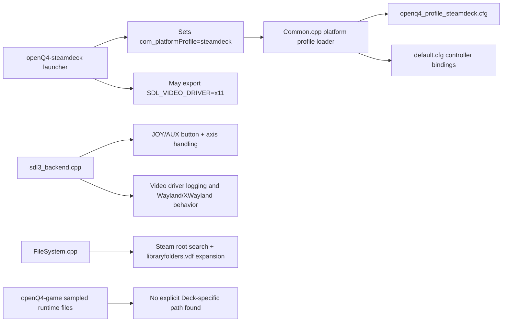

# Steam Deck Implementation Review of OpenQ4

## Executive summary

The current Steam Deck implementation in **OpenQ4** is real, but it is narrow in scope: it is centered on a dedicated Linux launcher, a small `steamdeck` platform profile, stock controller bindings, and Steam library auto-discovery. The implementation is **not** based on automatic hardware detection, and the project’s own Steam Deck documentation says so explicitly. In practice, Deck behavior currently depends on launching `openQ4-steamdeck`, which injects `+set com_platformProfile steamdeck`, and on a launcher policy that forces X11/XWayland when both Wayland and X11 session variables are present. The platform support docs also describe Steam Deck support as assuming a SteamOS 3.x-style environment and the explicit Deck launcher. citeturn50view0turn50view6turn29view0turn28view6turn35view0turn35view1

Across the code and docs I reviewed, the Steam Deck path is concentrated in **OpenQ4** engine/content/docs rather than **openQ4-game**. In sampled GameLibs runtime files, I did not identify explicit Steam Deck code or explicit consumption of the Deck-profile tuning cvars; the only clearly Deck-oriented references I found in the overall implementation surface live in the engine-side launcher/profile/bindings/backend/docs. The GameLibs repository itself is also described as gameplay-library source rather than the engine executable. citeturn39view0turn45view0turn45view1turn45view2turn45view3turn45view6turn45view7turn45view8turn45view9

I found **six high-confidence engineering issues** in the Steam Deck implementation: reliance on a manual launcher instead of automatic Deck detection; lack of native gyro, gamepad touchpad, and touchscreen support in the SDL3 backend; no suspend/resume lifecycle handling; a default policy that forces XWayland in mixed sessions; Steam installation discovery that is more home-directory-centric than it needs to be; and no Deck-specific performance, battery, or adaptive refresh policy despite Valve explicitly recommending FPS limiting for battery life and SDL3 exposing gamepad battery/sensor/touchpad APIs. citeturn50view0turn29view0turn49view2turn49view3turn48view0turn21view2turn21view3turn24view17turn24view18turn49view0

The top action items are straightforward. First, add a **native Deck input path** for gyro, touchpad, and direct touch APIs. Second, add **lifecycle handling** for suspend/resume and focus/background transitions. Third, remove the unconditional **XWayland bias** or at least make it a fallback instead of the default. Fourth, harden **Steam path discovery** and add explicit environment overrides. Fifth, add **Deck-aware performance defaults** so first launch is battery-safe and frame-paced without depending entirely on external SteamOS controls. Valve’s own FAQ is aligned with these priorities: it recommends FPS limits for battery life, notes suspend/resume save concerns, documents touch API pass-through for multi-touch, and recommends considering gyro/trackpad-oriented control schemes for camera-controlled games. citeturn49view3turn49view0turn49view2

## Scope and implementation surface

This review is based on direct inspection of the two specified GitHub repositories and on primary official documentation from Valve, SDL, and Proton. In **OpenQ4**, the key Steam Deck surfaces are `docs-user/steam-deck.md`, `docs-user/input-settings.md`, `content/baseoq4/pak0/default.cfg`, `content/baseoq4/pak0/openq4_profile_steamdeck.cfg`, `assets/linux/openQ4-steamdeck.in`, `src/framework/Common.cpp`, `src/framework/FileSystem.cpp`, and `src/sys/sdl3/sdl3_backend.cpp`. In **openQ4-game**, I sampled the repo structure and likely gameplay runtime files to check whether Deck-specific behavior had been pushed into gameplay code; I did not find evidence that it had. citeturn50view0turn30view6turn30view7turn31view0turn31view4turn29view0turn35view0turn35view1turn22view3turn22view4turn23view6turn22view0turn22view2turn39view0turn42view0turn42view1turn45view0turn45view1turn45view2turn45view3turn45view6turn45view7turn45view8turn45view9

The current implementation shape can be summarized like this. The **launcher** chooses environment defaults and injects the platform profile. The **engine** recognizes `com_platformProfile` and maps the only non-default profile name it accepts to `openq4_profile_steamdeck.cfg`. The **content config** supplies Deck-oriented default binds and a tiny profile override. The **SDL3 backend** is responsible for controller/joystick input, display environment reporting, and most platform-facing behavior. The **filesystem layer** tries to discover Quake 4 assets from native Steam roots and `libraryfolders.vdf`. I found no Vulkan-specific Deck path in the reviewed backend; the Deck path is implemented as SDL3 plus OpenGL-centric behavior, and the docs explicitly talk about Wayland-first OpenGL fallback ordering rather than Vulkan. citeturn29view0turn35view0turn35view1turn33view0turn31view0turn31view4turn22view0turn22view2turn22view3turn22view4turn23view6turn25view6turn24view12



## Priority and module matrix

The matrices below synthesize the issue set from the inspected launcher, profile, docs, input backend, and filesystem code, cross-checked against Valve’s Steam Deck guidance and SDL3’s available APIs. citeturn50view0turn29view0turn35view1turn22view3turn22view0turn49view2turn49view3turn48view0turn49view0

| Issue | Priority | Primary module | Why it matters on Steam Deck |
|---|---|---|---|
| Launcher-only activation and no automatic Deck detection | P1 | launcher, startup/profile loading | Easy to bypass accidentally; generic client path loses Deck-specific behavior |
| No native gyro, touchpad, or touchscreen path | P1 | SDL3 input backend, stock binds | Leaves major Deck inputs unused or mouse-emulated |
| No suspend/resume lifecycle handling | P1 | SDL3 platform lifecycle, save/config flow | Handheld sleep/wake is a first-class Deck behavior |
| Forced XWayland default in mixed sessions | P1 | launcher, SDL3 video path | Blocks native Wayland by default and raises display-stack risk |
| Steam library discovery is too brittle | P2 | filesystem discovery | Can fail on nonstandard Steam roots or Deck-adjacent setups |
| No Deck-specific performance, battery, or adaptive refresh policy | P2 | profile, startup defaults, SDL3 power/display APIs | First launch is not battery-aware or refresh-aware |

| Module | Current Steam Deck role | Issues touching it |
|---|---|---|
| `assets/linux/openQ4-steamdeck.in` | Entry-point policy and environment shaping | Launcher-only activation, forced XWayland |
| `src/framework/Common.cpp` | Profile selection and loading | Launcher-only activation, missing adaptive defaults |
| `content/baseoq4/pak0/default.cfg` | Stock gamepad/Deck-adjacent bindings | Missing native gyro/touchpad path |
| `content/baseoq4/pak0/openq4_profile_steamdeck.cfg` | Minimal Deck profile | Missing adaptive defaults |
| `src/sys/sdl3/sdl3_backend.cpp` | Input, lifecycle-adjacent platform behavior, video driver reporting | Missing native Deck inputs, missing suspend/resume, no power integration, Wayland/XWayland policy effects |
| `src/framework/FileSystem.cpp` | Native Steam asset discovery | Brittle Steam root discovery |
| `openQ4-game` sampled runtime files | No explicit Deck-specific implementation found in this review | Not directly implicated by the six issues |

## Implementation checklist

Status for the active implementation pass on June 13, 2026:

- [x] P1: Auto-select the Steam Deck profile for direct Deck/SteamOS launches when `com_platformProfile` is still `default`.
- [x] P1: Add native SDL3 gyro, gamepad touchpad, and touchscreen input routing.
- [x] P1: Handle SDL3 background/foreground lifecycle events for suspend/resume-style input and config recovery.
- [x] P1: Make native Wayland the default launcher path and keep XWayland behind `OPENQ4_FORCE_X11=1`.
- [x] P2: Add deterministic Steam install discovery overrides and XDG-aware Steam roots.
- [x] P2: Log Steam discovery candidate roots clearly enough for Deck QA and support.
- [x] P2: Add Deck-aware first-run frame-cap defaults that preserve explicit user settings.
- [x] P2: Add optional battery-aware controller rumble scaling without overriding explicit user tuning.
- [x] P2: Update user documentation and release-candidate notes for the new behavior.
- [x] P2: Run formatting/build validation.
- [x] P3: Add an SDL3 controller/Deck diagnostics console command for support logs.
- [x] P3: Document Steam Input pass-through and Steamworks partner configuration expectations.
- [x] P3: Add a Steam Deck QA checklist that covers launch, input, suspend/resume, display, asset discovery, and performance paths.
- [x] P3: Update user documentation and release-candidate notes for diagnostics and QA.
- [x] P3: Run formatting/build validation.
- [x] P4: Expose Deck-native gyro, touchpad, touchscreen, and low-battery rumble controls in Settings -> Game Options -> Controller.
- [x] P4: Add localized UI strings and settings-registry coverage for the new controller rows.
- [x] P4: Update Game Options scroll bounds and section jumps for the expanded Controller section.
- [x] P4: Update user documentation and release-candidate notes for the in-game Deck controls.
- [x] P4: Run settings coverage, formatting, and build validation.
- [x] P5: Add source-level Steam Deck regression coverage for launcher/profile activation, Steam discovery, SDL3 input/lifecycle/performance paths, menu rows, and documentation.
- [x] P5: Wire the Steam Deck regression coverage into local validation and CI smoke workflows.
- [x] P5: Update release-candidate notes for Steam Deck validation hardening.
- [x] P5: Run Steam Deck support coverage, settings coverage, formatting, and build validation.
- [x] P6: Update packaged and getting-started Steam Deck guidance for direct-launch auto-profile fallback, native Wayland default, XWayland fallback, diagnostics, and in-game controls.
- [x] P6: Add staged/package validation for the generated Steam Deck launcher contract.
- [x] P6: Extend Steam Deck support coverage to lock package docs and launcher metadata validation.
- [x] P6: Update release-candidate notes for Steam Deck package guidance and launcher validation.
- [x] P6: Run Steam Deck support coverage, Python validation, formatting, and build validation.

## Completion audit

Implementation status as of June 13, 2026:

- Implementation checklist: 29 / 29 complete (100%).
- Priority rounds: P1 through P6 complete.
- Original engineering issues addressed in source/docs/tests: 6 / 6.
- Automated validation status: passing for `steam_deck_support.py`, `settings_menu_coverage.py`, `openq4_validate.py push --skip-build`, `git diff --check`, and `tools/build/meson_setup.ps1 compile`.
- Hardware QA status: 0 / 45 checked in `docs-dev/steam-deck-qa.md`; this remains a separate live-device sign-off task, not an implementation blocker.

The detailed findings below are retained as the original review record. The checklist and audit above are the current implementation status.

## Detailed findings

Before the issue-by-issue analysis, one overarching point matters: in the sampled **openQ4-game** runtime files I reviewed, I did not find a Deck-specific implementation surface comparable to what exists in the engine repo. That means the fixes below should be treated primarily as **OpenQ4 engine/content/packaging work**, not gameplay-library work, unless later full-repo grep reveals otherwise. citeturn39view0turn45view0turn45view1turn45view2turn45view3turn45view6turn45view7turn45view8turn45view9

**Issue — Launcher-only activation and no automatic Deck detection**

**Description.** Steam Deck support is explicitly documented as launcher-driven rather than hardware-detected. The docs say to use `openQ4-steamdeck`, state that the launcher adds `+set com_platformProfile steamdeck`, and explicitly note that Steam Deck support is “explicit launcher/profile behavior, not automatic hardware detection.” In the engine, `com_platformProfile` defaults to `"default"`, and the platform-profile loader only maps the special profile name `steamdeck` to `openq4_profile_steamdeck.cfg`. citeturn50view0turn50view6turn29view0turn35view0turn35view1

**Root cause analysis.** The implementation treats Steam Deck as a packaging/launcher concern instead of a runtime platform capability concern. That is simple and low-risk, but it means every launch path that bypasses the wrapper also bypasses the Deck behavior. This is especially brittle for expert users, custom Steam launch options, direct binary invocation, alternate desktop entries, and test automation. citeturn50view0turn29view0turn35view1

**Severity and priority.** **High, P1.** The game still runs, but the Deck-specific behavior is easy to lose by accident, which makes bug reproduction and support harder than it needs to be. citeturn50view0turn29view0turn28view6

**Code locations.** `assets/linux/openQ4-steamdeck.in` (single-line launcher file in the current repo revision), `docs-user/steam-deck.md:L248-L253,L295-L296`, `src/framework/Common.cpp:L2390-L2390,L3021-L3059`. citeturn29view0turn50view0turn35view0turn35view1

**Reproduction steps.** On a Steam Deck or SteamOS 3.x desktop session, launch `openQ4-client_x64` directly instead of `openQ4-steamdeck`; inspect startup behavior and note that the documented Deck profile injection path is skipped. Then repeat with `openQ4-steamdeck` and compare config/profile behavior. citeturn50view0turn29view0

**Proposed fix.** Keep the launcher, but add a runtime fallback so the engine can self-select the Deck profile when the user did not already choose one. The safest version is opt-in-and-reversible: only auto-select on a strong Deck signal and only when the current profile is still `"default"`.

```cpp
// Common.cpp pseudocode
static bool Sys_LooksLikeSteamDeck() {
    // Prefer a strong signal; examples:
    // - SteamOS/Deck-specific packaging marker installed with the app
    // - explicit env from the launcher / Steam launch option
    // - platform-specific probe implemented behind Linux-only code
    return getenv("OPENQ4_AUTODETECT_STEAMDECK") != nullptr;
}

if (idStr::Icmp(com_platformProfile.GetString(), "default") == 0 && Sys_LooksLikeSteamDeck()) {
    common->Printf("Auto-selecting steamdeck platform profile.\n");
    cvarSystem->SetCVarString("com_platformProfile", "steamdeck", CVAR_INIT);
}
```

A more conservative packaging-only fix is to make every Deck-targeted desktop/Steam entry point call the wrapper, never the raw client binary. That is lower risk, but it does not solve direct invocation.

**Testing on Steam Deck.** Verify four launch paths: Steam shortcut, desktop file, direct shell invocation of `openQ4-client_x64`, and direct shell invocation of `openQ4-steamdeck`. In three of the four, the profile should be selected automatically or by wrapper; in the raw-client path, confirm the new fallback activates only when the platform signal is present. Quit and relaunch to confirm that archived config remains stable. citeturn50view0turn29view0turn35view1

**Backward-compatibility and platform risk.** The main risk is false-positive hardware detection on non-Deck Linux handhelds or 1280×800 desktops. That is why I recommend a strong explicit signal or packaging marker, not naive display-resolution heuristics.

**Issue — No native gyro, touchpad, or touchscreen path**

**Description.** The SDL3 backend exposes generic joystick/gamepad state and maps raw buttons into `JOY1..JOY32` plus `AUX1..AUX16`, and the stock config binds Deck-adjacent buttons such as `JOY18` and `JOY19..JOY22`. But I found no use of SDL3’s gamepad touchpad APIs, sensor APIs, or touch events in the backend during this review, and the Deck docs themselves do not mention gyro or direct touch handling. Valve explicitly recommends considering gyro-plus-stick/trackpad control schemes for camera games, and Valve’s Deck FAQ also says touch defaults to mouse emulation unless touch API pass-through is configured; SDL3 exposes gamepad touchpad, sensor, and battery APIs directly. citeturn22view0turn26view1turn27view0turn37view6turn37view8turn31view0turn50view0turn50view2turn50view3turn49view2turn48view0turn48view1turn21view2turn21view3turn24view17turn24view18turn24view2turn24view3

**Root cause analysis.** The implementation stops at a practical “classic controller plus extra buttons” layer. That gets the Deck working as a gamepad, but it leaves most of the Deck-specific input value on the table. The docs even frame `JOY18` as “touchpad objectives where available,” which is a slash-through of the Deck touch surface into a single bindable button instead of a native pointing or sensor-capable input source. citeturn31view0turn50view0turn30view7turn48view0turn49view2

**Severity and priority.** **High, P1.** This is not a launch blocker, but it is the biggest functional gap relative to what Steam Deck hardware and SDL3 can do. citeturn49view2turn48view0

**Code locations.** `src/sys/sdl3/sdl3_backend.cpp:L2439-L2488,L3746-L3871`, `content/baseoq4/pak0/default.cfg:L645-L706`, `docs-user/steam-deck.md:L254-L283`, `docs-user/input-settings.md:L317-L325,L395-L408,L462-L480`. citeturn22view0turn26view1turn37view0turn37view5turn37view6turn31view0turn31view3turn50view0turn30view6turn30view7

**Reproduction steps.** On Steam Deck, disable any Steam Input configuration that translates gyro or touchpad into plain mouse/keyboard emulation, or create a pass-through profile. Then test three cases: gyro aiming, a touchpad swipe/cursor gesture, and multi-touch on UI surfaces. In the current implementation, the input path is expected to degrade to generic button/axis behavior or Steam-level mouse emulation instead of native engine semantics. Valve’s FAQ is the reference for why this matters: touch defaults to mouse behavior unless touch API pass-through is enabled, and gyro/trackpad-oriented schemes are recommended for camera control where appropriate. citeturn49view2

**Proposed fix.** Add native Deck-capable input support into the SDL3 backend. This should be engine-level and optional, not Steam-Input-hostile.

```cpp
// sdl3_backend.cpp pseudocode
static idCVar in_gyro("in_gyro", "1", CVAR_SYSTEM | CVAR_ARCHIVE | CVAR_BOOL, "enable gyro aim");
static idCVar in_gyroSensitivity("in_gyroSensitivity", "1.0", CVAR_SYSTEM | CVAR_ARCHIVE | CVAR_FLOAT, "gyro sensitivity");
static idCVar in_touchpadMode("in_touchpadMode", "1", CVAR_SYSTEM | CVAR_ARCHIVE | CVAR_INTEGER,
                              "0=off, 1=UI cursor, 2=look, 3=bind-only");

void SDL3_OpenDeckCapabilities(SDL_Gamepad* pad) {
    if (SDL_GamepadHasSensor(pad, SDL_SENSOR_GYRO)) {
        SDL_SetGamepadSensorEnabled(pad, SDL_SENSOR_GYRO, in_gyro.GetBool());
    }
}

void SDL3_HandleEvent(const SDL_Event& ev) {
    switch (ev.type) {
        case SDL_EVENT_GAMEPAD_SENSOR_UPDATE:
            // convert gyro angular velocity to view delta
            break;
        case SDL_EVENT_GAMEPAD_TOUCHPAD_DOWN:
        case SDL_EVENT_GAMEPAD_TOUCHPAD_MOTION:
        case SDL_EVENT_GAMEPAD_TOUCHPAD_UP:
            // UI cursor or camera/look mapping, depending on mode
            break;
        case SDL_EVENT_FINGER_DOWN:
        case SDL_EVENT_FINGER_MOTION:
        case SDL_EVENT_FINGER_UP:
            // direct touchscreen routing for UI when touch API pass-through is enabled
            break;
    }
}
```

Also add a **Steam shipping checklist** item: provide a Steam Input config that exposes gyro and touchpad meaningfully, and if UI truly supports multi-touch, enable Valve’s **Touch API Pass-through** option on the Steam partner side. citeturn49view2turn48view0turn48view1

**Testing on Steam Deck.** Test with Steam Input pass-through and with a custom Steam Input profile. Verify: gyro can aim without large drift; touchpad motion is consumed natively when configured; touch still works in menus without regressing mouse emulation; rear paddles remain bindable; and ordinary Xbox/PS-compatible gamepads still work exactly as before. citeturn49view2turn48view0

**Backward-compatibility and platform risk.** Adding native Deck input can conflict with aggressive Steam Input remapping if both are active at once. The fix should therefore ship with clear cvars and auto-detection logs so users can tell whether they are in pass-through mode or emulation mode.

**Issue — No suspend/resume lifecycle handling**

**Description.** Valve’s official Steam Deck FAQ says there is nothing unique developers must do for Deck suspend/resume at the platform level, but it also explicitly warns that the Deck disconnects from Wi‑Fi while suspended and recommends backing up save files before suspension. In the OpenQ4 SDL3 backend review, I found no suspend/resume handlers, no lifecycle-specific callbacks, and no targeted background/foreground handling in the Deck path. SDL3 explicitly exposes application background/foreground events that are meant to be handled through an event watch callback. citeturn49view0turn21view7turn21view8turn24view0turn49view8

**Root cause analysis.** The implementation treats Steam Deck like a Linux desktop with a better launcher, not like a handheld that is routinely paused by suspending the entire device. That leaves save flushing, device reacquisition, relative-input restoration, and network recovery to generic behavior. citeturn49view0turn49view8

**Severity and priority.** **High, P1.** This is a lifecycle reliability problem, not just a UX nicety. Handheld sleep/wake is normal on Deck. citeturn49view0

**Code locations.** I found no matching suspend/resume or background/foreground handling in `src/sys/sdl3/sdl3_backend.cpp` during this review; the absence itself is the finding. Relevant lifecycle entry points should live in that file, because it is the SDL3 platform backend. Official SDL3 lifecycle events are documented in `SDL_EventType`. citeturn21view7turn21view8turn24view0turn49view8

**Reproduction steps.** With a live single-player session, suspend the Deck from gameplay, wait long enough to ensure Wi‑Fi disconnect and controller/state loss are plausible, then resume. Repeat during a level transition and again while in the UI. Watch for stale input capture, lost network state, missing save/config flushes, or audio/input not fully reinitializing. Valve’s FAQ is the baseline expectation here. citeturn49view0

**Proposed fix.** Add lifecycle hooks in the SDL3 backend and route them into common save/config/input recovery points.

```cpp
// sdl3_backend.cpp pseudocode
static bool SDL3_AppEventWatch(void* userdata, SDL_Event* ev) {
    switch (ev->type) {
        case SDL_EVENT_WILL_ENTER_BACKGROUND:
            common->Printf("SDL3: entering background, flushing config/save state.\n");
            session->AutoSaveIfSafe();
            common->WriteConfiguration();
            Sys_ReleaseRelativePointerIfCaptured();
            break;

        case SDL_EVENT_DID_ENTER_FOREGROUND:
            common->Printf("SDL3: returned to foreground, reacquiring input.\n");
            Sys_ReacquireRelativePointerIfNeeded();
            SDL3_ReopenGamepadIfNeeded();
            break;
    }
    return 1;
}

// startup
SDL_AddEventWatch(SDL3_AppEventWatch, nullptr);
```

If the engine lacks a safe autosave hook that can be called from here, at minimum flush config and other durable state, and gate gameplay autosave behind “safe point” checks. That is still materially better than doing nothing.

**Testing on Steam Deck.** Test single-player save integrity, controller reacquisition, guide/menu reopening, mouse-relative look, and network behavior after suspend/resume. Perform at least three scenarios: in-level idle, mid-combat, and during async loading. Verify no duplicate input events or broken rumble state after wake. citeturn49view0turn49view8

**Backward-compatibility and platform risk.** The main risk is calling heavyweight save logic at unsafe times. The fix should therefore separate “always safe” config/state flushes from “gameplay autosave if safe” logic.

**Issue — Forced XWayland default in mixed sessions**

**Description.** The Deck launcher exports `SDL_VIDEO_DRIVER=x11` and `SDL_VIDEODRIVER=x11` whenever both Wayland and X11 session variables are present and neither SDL video variable is already set. The docs say this is done so “Steam Deck sessions prefer XWayland for now.” Meanwhile, the SDL3 backend already logs native Wayland and XWayland states distinctly and explicitly says that native Wayland enables “Wayland-first OpenGL fallback ordering,” while X11-in-Wayland is logged as XWayland. citeturn29view0turn50view0turn22view2turn21view14

**Root cause analysis.** The launcher hard-codes a short-term compatibility policy into the default startup path instead of treating X11 as a fallback. That makes sense as a stabilization strategy, but it becomes a liability once the backend already contains explicit native-Wayland support and diagnostics. It also biases all mixed sessions away from compositor-native behavior before the engine even has a chance to try Wayland. citeturn29view0turn50view0turn22view2

**Severity and priority.** **High, P1.** Not every Deck user will hit a visible bug, but this is the single biggest display-stack policy decision in the implementation, and it affects scaling, presentation, input focus, and future HDR/refresh work. The risk is amplified because I found no Vulkan-specific Deck path; the current Deck path is effectively OpenGL-plus-window-system policy. citeturn29view0turn50view0turn25view6turn24view12

**Code locations.** `assets/linux/openQ4-steamdeck.in` (single-line launcher file), `docs-user/steam-deck.md:L248-L253,L295-L296`, `src/sys/sdl3/sdl3_backend.cpp:L2999-L3022`. citeturn29view0turn50view0turn22view2turn21view14

**Reproduction steps.** In a mixed session where both `WAYLAND_DISPLAY` and `DISPLAY` exist, launch `openQ4-steamdeck` with no explicit SDL video override and inspect logs; the expected current behavior is X11/XWayland. Then relaunch with `SDL_VIDEO_DRIVER=wayland` or `SDL_VIDEODRIVER=wayland` and compare window behavior, scaling, focus, and frame pacing. citeturn50view0turn22view2turn21view14

**Proposed fix.** Make Wayland the default attempt on mixed sessions, and keep X11 as an explicit fallback.

```diff
--- a/assets/linux/openQ4-steamdeck.in
+++ b/assets/linux/openQ4-steamdeck.in
@@
-#!/bin/sh
-if [ -z "${SDL_VIDEO_DRIVER:-}" ] && [ -z "${SDL_VIDEODRIVER:-}" ] && [ -n "${WAYLAND_DISPLAY:-}" ] && [ -n "${DISPLAY:-}" ]; then
-    export SDL_VIDEO_DRIVER=x11
-    export SDL_VIDEODRIVER=x11
-fi
+#!/bin/sh
+# Default to SDL's native choice; allow an explicit X11 fallback knob.
+if [ "${OPENQ4_FORCE_X11:-0}" = "1" ]; then
+    export SDL_VIDEO_DRIVER=x11
+    export SDL_VIDEODRIVER=x11
+fi
```

A stronger version is a two-stage launcher: first try native Wayland when available, and if startup fails, re-exec once under X11.

**Testing on Steam Deck.** Validate both LCD and OLED Decks if available. Test game mode and desktop mode. Confirm that the default path lands on Wayland when viable, that fallback to X11 is still possible, and that `r_screen`, fullscreen, UI scaling, alt-tab or overlay focus, and controller focus behavior remain stable. citeturn22view2turn21view14

**Backward-compatibility and platform risk.** Some older Mesa/gamescope/SDL combinations may still have X11-specific workarounds that users depend on. Keep the override and document it. Do not remove the ability to force X11.

**Issue — Steam library discovery is too brittle**

**Description.** The filesystem code builds candidate Steam roots from `HOME`-relative locations, specifically `~/.steam/steam`, `~/.local/share/Steam`, and the Flatpak path `~/.var/app/com.valvesoftware.Steam/.local/share/Steam`, then extends them via `libraryfolders.vdf`, and then looks for `steamapps/common/Quake 4` under each library root. The Steam Deck docs mirror those same roots. This is useful, but still more brittle than necessary because I did not find use of `XDG_DATA_HOME`, an explicit Steam-root override environment variable, or a Steam-compat-client-root hint in the reviewed code. citeturn22view3turn22view4turn23view6turn23view2turn50view0turn23view4turn23view1turn23view3turn23view4

**Root cause analysis.** The discovery logic is built around common native client locations and VDF expansion, which is reasonable for a native Linux title, but it does not give developers or advanced users enough deterministic override points for custom Steam roots, nonstandard XDG setups, or atypical test environments. On Deck-adjacent systems, that translates into avoidable support friction. citeturn22view3turn22view4turn23view6turn50view0

**Severity and priority.** **Medium, P2.** On stock SteamOS or common Linux installs this may work fine, but it is brittle in exactly the places expert users and QA often deviate. citeturn50view0turn22view3turn23view6

**Code locations.** `src/framework/FileSystem.cpp:L3423-L3495,L3579-L3637`, `docs-user/steam-deck.md:L284-L292`. citeturn22view3turn22view4turn23view1turn23view2turn23view6turn50view0

**Reproduction steps.** Test on a system where Steam lives outside the three hard-coded roots, or where `HOME` is not the best discovery anchor. Also test a Deck-like system with large external libraries on microSD and a user account using nonstandard XDG layout. Confirm whether auto-discovery still finds the Quake 4 retail root without a manual `fs_basepath`. citeturn50view0turn22view3turn23view6

**Proposed fix.** Add explicit override and XDG-aware discovery ahead of the current heuristics.

```cpp
// FileSystem.cpp pseudocode
envPath = getenv("OPENQ4_STEAM_ROOT");
if (envPath && envPath[0]) {
    FS_AddUniquePath(steamRoots, envPath);
}

envPath = getenv("STEAM_COMPAT_CLIENT_INSTALL_PATH");
if (envPath && envPath[0]) {
    FS_AddUniquePath(steamRoots, envPath);
}

const char* xdgDataHome = getenv("XDG_DATA_HOME");
if (xdgDataHome && xdgDataHome[0]) {
    path = xdgDataHome;
    path.AppendPath("Steam");
    FS_AddUniquePath(steamRoots, path.c_str());
}

// existing HOME-based paths remain as fallbacks
```

Also log the candidate roots before probing, so Deck QA can tell immediately why discovery did or did not succeed.

**Testing on Steam Deck.** Validate stock internal storage, Flatpak Steam, a microSD library, and an explicitly relocated Steam client root. Confirm that the first valid path is deterministic and that manual `+set fs_basepath` still overrides everything cleanly. citeturn50view0turn22view3turn23view6

**Backward-compatibility and platform risk.** Very low if the new sources are added before, not instead of, the current heuristics. The main risk is accidentally preferring a stale test root over a valid retail root; logging and deterministic precedence solve that.

**Issue — No Deck-specific performance, battery, or adaptive refresh policy**

**Description.** The current `steamdeck` profile is only seven lines long and sets joystick-related values such as `in_joystick`, `pm_ThumbstickConfig`, `pm_ButtonConfig`, and several `pm_*Sens` values. It does not set a Deck-appropriate frame cap, display policy, power policy, or battery-aware defaults. Meanwhile, the engine’s general `com_maxfps` default is `240`, Valve explicitly recommends that all games have an FPS limit for battery life, and SDL3 exposes gamepad battery info as well as touchpad, sensor, and rumble APIs. I also found no use of battery or power APIs in the reviewed SDL3 backend. citeturn31view4turn31view5turn33view1turn49view3turn48view0turn21view5turn24view15turn37view0turn37view1turn37view2

**Root cause analysis.** The Deck profile is essentially a controller preset, not a handheld performance policy. That leaves first-launch power behavior to general engine defaults and external SteamOS controls. That can be acceptable for advanced users, but it is not good default Deck ergonomics. citeturn31view4turn31view5turn49view3

**Severity and priority.** **Medium, P2.** This is not as urgent as input or suspend/resume, but it materially affects thermals, battery life, and out-of-box feel. citeturn49view3

**Code locations.** `content/baseoq4/pak0/openq4_profile_steamdeck.cfg:L260-L272`, `src/framework/Common.cpp` entry where `com_maxfps` defaults to `240` in the reviewed source, `src/sys/sdl3/sdl3_backend.cpp:L2486-L2491` for rumble/display cvars, plus the absence of battery power integration in the SDL3 backend review. citeturn31view4turn31view5turn33view1turn37view0turn37view1turn21view5turn24view15

**Reproduction steps.** On a clean config on Deck, launch the game and inspect effective frame cap, frame pacing, power draw, and controller rumble behavior under battery and AC. Compare behavior with and without SteamOS’s global frame limiter. The expected current state is that OpenQ4 does not provide a Deck-specific adaptive policy by itself. citeturn49view3turn31view4

**Proposed fix.** Add a first-run Deck policy that is refresh-aware and user-overridable. The right fix is not a hard-coded universal `60`: OLED Decks can run at higher refresh. A better default is “cap to detected panel refresh on first boot if the user has not already changed `com_maxfps`.”

```cpp
// Common.cpp / SDL3 integration pseudocode
if (idStr::Icmp(com_platformProfile.GetString(), "steamdeck") == 0) {
    if (com_maxfps.GetInteger() == 240) { // still default
        int detectedHz = SDL3_GetDetectedRefreshRateOrDefault(60);
        com_maxfps.SetInteger(idMath::ClampInt(40, 90, detectedHz));
    }

    // Optional low-battery adaptation
    int batteryPercent = -1;
    if (s_sdlGamepad && SDL_GetGamepadPowerInfo(s_sdlGamepad, &batteryPercent) != SDL_POWERSTATE_UNKNOWN) {
        if (batteryPercent >= 0 && batteryPercent < 20 && in_joystickRumbleScale.GetFloat() > 0.75f) {
            in_joystickRumbleScale.SetFloat(0.75f);
        }
    }
}
```

If you want a lower-risk first step, put only the frame-cap logic in code and leave battery-aware rumble as a later enhancement.

**Testing on Steam Deck.** Test on LCD and OLED models if available. Verify first-run default cap selection, stable frame pacing at panel refresh, no regression when the user has already set `com_maxfps`, and acceptable battery draw. Then validate that low-battery adaptation never overrides explicit user settings without a clear opt-in cvar. citeturn49view3turn48view0

**Backward-compatibility and platform risk.** Users who deliberately want uncapped or externally capped behavior may dislike silent policy changes. The fix should only apply when the value is still at the engine default, and it should log what it did.

## Cross-cutting compatibility notes and open questions

One cross-cutting architectural fact is worth calling out explicitly: in the reviewed Deck path, I found **no Vulkan-specific implementation**. The Steam Deck work I could see is concentrated in **SDL3 + OpenGL + launcher/profile/filesystem** behavior, and the backend docs/logging explicitly describe native Wayland as enabling “Wayland-first OpenGL fallback ordering.” That makes the XWayland-vs-Wayland decision especially important, because there is no separate Vulkan Deck path here to absorb display-stack complexity. citeturn25view6turn24view12

A second cross-cutting point is **Steam Input and Steamworks partner configuration**. Valve’s FAQ says touch defaults to mouse emulation unless touch APIs are passed through, says multi-touch requires the Steam partner-side “Touch API Pass-through” option, and recommends considering gyro/trackpad control schemes for appropriate games. The current OpenQ4 Deck docs do not mention Steam Input partner configuration, and the source surface reviewed here does not represent Steamworks metadata in-repo. For an actual Steam shipping plan, that metadata and policy should be tracked somewhere explicit, even if it lives outside the public source tree. citeturn49view2turn50view1turn50view2turn50view3

The main limitation of this review is that it is a **source-first** analysis without a live Steam Deck test run or hardware logs. Absence findings, especially in large files, are therefore based on targeted GitHub file inspection and targeted text queries rather than a full local clone plus exhaustive grep. I consider the six issues above high confidence, but I would still run one native-Deck validation pass after implementing the P1 fixes, with explicit checks for input pass-through, suspend/resume, and Wayland/XWayland behavior.
