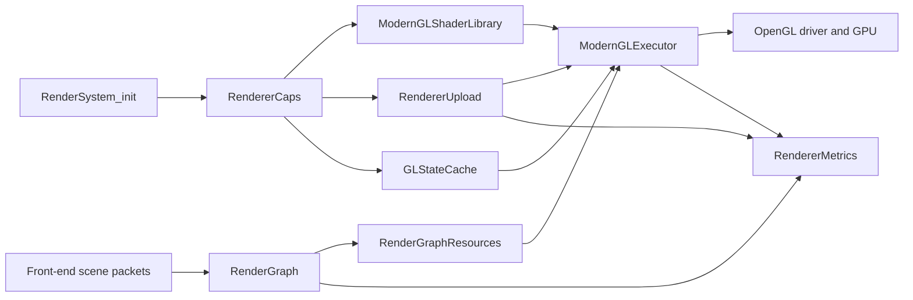

# Robustness and Optimization Audit of the openQ4 Renderer

## Executive summary

The renderer work is concentrated in `themuffinator/openQ4`; the companion `themuffinator/openQ4-game` repository is a game-libraries repository that contains `src/game` and `src/mpgame` and explicitly does **not** include a standalone engine executable or a renderer subsystem. In the engine repo, the renderer is already meaningfully modernized: there is capability-gated feature tiering for a modern baseline, GL 4.1, GL 4.3 GPU-driven work, and GL 4.5 low-overhead/DSA paths; a dedicated GL state cache; a render-graph resource manager; a shader library that emits GLSL 330/410/430/450 variants; an upload manager with persistent-map, map-range, and subdata fallbacks; and a metrics/self-test surface that is better than what many legacy idTech derivatives expose. citeturn51view0turn51view1turn51view2turn17view3turn32view0turn26view6turn26view4turn26view2turn25view0

The highest-value problems I found are not “the renderer is architecturally unsound”; they are narrower and more fixable: missing KHR_debug callback registration despite object labeling support, unchecked SSBO indexing in generated shader code, a portability hole in the non-`glBindTextures` fallback, unnecessary bind-to-zero churn in hot buffer update helpers, and an upload-fence retirement path that can convert GPU back-pressure into an indefinite CPU stall. I also found a lower-confidence but worthwhile optimization gap around framebuffer invalidation for transient render-graph resources. citeturn24view2turn24view3turn24view4turn42view0turn48view1turn41view0turn45view2turn38view2turn50search0turn52search1turn53search0turn53search3turn49search2

The good news is that the codebase already contains the scaffolding needed to fix most of this cleanly. The renderer has explicit feature probes, fallback tiers, shutdown cleanup for buffers/textures/framebuffers/fences, state-cache invalidation hooks, GPU timer plumbing, and multiple renderer self-tests. I did **not** find an obvious leak in the inspected upload-manager and render-graph teardown paths, but I would still treat leak detection and GPU-memory residency tracking as validation work to perform after the high-priority correctness fixes land. citeturn38view3turn46view0turn46view1turn45view2turn48view3turn30view0turn25view0

| Priority | Problematic area | Location | Severity | Suggested fix | Impact | Effort |
|---|---|---|---|---|---|---|
| P0 | Unchecked SSBO indexing in generated shaders | `src/renderer/ModernGLShaderLibrary.cpp:2683-2690`; `src/renderer/ModernGLExecutor.cpp:3781-3825` | High | Add explicit range checks and safe fallbacks for draw-record and bucket indices | High robustness gain; prevents UB in GPU-driven paths | M citeturn33view3turn41view0turn42view0turn53search0turn53search3 |
| P1 | No debug output callback/filtering path | `src/renderer/GLDebugScope.cpp:377-460`; no `glDebugMessageCallback`/`glDebugMessageControl` registration found in inspected init paths | Medium | Register a KHR_debug callback, filter notifications, cvar-gate sync mode | High debugging leverage | S citeturn24view2turn24view3turn24view4turn50search0turn50search12turn52search1turn52search3 |
| P1 | Texture multi-bind fallback is target-blind | `src/renderer/GLStateCache.cpp:2799-2817` | Medium | Make fallback accept per-unit targets instead of assuming `GL_TEXTURE_2D` | Medium portability/correctness gain | M citeturn48view1turn38view4 |
| P1 | Indefinite CPU wait on upload fences | `src/renderer/RendererUpload.cpp:2893-2910` | Medium | Replace unbounded wait with bounded retries + fallback policy/telemetry | Medium hitch reduction | M citeturn45view2turn50search1 |
| P2 | Redundant bind-to-zero churn in hot helpers | `src/renderer/ModernGLExecutor.cpp:3519-3525, 3548-3553` | Medium | Stop rebinding targets to zero in hot buffer update/create helpers | Medium CPU-driver overhead reduction | S citeturn17view3turn41view0turn52search2turn52search11 |
| P3 | Likely missed transient attachment invalidation opportunity | No `glInvalidateFramebuffer` found in inspected resource path; render graph already tracks `invalidateOps` | Low to Medium | Emit framebuffer invalidation/discard calls at last-use points | Low to medium bandwidth reduction, platform-dependent | M citeturn38view2turn38view4turn38view1turn28view3turn49search2turn52search6 |

## Scope and repository context

This review is centered on the renderer-side code in `openQ4`. The renderer-adjacent files inspected include `ModernGLExecutor.cpp`, `ModernGLShaderLibrary.cpp`, `GLStateCache.cpp`, `RendererUpload.cpp`, `RenderGraphResources.cpp`, `RendererCaps.cpp`, `RendererMetrics.cpp`, `RenderSystem.cpp`, `RenderSystem_init.cpp`, and the `src/renderer/OpenGL` helpers. By contrast, `openQ4-game` is the gameplay/DLL side of the workspace; its own README says it contains Quake4SDK-derived single-player and multiplayer game library code in `src/game` and `src/mpgame`, and “not included” is a standalone engine executable. That makes `openQ4-game` relevant mainly as an integration boundary, not as a renderer implementation target. citeturn6view0turn19view0turn23view2turn23view4turn23view6turn23view7turn26view0turn26view2turn26view4turn26view6turn51view0turn51view1turn51view2

I did not execute the engine in this environment, so the performance sections below are based on static inspection plus the engine’s built-in diagnostics surfaces rather than measured frame captures. Where I recommend a profiler method, it is a concrete validation procedure you can run against the code as-is. The severity and effort ratings are engineering estimates, not repository-provided metadata.



The module relationship above is directly reflected in the source layout and in the metrics structs, which separately track scene-packet, render-graph, modern-executor, upload-manager, and state-cache data. citeturn28view3turn30view0

## Architecture and pipeline assessment

Architecturally, the strongest part of the renderer is its explicit capability model. `ModernGLExecutor.cpp` separates a modern baseline from low-overhead and GPU-driven paths: the baseline requires VAO/UBO/VBO and classic program entry points; the low-overhead tier requires DSA plus multibind; the vertex-binding path is enabled for GL 4.3+ when low-overhead or GPU-driven work is selected; and the GPU-driven path requires SSBOs, compute, indirect draw, multi-draw, and the relevant entry points. The shader library mirrors that strategy by emitting GLSL 330, 410, 430, and 450 program variants according to the probed capabilities and selected features. This is a sound portability architecture and substantially better than hard-forking the renderer by platform. citeturn17view3turn32view0turn32view2turn36view3turn36view4

The runtime pipeline is also clearly segmented. `RendererMetrics.cpp` tracks distinct counts for scene packets, pass packets, draw packets, command packets, render-graph passes/resources/accesses, and modern-executor preparation/execution state; `RenderGraphResources.cpp` owns physical texture/FBO allocations; `RendererUpload.cpp` owns per-frame dynamic upload rings and a static-buffer allocator/pool; `GLStateCache.cpp` attempts to collapse redundant state changes; and `ModernGLExecutor.cpp` is the main back-end bridge that compiles helper programs, streams per-frame/per-draw data, and submits work. That separation is a strength because it means the main technical debt is mostly local, not architectural. citeturn28view3turn30view0turn23view4turn23view2turn26view4turn11view0

On shader quality, the generated GLSL is better than average for an engine of this lineage in one important respect: compile/link failure is checked and logged, rather than assumed; the helper compute program and overlay programs explicitly test `GL_COMPILE_STATUS` and `GL_LINK_STATUS`. The weaker part is maintainability and robustness: large C++ string-built shaders are harder to lint, diff, fuzz, and bounds-audit than external GLSL sources or generated templates with unit tests; more importantly, some generated SSBO access paths lack defensive range checks. citeturn42view0turn33view3turn53search0turn53search3

On memory lifetime, the inspected shutdown code is mostly disciplined. `RenderGraphResources_Shutdown()` deletes framebuffer and texture objects for all physical allocations; `idBufferAllocator::DrainPool()` deletes pooled buffer names and invalidates state-cache bindings; upload frame buffers unmap persistent mappings, delete VBOs, and delete outstanding sync objects on shutdown. That means I do **not** see an obvious “always leaks on shutdown / vid_restart” problem in the inspected code paths. citeturn38view3turn46view0turn46view1turn45view2

## Findings and concrete fixes

**Unchecked SSBO indexing in generated shaders**  
**Location:** `src/renderer/ModernGLShaderLibrary.cpp:2683-2690`; `src/renderer/ModernGLExecutor.cpp:3781-3825`  
**Severity:** High  
The generated vertex shader fetches `uDrawRecords.records[int(drawRecordIndex)]` with no bounds check, and the GPU-driven compute shader indexes `buckets[record.ids.x]` and writes `commands[dst]` without validating the bucket id against a count. In GLSL, out-of-bounds array/buffer access is undefined unless robust buffer access is enabled; the Khronos GLSL spec is explicit that out-of-bounds accesses are UB, and older GLSL wording is even more direct that out-of-bounds writes may be discarded or may overwrite other variables of the active program. In a renderer where these indices are CPU-generated, this is often “fine until it isn’t,” but once an upstream packet-generation bug, content corruption, or future feature branch introduces a bad index, the failure mode becomes GPU memory corruption rather than a clean CPU-side assert. citeturn33view3turn41view0turn42view0turn53search0turn53search3

**Repro / profiler method:** add a self-test that injects one invalid draw-record index and one invalid bucket id into a synthetic packet/bucket stream, then run with a debug context and GPU capture. On robust-access contexts, you may get clamped/contained behavior; on ordinary contexts, expect undefined output, possible driver messages, or sporadic corruption. Capturing the failing frame with a GPU debugger makes the bad index path obvious. citeturn25view0turn50search0turn52search1

**Concrete fix:** thread explicit record and bucket counts into the generated shaders and range-check before dereference. In the vertex path, return a safe uniform-backed fallback record on an invalid index. In the compute path, early-out and increment an error counter.

```glsl
// Generated vertex shader
uniform uint uDrawRecordCount;

ModernDrawRecord ModernFetchDrawRecord(void) {
#if MODERN_HAS_DRAW_RECORDS
    if (uDrawRecordMode != 0u) {
        uint drawRecordIndex = uint(attr_DrawRecordIndex + 0.5);
        if (drawRecordIndex < uDrawRecordCount) {
            return uDrawRecords.records[drawRecordIndex];
        }
        return ModernUniformDrawRecord(); // safe fallback for bad indices
    }
#endif
    return ModernUniformDrawRecord();
}
```

```glsl
// Generated compute shader
uniform uint u_bucketCount;

uint bucketIndex = record.ids.x;
if (bucketIndex >= u_bucketCount) {
    atomicAdd(counters[3], 1u); // or dedicated invalid-index counter
    return;
}

uint compactIndex = atomicAdd(buckets[bucketIndex].counters.x, 1u);
if (compactIndex >= buckets[bucketIndex].header.y) {
    return;
}
```

**Estimated effort:** Medium. The code change is small, but you should also add self-tests and metrics counters so you can detect range-check hits instead of silently falling back.

**Missing debug output callback and filtering**  
**Location:** `src/renderer/GLDebugScope.cpp:377-460`; no `glDebugMessageCallback` or `glDebugMessageControl` registration found in the inspected init path  
**Severity:** Medium  
`GLDebugScope.cpp` already supports object labels and push/pop debug groups, which is good, but I did not find a matching initialization path that registers a KHR_debug callback or configures message filtering. That leaves the renderer with annotations but without the main mechanism that actually surfaces driver-side correctness and performance diagnostics. Khronos documents `glDebugMessageCallback` as the way to install a debug output callback, and the OpenGL wiki explicitly notes that this catches GL errors and performance warnings more effectively than scattered `glGetError()` calls. citeturn24view2turn24view3turn24view4turn50search0turn50search12turn52search1turn52search3

**Repro / profiler method:** create a debug GL context, intentionally trigger a known validation mistake in a debug-only test path, and verify whether the application emits a callback message. Today, with the inspected code, the likely result is that debug groups and labels exist but the application does not receive structured callback traffic. Khronos also notes that synchronous debug output can invoke the callback from the offending call stack when enabled, which is ideal for triage. citeturn50search8turn52search1

**Concrete fix:** register a callback during GL init, gate synchronous mode behind a developer cvar, and filter out notifications by default.

```cpp
static void APIENTRY R_GLDebugCallback(GLenum source, GLenum type, GLuint id,
                                       GLenum severity, GLsizei length,
                                       const GLchar *message, const void *userParam) {
    (void)source; (void)type; (void)length; (void)userParam;
    if (severity == GL_DEBUG_SEVERITY_NOTIFICATION) {
        return;
    }
    common->Printf("[GL][%u] %s\n", id, message ? message : "");
}

static void R_InitGLDebugOutput() {
    if (glDebugMessageCallback == NULL || glDebugMessageControl == NULL) {
        return;
    }

    glEnable(GL_DEBUG_OUTPUT);
    if (r_glDebugSynchronous.GetBool()) {
        glEnable(GL_DEBUG_OUTPUT_SYNCHRONOUS);
    }

    glDebugMessageCallback(R_GLDebugCallback, NULL);
    glDebugMessageControl(GL_DONT_CARE, GL_DONT_CARE,
                          GL_DEBUG_SEVERITY_NOTIFICATION, 0, NULL, GL_FALSE);
}
```

**Estimated effort:** Small.

**Texture multi-bind fallback is target-blind**  
**Location:** `src/renderer/GLStateCache.cpp:2799-2817`  
**Severity:** Medium  
When `glBindTextures` is unavailable, `idGLStateCache::BindTextures()` falls back to a loop that binds every texture name as `GL_TEXTURE_2D`. That is structurally incorrect as a portability fallback because the target is not encoded in the API. The same engine creates non-`GL_TEXTURE_2D` resource targets, including multisample textures in the render-graph resource path, so this is not just a theoretical generic-API complaint. If a low-end portability tier ever takes this path while sampling a non-2D texture target, binding behavior will be wrong. citeturn48view1turn38view4

**Repro / profiler method:** force the renderer into a capability profile without `ARB_multi_bind` / `glBindTextures`, then create a test path that binds at least one non-2D target through the multibind abstraction. A GPU capture should show the wrong target binding on the affected unit.  

**Concrete fix:** make the fallback target-aware. The simplest safe API is to pass `(target, name)` pairs instead of names alone.

```cpp
struct textureBindDesc_t {
    GLenum target;
    GLuint name;
};

bool idGLStateCache::BindTexturesFallback(GLuint first, GLsizei count,
                                          const textureBindDesc_t *textures) {
    if (count <= 0 || textures == NULL) {
        return false;
    }

    bool issued = false;
    for (GLsizei i = 0; i < count; ++i) {
        issued = BindTexture(static_cast<int>(first + i),
                             textures[i].target,
                             textures[i].name) || issued;
    }
    return issued;
}
```

**Estimated effort:** Medium, because the call sites need to supply the target metadata.

**Unbounded CPU stall in upload fence retirement**  
**Location:** `src/renderer/RendererUpload.cpp:2893-2910`  
**Severity:** Medium  
The upload manager is otherwise well-designed, but `RetireFrameFence()` does a zero-time probe and then, if the fence is not ready, immediately falls back to `glClientWaitSync(..., GL_TIMEOUT_IGNORED)`. That is a fully blocking CPU wait. Khronos documents `glFenceSync` as inserting a fence into the GL command stream; using it is correct, but the policy choice here means any transient mismatch between ring depth and GPU consumption can become a frame hitch instead of a recoverable slowdown. This is the sort of thing that will only show up in pathological scenes or on slower GPUs, which is exactly why it is worth hardening now. citeturn45view2turn50search1turn50search9

**Repro / profiler method:** reduce upload-ring size and/or buffer count through existing cvars, then stress a scene with heavy upload traffic while recording `frameFenceWaits`, `frameStalls`, and the GPU timer metrics. If you see wait counts correlate with frame spikes, this path is the bottleneck. The renderer already records buffer stalls, so the codebase is close to being able to validate this cleanly. citeturn45view2turn47view3turn30view0

**Concrete fix:** switch from an infinite stall to bounded retries and a fallback policy. Options include temporarily falling back to a non-persistent/orphaning path, increasing ring depth, or skipping the reuse of that frame buffer if safe.

```cpp
void idUploadManager::RetireFrameFence(frameBuffer_t &frame) {
    if (frame.fence == NULL || !hasSync) {
        return;
    }

    const GLuint64 kRetryNs = 1000000ULL; // 1 ms
    const int kMaxRetries = 2;

    for (int i = 0; i < kMaxRetries; ++i) {
        GLenum result = glClientWaitSync(
            frame.fence,
            i == 0 ? 0 : GL_SYNC_FLUSH_COMMANDS_BIT,
            i == 0 ? 0 : kRetryNs);

        if (result == GL_ALREADY_SIGNALED || result == GL_CONDITION_SATISFIED) {
            glDeleteSync(frame.fence);
            frame.fence = NULL;
            stats.frameFencesRetired++;
            return;
        }
    }

    stats.frameFenceWaits++;
    stats.frameStalls++;
    // Fallback hook: grow ring, skip reuse, or route this frame through subdata/orphaning.
}
```

**Estimated effort:** Medium.

**Redundant bind-to-zero churn in hot buffer helpers**  
**Location:** `src/renderer/ModernGLExecutor.cpp:3519-3525, 3548-3553`  
**Severity:** Medium  
In the legacy (non-DSA) path, `R_ModernGLExecutor_CreateBuffer()` binds a buffer, calls `glBufferData()`, then binds the target back to zero and invalidates the state cache. `R_ModernGLExecutor_UpdateBuffer()` similarly binds the buffer, does `glBufferSubData()`, then binds zero. That is unnecessary churn in exactly the kind of helper that tends to sit on hot paths. The project already has a state cache whose purpose is to avoid redundant state changes; zero-unbinding works against that. The OpenGL wiki’s FBO and state-management notes are directionally consistent here: extra binds/validation cost CPU time. citeturn17view3turn41view0turn48view4turn52search2turn52search11

**Repro / profiler method:** capture a representative frame before and after removing the zero-unbinds, then compare `glBindBuffer` counts in an API trace and CPU-side driver time in a timeline profiler. Because the state cache already tracks hits and misses, you can also compare cache-miss statistics directly. citeturn48view3turn48view4

**Concrete fix:** in the non-DSA path, leave the bound object as the state-cache-authoritative binding rather than rebinding zero.

```cpp
static void R_ModernGLExecutor_UpdateBuffer(GLenum target, GLuint buffer,
                                            GLsizeiptr bytes, const void *data,
                                            modernGLExecutorStats_t &stats) {
    if (buffer == 0 || bytes <= 0 || data == NULL) {
        return;
    }

    if (rg_modernGLExecutorLowOverheadReady && glNamedBufferSubData != NULL) {
        glNamedBufferSubData(buffer, 0, bytes, data);
        stats.lowOverheadDSAUpdates++;
        return;
    }

    idGLStateCache &gl = R_GLStateCache();
    gl.BindBuffer(target, buffer);
    glBufferSubData(target, 0, bytes, data);
    // Do not bind target back to 0; let the cache track the live binding.
}
```

**Estimated effort:** Small.

**Transient attachment invalidation is not visible in the inspected backend path**  
**Location:** no `glInvalidateFramebuffer` found in the inspected resource path; render-graph metrics track `invalidateOps` but the resource/allocation code shown does not issue an invalidate call  
**Severity:** Low to Medium  
`RendererMetrics.cpp` already has a notion of `invalidateOps`, which is a strong hint that the render-graph model understands lifetime/discard opportunities. But in the inspected GL object/resource path, I did not find a corresponding `glInvalidateFramebuffer` or named-framebuffer invalidate call. Khronos documents these calls specifically as a way to invalidate framebuffer attachment contents when they no longer need to be preserved. This matters most for transient depth/MSAA/postprocess attachments and on bandwidth-sensitive or tiled architectures. I am labeling this lower confidence than the other findings because I did not fully trace every executor call site that might consume render-graph invalidate metadata. citeturn28view3turn38view2turn49search2turn52search6

**Repro / profiler method:** compare GPU bandwidth/store-load behavior on transient attachments before and after adding invalidation calls, especially on postprocess and MSAA paths. If your tooling exposes tile-store/load or attachment-resolve traffic, this is straightforward to validate.  

**Concrete fix:** emit invalidate/discard calls at the last use of transient attachments.

```cpp
static void R_InvalidateTransientAttachments(GLuint fbo,
                                             bool discardColor,
                                             bool discardDepth) {
    GLenum attachments[4];
    GLsizei count = 0;

    if (discardColor) {
        attachments[count++] = GL_COLOR_ATTACHMENT0;
    }
    if (discardDepth) {
        attachments[count++] = GL_DEPTH_ATTACHMENT;
    }

    if (count > 0) {
        glInvalidateFramebuffer(GL_FRAMEBUFFER, count, attachments);
    }
}
```

**Estimated effort:** Medium, because the real work is threading last-use information from the render graph into the execution path.

## Diagnostics and profiling methods

The renderer already exposes a serious diagnostics surface, and you should lean on it before adding new instrumentation. `RenderSystem_init.cpp` registers multiple renderer self-tests and maintenance hooks, including modern-visible, compatibility, pass-ownership, modern-visibility, low-overhead, shader-library, draw-plan, and submit-plan self-tests, plus a shader-library reload hook that invalidates cached plans after reload. The repository also includes a `build_validate_modernglexecutor.log`, which is useful as a baseline model for validation-oriented CI artifacts. citeturn25view0turn21view0

The metrics layer is also worth exploiting more aggressively. `RendererMetrics.cpp` tracks scene packets, pass packets, draw packets, command packets, render-graph passes/resources/accesses, executor preparation state, state-cache stats, clustered-lighting stats, and GPU timer query results with dropped-query accounting. That means you can validate most of the recommended fixes without adding a large new observability subsystem: wire a few more counters into the existing metrics structs and use those as your acceptance criteria. citeturn28view3turn30view0

| Question | Built-in signal | Recommended method |
|---|---|---|
| Are bind-churn fixes working? | `glStateCache` hit/miss counters | Compare API traces and cache misses before/after the patch |
| Are upload stalls reduced? | `frameStalls`, `frameFenceWaits`, GPU timer totals | Stress upload-heavy scenes with reduced ring size and watch stall counters |
| Did shader hardening catch bad indices? | Add a dedicated “invalid-index” counter to the existing validation counters | Synthetic self-test that injects bad indices into the GPU-driven path |
| Are transient invalidations helping? | Existing render-graph pass/resource counts; add per-pass invalidate count if needed | Compare GPU captures on post effects and transient depth/MSAA passes |
| Did debug output improve triage? | Callback message volume and severity buckets | Run self-tests under a debug context and verify messages are surfaced |

From a practical profiling perspective, I would proceed in this order: first use the existing self-tests to guarantee no regressions; second use the built-in metrics to compare counters; third use an API capture to validate call-count reductions and correct texture targets; fourth use a GPU capture to inspect upload stalls and transient attachment behavior. The reason for that order is simple: the codebase already has more internal telemetry than most engines at this stage, so you should exploit it before adding custom one-off instrumentation. citeturn25view0turn28view3turn30view0turn48view3

## Prioritized roadmap

The best roadmap here is incremental and test-first. I would not rewrite the renderer; I would harden and simplify the existing one. The first tranche should be correctness and debuggability: add KHR_debug callback registration, add SSBO range checks, and add explicit counters for invalid shader indices and fence timeout events. The second tranche should target CPU-side efficiency and portability: remove bind-to-zero churn, make the texture multibind fallback target-aware, and verify the behavior on a capability profile without multibind/DSA. The third tranche should focus on data-driven optimization: measure upload-path hitching, evaluate coherent-vs-explicit-flush persistent mapping on target GPUs, and add transient framebuffer invalidation where it demonstrates real gains. citeturn24view2turn42view0turn45view2turn48view1turn52search0turn49search2

| Phase | Recommended work | Expected result | Effort |
|---|---|---|---|
| Immediate | Add debug callback/filtering; harden SSBO indices; add invalid-index and fence-timeout counters | Faster triage and materially stronger robustness | S–M |
| Near-term | Remove zero-unbinds; fix target-blind texture fallback; add regression tests for non-2D texture bindings | Lower CPU overhead and safer portability | S–M |
| Mid-term | Profile upload stalls under stress; evaluate bounded-wait policy and persistent-map variants | Fewer frame spikes in upload-heavy scenes | M |
| Later | Thread render-graph last-use/discard data into backend invalidation calls; optionally externalize/generated-test shader sources | Better bandwidth behavior and easier shader maintenance | M–L |

My overall assessment is favorable. `openQ4` already has the right architectural pieces for a robust modernized OpenGL renderer, and the code shows unusually good attention to fallback tiers, cleanup, metrics, and self-tests for a legacy-engine modernization. The main work now is to close a short list of avoidable robustness and portability gaps, then spend profiling time on the few hot paths where the renderer still does more state and synchronization work than necessary. citeturn17view3turn25view0turn28view3turn38view3turn46view0turn48view3