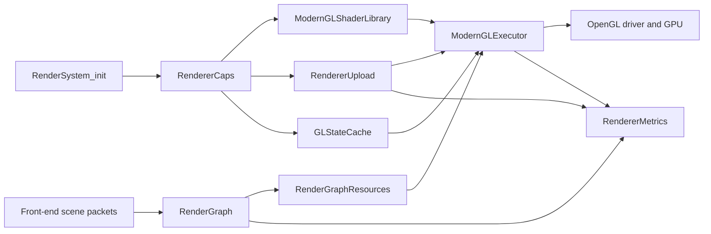

# Robustness and Optimization Audit of the openQ4 Renderer

## Executive summary

The renderer work is concentrated in `themuffinator/openQ4`; the companion `themuffinator/openQ4-game` repository is a game-libraries repository that contains `src/game` and `src/mpgame` and explicitly does **not** include a standalone engine executable or a renderer subsystem. In the engine repo, the renderer is already meaningfully modernized: there is capability-gated feature tiering for a modern baseline, GL 4.1, GL 4.3 GPU-driven work, and GL 4.5 low-overhead/DSA paths; a dedicated GL state cache; a render-graph resource manager; a shader library that emits GLSL 330/410/430/450 variants; an upload manager with persistent-map, map-range, and subdata fallbacks; and a metrics/self-test surface that is better than what many legacy idTech derivatives expose. citeturn51view0turn51view1turn51view2turn17view3turn32view0turn26view6turn26view4turn26view2turn25view0

The highest-value problems I found are not “the renderer is architecturally unsound”; they are narrower and more fixable: missing KHR_debug callback registration despite object labeling support, unchecked SSBO indexing in generated shader code, a portability hole in the non-`glBindTextures` fallback, unnecessary bind-to-zero churn in hot buffer update helpers, and an upload-fence retirement path that can convert GPU back-pressure into an indefinite CPU stall. I also found a lower-confidence but worthwhile optimization gap around framebuffer invalidation for transient render-graph resources. citeturn24view2turn24view3turn24view4turn42view0turn48view1turn41view0turn45view2turn38view2turn50search0turn52search1turn53search0turn53search3turn49search2

The good news is that the codebase already contains the scaffolding needed to fix most of this cleanly. The renderer has explicit feature probes, fallback tiers, shutdown cleanup for buffers/textures/framebuffers/fences, state-cache invalidation hooks, GPU timer plumbing, and multiple renderer self-tests. I did **not** find an obvious leak in the inspected upload-manager and render-graph teardown paths, but I would still treat leak detection and GPU-memory residency tracking as validation work to perform after the high-priority correctness fixes land. citeturn38view3turn46view0turn46view1turn45view2turn48view3turn30view0turn25view0

| Priority | Problematic area | Location | Severity | Suggested fix | Impact | Effort |
|---|---|---|---|---|---|---|
| P0 | Unchecked SSBO indexing in generated shaders | `src/renderer/ModernGLShaderLibrary.cpp:2683-2690`; `src/renderer/ModernGLExecutor.cpp:3781-3825` | High | Add explicit range checks and safe fallbacks for draw-record and bucket indices | High robustness gain; prevents UB in GPU-driven paths | M citeturn33view3turn41view0turn42view0turn53search0turn53search3 |
| P1 | No debug output callback/filtering path | `src/renderer/GLDebugScope.cpp:377-460`; no `glDebugMessageCallback`/`glDebugMessageControl` registration found in inspected init paths | Medium | Register a KHR_debug callback, filter notifications, cvar-gate sync mode | High debugging leverage | S citeturn24view2turn24view3turn24view4turn50search0turn50search12turn52search1turn52search3 |
| P1 | Texture multi-bind fallback is target-blind | `src/renderer/GLStateCache.cpp:2799-2817` | Medium | Make fallback accept per-unit targets instead of assuming `GL_TEXTURE_2D` | Medium portability/correctness gain | M citeturn48view1turn38view4 |
| P1 | Indefinite CPU wait on upload fences | `src/renderer/RendererUpload.cpp:2893-2910` | Medium | Replace unbounded wait with bounded retries + fallback policy/telemetry | Medium hitch reduction | M citeturn45view2turn50search1 |
| P2 | Redundant bind-to-zero churn in hot helpers | `src/renderer/ModernGLExecutor.cpp:3519-3525, 3548-3553` | Medium | Stop rebinding targets to zero in hot buffer update/create helpers | Medium CPU-driver overhead reduction | S citeturn17view3turn41view0turn52search2turn52search11 |
| P3 | Likely missed transient attachment invalidation opportunity | No `glInvalidateFramebuffer` found in inspected resource path; render graph already tracks `invalidateOps` | Low to Medium | Emit framebuffer invalidation/discard calls at last-use points | Low to medium bandwidth reduction, platform-dependent | M citeturn38view2turn38view4turn38view1turn28view3turn49search2turn52search6 |

## Scope and repository context

This review is centered on the renderer-side code in `openQ4`. The renderer-adjacent files inspected include `ModernGLExecutor.cpp`, `ModernGLShaderLibrary.cpp`, `GLStateCache.cpp`, `RendererUpload.cpp`, `RenderGraphResources.cpp`, `RendererCaps.cpp`, `RendererMetrics.cpp`, `RenderSystem.cpp`, `RenderSystem_init.cpp`, and the `src/renderer/OpenGL` helpers. By contrast, `openQ4-game` is the gameplay/DLL side of the workspace; its own README says it contains Quake4SDK-derived single-player and multiplayer game library code in `src/game` and `src/mpgame`, and “not included” is a standalone engine executable. That makes `openQ4-game` relevant mainly as an integration boundary, not as a renderer implementation target. citeturn6view0turn19view0turn23view2turn23view4turn23view6turn23view7turn26view0turn26view2turn26view4turn26view6turn51view0turn51view1turn51view2

I did not execute the engine in this environment, so the performance sections below are based on static inspection plus the engine’s built-in diagnostics surfaces rather than measured frame captures. Where I recommend a profiler method, it is a concrete validation procedure you can run against the code as-is. The severity and effort ratings are engineering estimates, not repository-provided metadata.



The module relationship above is directly reflected in the source layout and in the metrics structs, which separately track scene-packet, render-graph, modern-executor, upload-manager, and state-cache data. citeturn28view3turn30view0

## Architecture and pipeline assessment

Architecturally, the strongest part of the renderer is its explicit capability model. `ModernGLExecutor.cpp` separates a modern baseline from low-overhead and GPU-driven paths: the baseline requires VAO/UBO/VBO and classic program entry points; the low-overhead tier requires DSA plus multibind; the vertex-binding path is enabled for GL 4.3+ when low-overhead or GPU-driven work is selected; and the GPU-driven path requires SSBOs, compute, indirect draw, multi-draw, and the relevant entry points. The shader library mirrors that strategy by emitting GLSL 330, 410, 430, and 450 program variants according to the probed capabilities and selected features. This is a sound portability architecture and substantially better than hard-forking the renderer by platform. citeturn17view3turn32view0turn32view2turn36view3turn36view4

The runtime pipeline is also clearly segmented. `RendererMetrics.cpp` tracks distinct counts for scene packets, pass packets, draw packets, command packets, render-graph passes/resources/accesses, and modern-executor preparation/execution state; `RenderGraphResources.cpp` owns physical texture/FBO allocations; `RendererUpload.cpp` owns per-frame dynamic upload rings and a static-buffer allocator/pool; `GLStateCache.cpp` attempts to collapse redundant state changes; and `ModernGLExecutor.cpp` is the main back-end bridge that compiles helper programs, streams per-frame/per-draw data, and submits work. That separation is a strength because it means the main technical debt is mostly local, not architectural. citeturn28view3turn30view0turn23view4turn23view2turn26view4turn11view0

On shader quality, the generated GLSL is better than average for an engine of this lineage in one important respect: compile/link failure is checked and logged, rather than assumed; the helper compute program and overlay programs explicitly test `GL_COMPILE_STATUS` and `GL_LINK_STATUS`. The weaker part is maintainability and robustness: large C++ string-built shaders are harder to lint, diff, fuzz, and bounds-audit than external GLSL sources or generated templates with unit tests; more importantly, some generated SSBO access paths lack defensive range checks. citeturn42view0turn33view3turn53search0turn53search3

On memory lifetime, the inspected shutdown code is mostly disciplined. `RenderGraphResources_Shutdown()` deletes framebuffer and texture objects for all physical allocations; `idBufferAllocator::DrainPool()` deletes pooled buffer names and invalidates state-cache bindings; upload frame buffers unmap persistent mappings, delete VBOs, and delete outstanding sync objects on shutdown. That means I do **not** see an obvious “always leaks on shutdown / vid_restart” problem in the inspected code paths. citeturn38view3turn46view0turn46view1turn45view2

## Findings and concrete fixes

**Unchecked SSBO indexing in generated shaders**  
**Location:** `src/renderer/ModernGLShaderLibrary.cpp:2683-2690`; `src/renderer/ModernGLExecutor.cpp:3781-3825`  
**Severity:** High  
The generated vertex shader fetches `uDrawRecords.records[int(drawRecordIndex)]` with no bounds check, and the GPU-driven compute shader indexes `buckets[record.ids.x]` and writes `commands[dst]` without validating the bucket id against a count. In GLSL, out-of-bounds array/buffer access is undefined unless robust buffer access is enabled; the Khronos GLSL spec is explicit that out-of-bounds accesses are UB, and older GLSL wording is even more direct that out-of-bounds writes may be discarded or may overwrite other variables of the active program. In a renderer where these indices are CPU-generated, this is often “fine until it isn’t,” but once an upstream packet-generation bug, content corruption, or future feature branch introduces a bad index, the failure mode becomes GPU memory corruption rather than a clean CPU-side assert. citeturn33view3turn41view0turn42view0turn53search0turn53search3

**Repro / profiler method:** add a self-test that injects one invalid draw-record index and one invalid bucket id into a synthetic packet/bucket stream, then run with a debug context and GPU capture. On robust-access contexts, you may get clamped/contained behavior; on ordinary contexts, expect undefined output, possible driver messages, or sporadic corruption. Capturing the failing frame with a GPU debugger makes the bad index path obvious. citeturn25view0turn50search0turn52search1

**Concrete fix:** thread explicit record and bucket counts into the generated shaders and range-check before dereference. In the vertex path, return a safe uniform-backed fallback record on an invalid index. In the compute path, early-out and increment an error counter.

```glsl
// Generated vertex shader
uniform uint uDrawRecordCount;

ModernDrawRecord ModernFetchDrawRecord(void) {
#if MODERN_HAS_DRAW_RECORDS
    if (uDrawRecordMode != 0u) {
        uint drawRecordIndex = uint(attr_DrawRecordIndex + 0.5);
        if (drawRecordIndex < uDrawRecordCount) {
            return uDrawRecords.records[drawRecordIndex];
        }
        return ModernUniformDrawRecord(); // safe fallback for bad indices
    }
#endif
    return ModernUniformDrawRecord();
}
```

```glsl
// Generated compute shader
uniform uint u_bucketCount;

uint bucketIndex = record.ids.x;
if (bucketIndex >= u_bucketCount) {
    atomicAdd(counters[3], 1u); // or dedicated invalid-index counter
    return;
}

uint compactIndex = atomicAdd(buckets[bucketIndex].counters.x, 1u);
if (compactIndex >= buckets[bucketIndex].header.y) {
    return;
}
```

**Estimated effort:** Medium. The code change is small, but you should also add self-tests and metrics counters so you can detect range-check hits instead of silently falling back.

**Missing debug output callback and filtering**  
**Location:** `src/renderer/GLDebugScope.cpp:377-460`; no `glDebugMessageCallback` or `glDebugMessageControl` registration found in the inspected init path  
**Severity:** Medium  
`GLDebugScope.cpp` already supports object labels and push/pop debug groups, which is good, but I did not find a matching initialization path that registers a KHR_debug callback or configures message filtering. That leaves the renderer with annotations but without the main mechanism that actually surfaces driver-side correctness and performance diagnostics. Khronos documents `glDebugMessageCallback` as the way to install a debug output callback, and the OpenGL wiki explicitly notes that this catches GL errors and performance warnings more effectively than scattered `glGetError()` calls. citeturn24view2turn24view3turn24view4turn50search0turn50search12turn52search1turn52search3

**Repro / profiler method:** create a debug GL context, intentionally trigger a known validation mistake in a debug-only test path, and verify whether the application emits a callback message. Today, with the inspected code, the likely result is that debug groups and labels exist but the application does not receive structured callback traffic. Khronos also notes that synchronous debug output can invoke the callback from the offending call stack when enabled, which is ideal for triage. citeturn50search8turn52search1

**Concrete fix:** register a callback during GL init, gate synchronous mode behind a developer cvar, and filter out notifications by default.

```cpp
static void APIENTRY R_GLDebugCallback(GLenum source, GLenum type, GLuint id,
                                       GLenum severity, GLsizei length,
                                       const GLchar *message, const void *userParam) {
    (void)source; (void)type; (void)length; (void)userParam;
    if (severity == GL_DEBUG_SEVERITY_NOTIFICATION) {
        return;
    }
    common->Printf("[GL][%u] %s\n", id, message ? message : "");
}

static void R_InitGLDebugOutput() {
    if (glDebugMessageCallback == NULL || glDebugMessageControl == NULL) {
        return;
    }

    glEnable(GL_DEBUG_OUTPUT);
    if (r_glDebugSynchronous.GetBool()) {
        glEnable(GL_DEBUG_OUTPUT_SYNCHRONOUS);
    }

    glDebugMessageCallback(R_GLDebugCallback, NULL);
    glDebugMessageControl(GL_DONT_CARE, GL_DONT_CARE,
                          GL_DEBUG_SEVERITY_NOTIFICATION, 0, NULL, GL_FALSE);
}
```

**Estimated effort:** Small.

**Texture multi-bind fallback is target-blind**  
**Location:** `src/renderer/GLStateCache.cpp:2799-2817`  
**Severity:** Medium  
When `glBindTextures` is unavailable, `idGLStateCache::BindTextures()` falls back to a loop that binds every texture name as `GL_TEXTURE_2D`. That is structurally incorrect as a portability fallback because the target is not encoded in the API. The same engine creates non-`GL_TEXTURE_2D` resource targets, including multisample textures in the render-graph resource path, so this is not just a theoretical generic-API complaint. If a low-end portability tier ever takes this path while sampling a non-2D texture target, binding behavior will be wrong. citeturn48view1turn38view4

**Repro / profiler method:** force the renderer into a capability profile without `ARB_multi_bind` / `glBindTextures`, then create a test path that binds at least one non-2D target through the multibind abstraction. A GPU capture should show the wrong target binding on the affected unit.  

**Concrete fix:** make the fallback target-aware. The simplest safe API is to pass `(target, name)` pairs instead of names alone.

```cpp
struct textureBindDesc_t {
    GLenum target;
    GLuint name;
};

bool idGLStateCache::BindTexturesFallback(GLuint first, GLsizei count,
                                          const textureBindDesc_t *textures) {
    if (count <= 0 || textures == NULL) {
        return false;
    }

    bool issued = false;
    for (GLsizei i = 0; i < count; ++i) {
        issued = BindTexture(static_cast<int>(first + i),
                             textures[i].target,
                             textures[i].name) || issued;
    }
    return issued;
}
```

**Estimated effort:** Medium, because the call sites need to supply the target metadata.

**Unbounded CPU stall in upload fence retirement**  
**Location:** `src/renderer/RendererUpload.cpp:2893-2910`  
**Severity:** Medium  
The upload manager is otherwise well-designed, but `RetireFrameFence()` does a zero-time probe and then, if the fence is not ready, immediately falls back to `glClientWaitSync(..., GL_TIMEOUT_IGNORED)`. That is a fully blocking CPU wait. Khronos documents `glFenceSync` as inserting a fence into the GL command stream; using it is correct, but the policy choice here means any transient mismatch between ring depth and GPU consumption can become a frame hitch instead of a recoverable slowdown. This is the sort of thing that will only show up in pathological scenes or on slower GPUs, which is exactly why it is worth hardening now. citeturn45view2turn50search1turn50search9

**Repro / profiler method:** reduce upload-ring size and/or buffer count through existing cvars, then stress a scene with heavy upload traffic while recording `frameFenceWaits`, `frameStalls`, and the GPU timer metrics. If you see wait counts correlate with frame spikes, this path is the bottleneck. The renderer already records buffer stalls, so the codebase is close to being able to validate this cleanly. citeturn45view2turn47view3turn30view0

**Concrete fix:** switch from an infinite stall to bounded retries and a fallback policy. Options include temporarily falling back to a non-persistent/orphaning path, increasing ring depth, or skipping the reuse of that frame buffer if safe.

```cpp
void idUploadManager::RetireFrameFence(frameBuffer_t &frame) {
    if (frame.fence == NULL || !hasSync) {
        return;
    }

    const GLuint64 kRetryNs = 1000000ULL; // 1 ms
    const int kMaxRetries = 2;

    for (int i = 0; i < kMaxRetries; ++i) {
        GLenum result = glClientWaitSync(
            frame.fence,
            i == 0 ? 0 : GL_SYNC_FLUSH_COMMANDS_BIT,
            i == 0 ? 0 : kRetryNs);

        if (result == GL_ALREADY_SIGNALED || result == GL_CONDITION_SATISFIED) {
            glDeleteSync(frame.fence);
            frame.fence = NULL;
            stats.frameFencesRetired++;
            return;
        }
    }

    stats.frameFenceWaits++;
    stats.frameStalls++;
    // Fallback hook: grow ring, skip reuse, or route this frame through subdata/orphaning.
}
```

**Estimated effort:** Medium.

**Redundant bind-to-zero churn in hot buffer helpers**  
**Location:** `src/renderer/ModernGLExecutor.cpp:3519-3525, 3548-3553`  
**Severity:** Medium  
In the legacy (non-DSA) path, `R_ModernGLExecutor_CreateBuffer()` binds a buffer, calls `glBufferData()`, then binds the target back to zero and invalidates the state cache. `R_ModernGLExecutor_UpdateBuffer()` similarly binds the buffer, does `glBufferSubData()`, then binds zero. That is unnecessary churn in exactly the kind of helper that tends to sit on hot paths. The project already has a state cache whose purpose is to avoid redundant state changes; zero-unbinding works against that. The OpenGL wiki’s FBO and state-management notes are directionally consistent here: extra binds/validation cost CPU time. citeturn17view3turn41view0turn48view4turn52search2turn52search11

**Repro / profiler method:** capture a representative frame before and after removing the zero-unbinds, then compare `glBindBuffer` counts in an API trace and CPU-side driver time in a timeline profiler. Because the state cache already tracks hits and misses, you can also compare cache-miss statistics directly. citeturn48view3turn48view4

**Concrete fix:** in the non-DSA path, leave the bound object as the state-cache-authoritative binding rather than rebinding zero.

```cpp
static void R_ModernGLExecutor_UpdateBuffer(GLenum target, GLuint buffer,
                                            GLsizeiptr bytes, const void *data,
                                            modernGLExecutorStats_t &stats) {
    if (buffer == 0 || bytes <= 0 || data == NULL) {
        return;
    }

    if (rg_modernGLExecutorLowOverheadReady && glNamedBufferSubData != NULL) {
        glNamedBufferSubData(buffer, 0, bytes, data);
        stats.lowOverheadDSAUpdates++;
        return;
    }

    idGLStateCache &gl = R_GLStateCache();
    gl.BindBuffer(target, buffer);
    glBufferSubData(target, 0, bytes, data);
    // Do not bind target back to 0; let the cache track the live binding.
}
```

**Estimated effort:** Small.

**Transient attachment invalidation is not visible in the inspected backend path**  
**Location:** no `glInvalidateFramebuffer` found in the inspected resource path; render-graph metrics track `invalidateOps` but the resource/allocation code shown does not issue an invalidate call  
**Severity:** Low to Medium  
`RendererMetrics.cpp` already has a notion of `invalidateOps`, which is a strong hint that the render-graph model understands lifetime/discard opportunities. But in the inspected GL object/resource path, I did not find a corresponding `glInvalidateFramebuffer` or named-framebuffer invalidate call. Khronos documents these calls specifically as a way to invalidate framebuffer attachment contents when they no longer need to be preserved. This matters most for transient depth/MSAA/postprocess attachments and on bandwidth-sensitive or tiled architectures. I am labeling this lower confidence than the other findings because I did not fully trace every executor call site that might consume render-graph invalidate metadata. citeturn28view3turn38view2turn49search2turn52search6

**Repro / profiler method:** compare GPU bandwidth/store-load behavior on transient attachments before and after adding invalidation calls, especially on postprocess and MSAA paths. If your tooling exposes tile-store/load or attachment-resolve traffic, this is straightforward to validate.  

**Concrete fix:** emit invalidate/discard calls at the last use of transient attachments.

```cpp
static void R_InvalidateTransientAttachments(GLuint fbo,
                                             bool discardColor,
                                             bool discardDepth) {
    GLenum attachments[4];
    GLsizei count = 0;

    if (discardColor) {
        attachments[count++] = GL_COLOR_ATTACHMENT0;
    }
    if (discardDepth) {
        attachments[count++] = GL_DEPTH_ATTACHMENT;
    }

    if (count > 0) {
        glInvalidateFramebuffer(GL_FRAMEBUFFER, count, attachments);
    }
}
```

**Estimated effort:** Medium, because the real work is threading last-use information from the render graph into the execution path.

## Diagnostics and profiling methods

The renderer already exposes a serious diagnostics surface, and you should lean on it before adding new instrumentation. `RenderSystem_init.cpp` registers multiple renderer self-tests and maintenance hooks, including modern-visible, compatibility, pass-ownership, modern-visibility, low-overhead, shader-library, draw-plan, and submit-plan self-tests, plus a shader-library reload hook that invalidates cached plans after reload. The repository also includes a `build_validate_modernglexecutor.log`, which is useful as a baseline model for validation-oriented CI artifacts. citeturn25view0turn21view0

The metrics layer is also worth exploiting more aggressively. `RendererMetrics.cpp` tracks scene packets, pass packets, draw packets, command packets, render-graph passes/resources/accesses, executor preparation state, state-cache stats, clustered-lighting stats, and GPU timer query results with dropped-query accounting. That means you can validate most of the recommended fixes without adding a large new observability subsystem: wire a few more counters into the existing metrics structs and use those as your acceptance criteria. citeturn28view3turn30view0

| Question | Built-in signal | Recommended method |
|---|---|---|
| Are bind-churn fixes working? | `glStateCache` hit/miss counters | Compare API traces and cache misses before/after the patch |
| Are upload stalls reduced? | `frameStalls`, `frameFenceWaits`, GPU timer totals | Stress upload-heavy scenes with reduced ring size and watch stall counters |
| Did shader hardening catch bad indices? | Add a dedicated “invalid-index” counter to the existing validation counters | Synthetic self-test that injects bad indices into the GPU-driven path |
| Are transient invalidations helping? | Existing render-graph pass/resource counts; add per-pass invalidate count if needed | Compare GPU captures on post effects and transient depth/MSAA passes |
| Did debug output improve triage? | Callback message volume and severity buckets | Run self-tests under a debug context and verify messages are surfaced |

From a practical profiling perspective, I would proceed in this order: first use the existing self-tests to guarantee no regressions; second use the built-in metrics to compare counters; third use an API capture to validate call-count reductions and correct texture targets; fourth use a GPU capture to inspect upload stalls and transient attachment behavior. The reason for that order is simple: the codebase already has more internal telemetry than most engines at this stage, so you should exploit it before adding custom one-off instrumentation. citeturn25view0turn28view3turn30view0turn48view3

## Prioritized roadmap

The best roadmap here is incremental and test-first. I would not rewrite the renderer; I would harden and simplify the existing one. The first tranche should be correctness and debuggability: add KHR_debug callback registration, add SSBO range checks, and add explicit counters for invalid shader indices and fence timeout events. The second tranche should target CPU-side efficiency and portability: remove bind-to-zero churn, make the texture multibind fallback target-aware, and verify the behavior on a capability profile without multibind/DSA. The third tranche should focus on data-driven optimization: measure upload-path hitching, evaluate coherent-vs-explicit-flush persistent mapping on target GPUs, and add transient framebuffer invalidation where it demonstrates real gains. citeturn24view2turn42view0turn45view2turn48view1turn52search0turn49search2

| Phase | Recommended work | Expected result | Effort |
|---|---|---|---|
| Immediate | Add debug callback/filtering; harden SSBO indices; add invalid-index and fence-timeout counters | Faster triage and materially stronger robustness | S–M |
| Near-term | Remove zero-unbinds; fix target-blind texture fallback; add regression tests for non-2D texture bindings | Lower CPU overhead and safer portability | S–M |
| Mid-term | Profile upload stalls under stress; evaluate bounded-wait policy and persistent-map variants | Fewer frame spikes in upload-heavy scenes | M |
| Later | Thread render-graph last-use/discard data into backend invalidation calls; optionally externalize/generated-test shader sources | Better bandwidth behavior and easier shader maintenance | M–L |

## Mid-term execution status

The first Windows x64 mid-term tranche is now captured in `docs-dev/plans/2026-06-15-renderer-optimization-mid-term-checklist.md`. The local evidence covers upload-pressure stress runs, low-overhead GL 3.3 versus GL 4.5 metrics, default/ARB2/executor performance comparisons, capped/uncapped/VSync presentation pacing, opt-in GPU timers, visual screenshot inspection, graph-invalidation GPU evidence, broad safe startup validation, and required SP/MP gameplay.

The measured result is conservative: no upload-ring, renderer-default, transient-invalidation, low-overhead, or promotion-policy default should change from this tranche. The sampled upload-pressure runs did not show waits, timeouts, fallbacks, or overflow pressure; the ARB2-or-better comparison was mixed; graph invalidation remains default-off until pass-owned submission counters and stronger bandwidth evidence exist; and timer-query captures remain diagnostic rather than acceptance pacing data.

The mid-term implementation tranche is closed without a renderer-default promotion. The deferred promotion-quality gates are approved deterministic screenshot references, RenderDoc/API capture for pass contents and bind-count claims, Linux x64 validation, and macOS GL 4.1 validation. Rollback now has a local gameplay proof, but it still needs to be reviewed as part of any final promotion evidence bundle. The required promotion platforms for a renderer promotion or portability claim remain Windows x64, Linux x64, and macOS GL 4.1.

The long-term follow-up checklist is tracked in `docs-dev/plans/2026-06-15-renderer-optimization-long-term-checklist.md`. It owns the deferred promotion evidence, approved references, RenderDoc/API capture, cross-platform validation, pass-owned invalidation, and future default-promotion decision work.

Long-term implementation round 1 has started with the pass-owned render-graph invalidation backend. Eligibility classification remains in the resource manager, while the modern executor can now submit `glInvalidateFramebuffer` after pass-owned final use when `r_rendererGraphInvalidate` is enabled and the GL tier supports it. New metrics expose submitted invalidations plus disabled, unsupported-tier, missing-owner, and missing-FBO submit skips. Windows x64 self-test validation passed in `.tmp/renderer-validation/long-term-graph-invalidation-r1/renderer_validation_report.md`; an SP `game/storage1` gameplay probe passed in `.tmp/renderer-gameplay/long-term-graph-invalidation-r1/renderer_gameplay_benchmark_report.md` with armed candidates but zero submitted invalidations because that run did not execute a pass-owned modern submit path. Capture-positive gameplay evidence, visual comparison, and any default-policy change remain deferred.

Long-term implementation round 2 adds a dedicated long-run upload-pressure profile and explicit upload-counter coverage in gameplay reports. `upload-pressure-long` uses 30-second samples by default and reports whether fence waits, fence timeouts, fence fallbacks, ring high-water, overflow KB, and frame-stall counters were parsed for each role. The first bounded Windows x64 probe, `.tmp/renderer-gameplay/long-term-upload-pressure-r1/renderer_gameplay_benchmark_report.md`, passed `game/storage1` with the reduced-ring variant and reported complete counter coverage with no waits, timeouts, fallbacks, overflow, or stalls. This is harness and local-evidence work only; broader hardware captures and upload-default decisions remain deferred.

Long-term implementation round 3 adds focused no-multibind fallback validation. The safe validation matrix now includes `renderer-no-multibind-fallback-selftest`, which exercises the GL state-cache fallback path for mixed 2D/cube-map texture targets without changing renderer defaults. The first Windows x64 validation report, `.tmp/renderer-validation/long-term-low-overhead-no-multibind-r1/renderer_validation_report.md`, passed under `LowOverheadGL45` with `textureMultiBindFallback=2`, `mixedTargetFallback=1`, and zero warning signatures. API-capture bind-count evidence remains deferred.

Long-term implementation round 4 adds safe restart validation for modern renderer cvar changes. The safe validation matrix now includes `renderer-modern-cvar-vid-restart`, an assetless `vid_restart` probe that records `gfxInfo`, forces `r_glTier gl45` with modern executor, visible, visible-depth, opaque, deferred, and forward+ cvars enabled, restarts the renderer, then verifies the post-restart `gfxInfo` state. The first Windows x64 validation report, `.tmp/renderer-validation/long-term-modern-cvar-vid-restart-r1/renderer_validation_report.md`, passed under `LowOverheadGL45` with zero warning signatures and preserved the expected modern-path cvar state across restart. Leak detection, repeated map-load growth checks, SP/MP mode-switch object lifetime checks, and the manual ten-restart long-run loop remain deferred.

Long-term implementation round 5 adds restart/residency object-count validation. The safe validation runner now supports `valueChecks`, which extract named values from repeated log summaries and fail a case if the selected samples drift. The new `renderer-resource-count-vid-restart` case performs three assetless `vid_restart` cycles under forced `LowOverheadGL45` with modern side paths enabled, then compares the last three post-restart `gfxInfo` summaries. The first Windows x64 validation report, `.tmp/renderer-validation/long-term-resource-count-vid-restart-r1/renderer_validation_report.md`, passed with zero warning signatures and stable render-graph texture/FBO, upload/static-buffer/fence, and shader-program counts. This is object-count stability evidence, not a replacement for external leak-detector runs or gameplay map-transition lifetime checks.

Long-term implementation round 6 adds repeated-map gameplay object-count validation. The new asset-dependent `map-transition-resource-count` benchmark profile runs one SP process through `game/storage1 -> game/storage2 -> game/storage1 -> game/storage2 -> game/storage1`, compares the post-warm repeated `storage1` samples, and reports graph/FBO, upload frame-buffer, fence, shader-program, and tracked static-residency counts in Markdown/JSON. The first Windows x64 run, `.tmp/renderer-gameplay/long-term-map-transition-r4/renderer_gameplay_benchmark_report.md`, passed with graph handles/textures/FBO counts stable at `9/8/5/5`, upload frame buffers stable at `4`, fences stable at `1/1` with no waits/timeouts/fallbacks, and shader programs stable at `64` with `failed=0`. Static upload residency remained visible as tracked content-cache warming (`103->166` buffers, `6128->7427KB`) rather than a hard object-count leak gate; a separate vertex-cache residency budget/LRU decision remains deferred.

Long-term implementation round 7 adds SP/MP/SP game-module transition object-count validation. `reloadEngine` now preserves the active `logFile` setting and appends when reopening the same log after a reload, so one report can retain pre-reload, MP, and post-reload SP samples. The new `mode-transition-resource-count` benchmark profile runs `SP/game_sp/game/storage1 -> MP/game_mp/mp/q4dm1 -> SP/game_sp/game/storage1` in one process and compares the repeated SP sample. The first Windows x64 run, `.tmp/renderer-gameplay/long-term-mode-transition-r4/renderer_gameplay_benchmark_report.md`, passed with graph handles/textures/FBO counts stable at `9/8/5/5`, upload frame buffers stable at `4`, fences stable at `1/1` with no waits/timeouts/fallbacks, and shader programs stable at `64` with `failed=0`. Static upload residency is still tracked separately from the hard leak gate; in the passing run the repeated SP sample returned to `38` buffers and `4805KB` after the MP hop.

Long-term implementation round 8 adds default-off renderer shutdown leak-audit coverage. `r_rendererShutdownAudit` now emits pre/post teardown summaries for full `vid_restart` and final renderer shutdown, using direct live-object counters for render-graph physical allocations/textures/FBOs, upload frame/mapped/fence/static/pool objects, modern executor VAO/buffer/FBO/sampler/helper-program/shader-library/sync objects, and clustered-lighting GL objects. The new assetless `renderer-shutdown-leak-audit-vid-restart` safe case runs three full restarts under forced `LowOverheadGL45` with modern side paths enabled, then exits and requires every post-teardown audit row to report `live=0 status=pass`. The first Windows x64 report, `.tmp/renderer-validation/long-term-shutdown-leak-audit-r1/renderer_validation_report.md`, passed with zero warning signatures and all tracked post-teardown fields at zero. External process/driver leak tools still belong in final platform sign-off, but renderer-owned GL teardown now has an automated internal gate.

Long-term implementation round 9 adds an opt-in static vertex/index residency budget gate. `r_vertexBufferBudget` remains default-off, but when enabled it treats `r_vertexBufferMegs` as an LRU budget for static vertex-cache VBO/IBO blocks while `r_vertexBufferBudgetFrames` protects recently touched blocks from purge. `gfxInfo` now prints `Renderer vertex cache:` with the budget status, fixed/purgable/protected bytes, last purge, and any remaining over-budget amount. The new assetless `renderer-vertex-cache-budget-selftest` passed in `.tmp/renderer-validation/long-term-vertex-cache-budget-r1/renderer_validation_report.md`, recording an old-block purge of `1/2048KB` while preserving a touched block. The new `static-residency-budget` gameplay profile also passed in `.tmp/renderer-gameplay/long-term-static-residency-budget-r1/renderer_gameplay_benchmark_report.md`; all five SP map-transition samples reported `budget=pass/0KB`, with the final sample at `166/7425KB` under the 8MB gate and the existing graph/FBO/upload/fence/shader object gates still stable. The decision is to keep default residency tracked-only and use the LRU budget as a focused validation/low-memory tool, not a default policy change.

Long-term implementation round 10 tightens render-graph invalidation gameplay accounting. `Renderer graph resources`, detailed renderer metrics, and gameplay reports now expose `unsubmittedPass` for armed invalidation candidates whose owning modern pass did not reach a submit hook, closing the previous `armed>0 submitted=0` ambiguity. The new `graph-invalidation-modern` gameplay profile applies modern visible-depth, opaque, deferred, and forward+ side-path cvars after map load, enables the modern executor and GPU timers by default, compares default versus armed invalidation variants, and fails when the expected cvar state or invalidation accounting is absent. The focused safe validation report `.tmp/renderer-validation/long-term-graph-invalidation-accounting-r1/renderer_validation_report.md` passed the renderer foundation self-tests after the stats change. The first Windows x64 gameplay run, `.tmp/renderer-gameplay/long-term-graph-invalidation-modern-r1/renderer_gameplay_benchmark_report.md`, passed `game/storage1`: default reported `enabled=0/armed=0/submitted=0/unsubmittedPass=0`, while armed reported `enabled=1/armed=3/submitted=0/unsubmittedPass=3`. This is stronger default-vs-armed evidence and a clearer blocker for future work, but it is not capture-positive GL discard evidence; `glInvalidateFramebuffer` gameplay submission and any default-policy change remain deferred.

Long-term implementation round 11 promotes low-overhead diagnostic submit from a one-off probe into repeatable gameplay validation. The new `low-overhead-submit` profile forces the GL 4.5 tier, enables the modern executor, turns on `r_rendererModernSubmit 1` after map load, enables GPU timers, and fails unless the report sees submitted masked modern draws, low-overhead readiness, graph DSA activity, texture/sampler multibind batches, restore handoff counters, and zero submit fallback or missing-buffer counters. The gameplay report now includes a `Modern Submit Metrics` table so the evidence is visible without manually reading logs. The first Windows x64 run, `.tmp/renderer-gameplay/long-term-low-overhead-submit-r1/renderer_gameplay_benchmark_report.md`, passed `game/storage1` and `game/medlabs`: storage submitted `12` diagnostic material draws and medlabs submitted `192`, both with missing VBO/IBO at `0/0`, graph DSA at `6/26/6`, low-overhead readiness at `req=1 ready=1 dsa=1 multi=1`, and legacy handoff reset evidence. This closes the draw-submission gameplay gap for the low-overhead follow-up, but API-capture GL call-count proof and any default state-filtering policy change remain deferred.

Long-term implementation round 12 adds an automated dedicated-server guard for the renderer/BSE lifecycle. The validation matrix can now run per-case executables, and `dedicated-disabled-bse-manager-startup` launches `.install/openQ4-ded_x64.exe`, requires the disabled BSE runtime manager marker while preserving the integrated effect-decl allocator, verifies the MP game module loads, and rejects generic `ERROR:` markers, the previous `idVertexCache Free: NULL pointer` shutdown error, and accidental full client BSE attachment. The renderer fix tracks whether `idVertexCache::Init()` actually ran before `idVertexCache::Shutdown()` walks GL-backed lists, so dedicated servers that never open GL can shut down renderer scaffolding quietly. The first Windows x64 report, `.tmp/renderer-validation/long-term-dedicated-bse-r1/renderer_validation_report.md`, passed with warning-signature count `0`, `game-mp_x64.dll` loaded, and the dedicated disabled-BSE manager path preserved.

Long-term implementation round 13 adds the promotion-evidence bundle aggregator. `tools/tests/renderer_promotion_evidence.py` reads safe validation, required gameplay, visual, capture, performance, presentation, rollback, default-safety, and platform reports and writes `promotion_evidence_summary.md/json` so the complete `r_rendererPromotionEvidence` token is backed by one reviewed checklist artifact before `r_rendererModernAutoPromote` can be considered for a default path. The first Windows x64 summary, `.tmp/renderer-validation/long-term-promotion-evidence-r1/promotion_evidence_summary.md`, is intentionally blocked: zero-warning safe validation, SP/MP required gameplay, presentation, rollback, debug-off defaults, and Windows platform evidence are present, while approved reference-backed visual comparison, RenderDoc/API review, ARB2-or-better performance review, Linux x64, macOS GL 4.1, and the final promotion/no-promotion decision remain open. The new tool is also covered by the GitHub script-smoke `py_compile` checks; gameplay, approved references, API captures, and macOS GL evidence remain local/manual until suitable runners and capture workflows exist.

Long-term implementation round 14 standardizes the RenderDoc/API capture evidence path. `tools/tests/renderer_capture_summary.py` defines the required capture matrix before traces are collected: default ARB2-compatible, explicit ARB2 rollback, modern executor prepare-only, modern-visible opt-in, graph-invalidation armed, low-overhead GL 4.5, GL 3.3 fallback, and MP listen/client cases. It writes a blocked `capture_summary.md/json` plus `capture_manifest_template.json` under `.tmp/renderer-captures/<run>/`, with per-case folders named `<case-id>/`, RenderDoc captures named `<case-id>.rdc`, API traces named `<case-id>.api-trace.json`, and review metadata named `review.json`. The first summary, `.tmp/renderer-captures/long-term-capture-matrix-r1/capture_summary.md`, records all rows as missing by design; the follow-up promotion bundle `.tmp/renderer-validation/long-term-promotion-evidence-r2-capture-summary/promotion_evidence_summary.md` proves that a blocked capture summary keeps promotion blocked instead of satisfying `renderdoc=pass`. RenderDoc remains the preferred tool for forced core-profile modern tiers, while ARB2 compatibility and bind-count claims require API/driver trace evidence until compatibility capture is proven reliable.

Long-term implementation round 15 closes the shader/test-asset maintenance decision without changing renderer packaging. `tools/tests/renderer_shader_inventory.py` statically audits the internal modern GL shader-library source contract: shader-kind enum, descriptor table, name switch, GLSL 330/410/430/450 generation, 64-program capacity, draw-record SSBO bounds guards, lens-flare tier self-test coverage, forced shader-tier validation cases, and the opt-in reload gate. The first report, `.tmp/renderer-validation/long-term-shader-source-inventory-r1/shader_source_inventory.md`, passed with 16 shader kinds and 64 expected variants, exactly matching `MODERN_GL_SHADER_MAX_PROGRAMS`. The roadmap decision is to keep runtime shader sources as internal C++ string builders; generated shader-source inventory Markdown/JSON stays under `.tmp/` as validation evidence and is not packaged as loose shader content.

Long-term implementation round 16 standardizes approved visual-reference evidence. `tools/tests/renderer_visual_reference_summary.py` defines the long-term `visual-comparison` approval matrix, writes a lightweight manifest template, consumes reference-backed gameplay benchmark reports, verifies per-role image comparison status and RMS/max thresholds, and records the required human-review checklist for black frames, post-process, GUI/subview composition, lens flare, shadow/stencil fallback, BSE visibility, and MP HUD/weapon-view coverage. The first summary, `.tmp/renderer-references/long-term-visual-reference-manifest-r1/visual_reference_summary.md`, is intentionally blocked because approved reference images and a `visual-comparison --require-references` gameplay report have not been collected yet. Feeding that blocked summary into `.tmp/renderer-validation/long-term-promotion-evidence-r3-visual-summary/promotion_evidence_summary.md` keeps promotion blocked rather than satisfying `visual=pass`. The policy decision is to keep binary approved references external/manual under `.tmp/renderer-references/...`; manifest and summary JSON/Markdown carry the auditable review evidence, and binary screenshots are not tracked by default.

Long-term implementation round 17 standardizes ARB2-or-better performance review. `tools/tests/renderer_performance_summary.py` defines the `performance-comparison` scene matrix, writes a review manifest template, consumes gameplay benchmark reports, compares a candidate variant against explicit `r_renderer arb2`, keeps the current default as secondary context, and checks P50/P95/P99/max frame time, pacing Hz, warning counts, required variants, and wall-clock sampling before `perf=arb2-or-better` can be reviewed. The first summary, `.tmp/renderer-validation/long-term-performance-summary-r1/performance_summary.md`, consumes the existing mid-term report and fails the current `executor` candidate because `game/airdefense1` regressed against explicit ARB2: executor P95/P99/max/Hz was `30/33/34 ms/42.8 Hz` versus ARB2 `14/16/18 ms/95.8 Hz`. Feeding that summary into `.tmp/renderer-validation/long-term-promotion-evidence-r4-performance-summary/promotion_evidence_summary.md` keeps promotion failed for performance until a future candidate clears every agreed scene.

Long-term implementation round 18 standardizes cross-platform evidence. `tools/tests/renderer_platform_summary.py` defines the Windows x64, Linux x64, and macOS GL 4.1 platform ledger, consumes safe validation, required SP/MP gameplay, reference-backed visual comparison, presentation pacing, and optional platform-notes reports, and records the executable, OS, GPU/driver, GL vendor/renderer/version, selected/requested tier, context profile, debug context, timer-query, upload-manager, persistent-map, map-range fallback, DSA, multibind, and GPU-driven fields before a platform can pass. The first summary, `.tmp/renderer-validation/long-term-platform-summary-r1/platform_summary.md`, is blocked by design: Windows x64 evidence is partially present but still needs approved references and reviewed GPU/driver/vendor/renderer metadata, while Linux x64 and macOS GL 4.1 evidence are missing rather than inferred. The promotion aggregator now accepts `--platform-summary`; `.tmp/renderer-validation/long-term-promotion-evidence-r5-platform-summary/promotion_evidence_summary.md` includes that ledger and keeps portability gated, with the overall promotion bundle still failed by the existing ARB2-or-better performance failure.

Long-term implementation round 19 standardizes modern promotion-candidate selection. `tools/tests/renderer_candidate_summary.py` defines the candidate matrix (`executor-prepare`, `modern-visible-hybrid`, `deferred-lite`, `forward-plus`, and `gpu-driven-submit`), records frame-average/P50/P95/P99/max/Hz/fallback/warning/visual/rollback/platform thresholds, consumes the performance and promotion summaries, and writes a candidate review manifest before any path can be treated as the selected default-promotion candidate. The first summary, `.tmp/renderer-validation/long-term-candidate-summary-r1/candidate_summary.md`, evaluates the currently measured `executor-prepare` path and fails it: storage1, storage2, and medlabs pass against explicit ARB2, but `game/airdefense1` fails frame average, P50, P95, P99, max frame time, and pacing-Hz checks. The recommendation is `executor-prepare-disqualified`; the other candidate rows are documented but remain unselected until they have dedicated performance, visual, capture, and platform evidence. The promotion aggregator now accepts `--candidate-summary`; `.tmp/renderer-validation/long-term-promotion-evidence-r6-candidate-summary/promotion_evidence_summary.md` keeps promotion failed with an explicit candidate-selection gate rather than requiring reviewers to infer that from performance tables.

My overall assessment is favorable. `openQ4` already has the right architectural pieces for a robust modernized OpenGL renderer, and the code shows unusually good attention to fallback tiers, cleanup, metrics, and self-tests for a legacy-engine modernization. The main work now is to close a short list of avoidable robustness and portability gaps, then spend profiling time on the few hot paths where the renderer still does more state and synchronization work than necessary. citeturn17view3turn25view0turn28view3turn38view3turn46view0turn48view3
