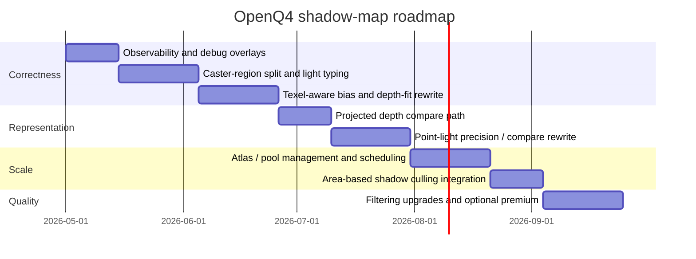

# OpenQ4 Shadow Mapping Assessment

## Executive Summary

The current shadow-map path in OpenQ4 is a serious and already quite ambitious extension of an otherwise classic entity["organization","id Software","game studio"] idTech4-style renderer: it is optional and default-off, it falls back to the legacy shadow path when shadow maps are unavailable or rejected for a light, it supports projected lights and point lights, it adds projected-light cascades, hashed alpha casting, and an experimental translucent-moment path, and it keeps a large tuning surface of bias, padding, filtering, and debugging cvars rather than presenting a single consolidated production path. That is the right evolutionary direction for a renderer descended from entity["video_game","Doom 3","2004 fps"] / entity["video_game","Quake 4","2005 fps"], but it also means the implementation is still carrying structural decisions that are much more important than any final-tier filtering choice. fileciteturn12file0L1-L1 fileciteturn18file0L1-L1

My highest-confidence conclusion is that OpenQ4’s next gains should **not** come from jumping to exotic shadow representations first. The code and shaders already show that the hard problems are: non-texel-aware biasing, manual compare paths with avoidable precision loss, projected-fit instability under slope and cascade changes, and probable caster-selection/culling path weaknesses in large scenes. Those are exactly the conditions that generate Peter Panning, slope-sensitive breakup, missing shadows in complex views, and expensive but still imperfect PCF. fileciteturn21file0L1-L1 fileciteturn22file0L1-L1 fileciteturn31file0L1-L1 citeturn14view0turn11search24turn15view0

The recommended target is a **production hybrid**: keep stencil shadows as fallback; make projected/spot, point, and parallel/global/sky lights explicit shadow classes; fix correctness and observability first; move biasing to texel-aware world/light-space models; use conservative caster expansion instead of visibility-only caster submission; use hardware comparison samplers for projected depth maps where possible; replace the point-light packed RG depth path if the compatibility envelope allows it; then, only after that, decide whether PCF, PCSS-lite, VSM-family, or moment techniques are worth the extra complexity. fileciteturn12file0L1-L1 fileciteturn18file0L1-L1 fileciteturn21file0L1-L1 fileciteturn22file0L1-L1 citeturn14view3turn14view4turn13view2turn15view0

## Current OpenQ4 Design

OpenQ4’s public shadow documentation states that the current system supports projected-light shadow maps, point-light shadow maps, optional projected-light cascades, hashed alpha for cutouts, and an experimental translucent shadow overlay; it also states that when the shadow-map path is unavailable or unsuitable, the renderer falls back to the legacy shadow path rather than leaving the light unshadowed. The renderer cvars show that `r_useShadowMap` is default `0`, `r_shadowMapCSM` is optional, hashed-alpha casting is enabled by default, and translucent moments are explicitly marked experimental. fileciteturn12file0L1-L1 fileciteturn18file0L1-L1

On the projected-light receiver side, `content/baseoq4/glprogs/shadow_interaction.fs` uses a regular `sampler2D uShadowMap`, performs **manual depth compare** in shader code, applies a constant-plus-normal bias through `ShadowReceiverBias`, chooses cascades by `vViewDepth`, clamps sampling into per-cascade atlas rects, and uses a 13-sample Poisson-like PCF kernel. The same shader already contains defensive logic for invalid `w`, NaNs, and atlas debug visualization; that is a good sign, because it means the implementation has already encountered projection-path fragility. fileciteturn21file0L1-L1

On the point-light receiver side, `content/baseoq4/glprogs/shadow_point_interaction.fs` uses a `samplerCube`, but not a `samplerCubeShadow`; it stores point-light depth as **packed RG depth**, unpacks it with `UnpackDepth16`, and then performs manual compare plus a similar 13-tap filter in angular space. This path gives OpenQ4 a portable solution, but it also sacrifices depth precision and the hardware comparison/PCF path that modern OpenGL shadow samplers can provide. fileciteturn22file0L1-L1 citeturn14view3turn14view4

The caster side is already more advanced than a naive first pass. `shadow_proj_caster.fs` and `shadow_point_caster.fs` implement classic alpha-test and hashed-alpha caster rejection, while `shadow_proj_translucent_caster.fs` and `shadow_point_translucent_caster.fs` accumulate optical-depth moments into three MRTs for red, green, and blue transmission. That is clever and surprisingly ambitious for this renderer generation, but it also means the opaque path must be made rock-solid before the translucent path deserves more expansion. fileciteturn24file0L1-L1 fileciteturn25file0L1-L1 fileciteturn28file0L1-L1 fileciteturn29file0L1-L1

The game/renderer interface in `OpenQ4-GameLibs/src/renderer/RenderWorld.h` is especially important. It exposes `renderEntity_t::noShadow`, `noSelfShadow`, `shadowLODDistance`, and `suppressLOD`, and `renderLight_t::noShadows`, `noDynamicShadows`, `pointLight`, `parallel`, and `globalLight`. It also exposes portal-area APIs such as `FindVisibleAreas`, `BoundsInAreas`, and `AreasAreConnected`, plus a portal-sky render flag. In other words: the right classification hooks for a production shadow system already exist, but OpenQ4 still needs a stronger policy layer that uses them deliberately. fileciteturn31file0L1-L1

The renderer-side integration surface is also revealing: `RenderSystem_init.cpp` exposes not only shadow-map toggles, but also `r_useLightPortalFlow`, `r_useShadowSurfaceScissor`, `r_lod_entities`, `r_lod_shadows`, and related percentage thresholds. These are useful for cost control, but they are also exactly the sort of culling and LOD gates that can make shadows disappear in complex scenes if caster submission is too tightly coupled to visible interaction submission. fileciteturn18file0L1-L1

The recommended end-state pipeline is below. The key difference from the likely current behavior is the explicit split between **receiver selection** and **caster expansion/classification**.


That pipeline matches the original strengths of idTech4’s interaction renderer while correcting the part that a pure interaction list does not solve well: “what can cast onto the receiver set even if it is not itself a visible screen-space interaction?” fileciteturn18file0L1-L1 fileciteturn31file0L1-L1 citeturn15view0turn14view2

## Analytical Assessment of the Main Failure Modes

**Peter panning.** The current projected path stacks caster-side polygon offset with receiver-side constant bias and a normal-angle term, while the point path does the same in a slightly different parameterization. The receiver shaders compute slope response from `vShadowLightCos`, but the bias is still not explicitly tied to **world-units-per-texel**, per-cascade texel footprint, or receiver-plane derivatives. That is the classic recipe for a system that needs visibly large offsets to suppress acne and therefore detaches shadows at contacts. Official CSM guidance is explicit that larger PCF kernels worsen the correlation problem and that tight near/far fitting and more advanced biasing are required; recent adaptive-bias work goes further and shows why constant and slope-scale-only methods still over-bias. fileciteturn21file0L1-L1 fileciteturn22file0L1-L1 citeturn14view0turn11search24turn5search1

**Slope errors.** OpenQ4’s shaders apply slope sensitivity through the light-normal cosine, but they do not currently estimate a per-texel receiver-plane bias through derivatives, nor do they appear to derive bias from texel footprint in light space. That means steep receivers, especially under wider PCF kernels, are forced into a generic bias regime that cannot remain both stable and contact-tight. This is exactly the scenario that entity["organization","Microsoft","software company"]’s CSM guidance identifies as requiring per-texel, derivative-based bias when PCF kernels get large. fileciteturn21file0L1-L1 fileciteturn22file0L1-L1 citeturn14view0

**Complex scenes with many shadow casters.** OpenQ4’s available controls strongly suggest that shadow submission is still influenced by visibility/interaction-era heuristics: portal flow, scissor, entity/shadow LOD, `suppressLOD`, and `shadowLODDistance`. Those are good tools for cost control, but they are not sufficient caster logic for large scenes with off-screen blockers or long projected-light paths. In those scenes, the dominant bug is often not “poor filtering” but “the blocker was never rendered into the map.” The literature on partitioning/warping makes the same point from a different angle: fitting and partitioning matter because ordinary shadow maps distribute error badly in large depth ranges. fileciteturn18file0L1-L1 fileciteturn31file0L1-L1 citeturn15view0turn13view2

**Efficiency and culling, including PVS2/PHS-style concerns.** I did not find an explicitly named “PVS2/PHS” shadow path in the surfaced repository files, but the engine-side area/portal APIs are clearly present, and they are the correct place to build one. The right production rule in an idTech4 renderer is not “submit only what the eye currently sees,” and not even “submit only what the interaction scissor can see.” It is “submit all casters that are conservatively capable of shadowing the current receiver region,” then reduce that set using portal/area connectivity and light-space tests. In practice, that means using `BoundsInAreas` / `AreasAreConnected` as a shadow-caster coarse filter, followed by light-space AABB or frustum tests, not receiver-only scissor or screen-coverage LOD. fileciteturn31file0L1-L1 fileciteturn18file0L1-L1

**Filtering quality.** The current 13-tap PCF baseline is perfectly respectable as a baseline, but it is manual, expensive, and precision-limited by the underlying representation. For projected lights, OpenGL comparison samplers would allow hardware-assisted PCF on genuine depth textures; for point lights, OpenQ4’s packed RG depth path currently blocks the same opportunity and adds unpack noise/quantization. The immediate conclusion is that OpenQ4 is spending a lot of texture bandwidth to filter around representation and bias issues that should first be fixed closer to the source. fileciteturn21file0L1-L1 fileciteturn22file0L1-L1 citeturn14view3turn14view4

**Different light types, including skies.** The user-facing docs emphasize projected and point lights, plus projected-light CSM; meanwhile the renderer API already distinguishes `pointLight`, `parallel`, and `globalLight`, and the render flags include portal sky rendering. That combination strongly suggests that the current shadow-map path is still “projected/point first,” while the engine API is already capable of a more explicit per-light-class policy. My recommendation is to stop treating all non-point lights as a single bucket. Small projected spots, large projected architectural lights, and parallel/global/sky lights should not share the same fit, update, or caching policy. fileciteturn12file0L1-L1 fileciteturn31file0L1-L1

The bottom-line diagnosis is therefore straightforward: **OpenQ4’s most important missing pieces are not “more taps,” but “better fit, better bias, better caster classification, and better light-type specialization.”** That diagnosis is consistent with the original shadow-map literature, the CSM guidance, the adaptive-bias literature, and the code that is currently in the repository. citeturn6search1turn13view2turn15view0turn14view0turn11search24

## Technique Comparison and Recommended Target Architecture

### Filtering and shadow representation

| Technique | Quality | Performance | Typical artifacts | Suitability for OpenQ4 |
|---|---|---:|---|---|
| Hardware PCF on depth textures | Good hard/softened edges baseline | Low to medium | Bias sensitivity, limited softness | **Best default target for projected lights** |
| Manual Poisson PCF | Similar baseline quality, more control | Medium | Same as PCF plus higher texture cost | Good transitional path, but not ideal final state |
| PCSS / PCSS-lite | Better contact hardening | High | Expensive blocker search, instability on thin blockers | Premium mode only, after correctness fixes |
| VSM | Wide, cheap filtering | Medium | Light bleeding, variance failure cases | Possible research branch for selected lights |
| ESM | Better filtering than raw PCF with simpler storage than some moment methods | Medium | Exponent tuning, residual leakage/error cases | Viable optional branch, not first-line fix |
| EVSM | Often better than VSM in practice, but precision-sensitive | Medium to high | Exponent/precision tuning, residual bleeding | Optional experiment, not the first production target |
| Moment shadow maps / improved moments | High-quality filterable shadows, translucent compatibility | Medium to high | More storage/math complexity | Good long-term R&D path, especially for translucent occluders |

These conclusions combine OpenQ4’s current implementation constraints with the primary technique references: classic shadow maps, hashed alpha, VSM, ESM, and improved moment shadow maps. citeturn6search1turn13view0turn8search0turn8search46turn8search10turn10search36

### Projection and partitioning

| Technique | Strength | Weakness | Best use in OpenQ4 | Recommendation |
|---|---|---|---|---|
| Stable single projected map | Minimal CPU/GPU overhead, simplest debug story | Aliasing in large depth ranges | Small to medium projected lights | **Default for ordinary projected lights** |
| CSM / PSSM | Best general answer for large directional or global coverage | More passes, more seam/stability complexity | Parallel/global/sky lights, very large projected lights | **Primary large-coverage solution** |
| PSM | Reduces perspective aliasing | Post-perspective singularities, caster issues | Research only | Not recommended as first production path |
| LiSPSM | Better warp behavior than PSM, avoids PSM singularities and missed-caster pitfalls | Still more complex than stable CSM; less natural in an interaction-era engine | Large projected lights if CSM cost is too high or splits are undesirable | Later-stage optional path |
| Warping + partitioning | Low error for difficult depth ranges | More complexity in fit/update/debug | Special high-range cases | Only after stable CSM is solid |

The key external point here is that LiSPSM explicitly avoids the singularities and missed-caster problems of PSM, while warping-plus-partitioning literature shows that partitioning is usually the bigger win in high depth ranges. For OpenQ4, that pushes the decision strongly toward **stable CSM first, LiSPSM later if still needed**. citeturn13view2turn15view3turn15view4turn15view5turn15view0turn14view5

### Recommended architecture

For OpenQ4 specifically, I would choose this stack:

- **Projected spot / projective lights:** stable single-map depth shadow by default; optional multi-cascade only when the projected footprint and receiver depth range justify it.
- **Point lights:** true depth cubemap comparison path if compatibility envelope permits; otherwise keep the current packed path only as fallback.
- **Parallel / global / sky lights:** dedicated stable CSM path with texel snapping, conservative caster expansion, and update throttling.
- **Alpha-tested casters:** keep hashed alpha, but make the hash stable in a better domain than raw `gl_FragCoord` if atlas movement remains visible.
- **Translucent moments:** keep experimental and separate from opaque-path correctness.

That is the best balance of quality, implementation risk, GPU cost, and compatibility with an idTech4 interaction renderer. fileciteturn24file0L1-L1 fileciteturn25file0L1-L1 fileciteturn31file0L1-L1 citeturn14view2turn14view5turn13view2

## Code-Level Recommendations in OpenQ4 and OpenQ4-GameLibs

| File | Current behavior | Concrete recommendation |
|---|---|---|
| `content/baseoq4/glprogs/shadow_interaction.fs` | Manual compare against `sampler2D`, 13-tap PCF, constant + normal bias, cascade bias scale, atlas clamp, invalid-`w` guards | Replace `ShadowReceiverBias` with a texel-aware bias model driven by per-cascade world-units-per-texel; add optional receiver-plane derivative bias for larger kernels; migrate to `sampler2DShadow` + compare mode if the projected path already renders true depth textures; keep debug modes and add a bias heatmap. |
| `content/baseoq4/glprogs/shadow_point_interaction.fs` | RG-packed cubemap depth, manual unpack/compare, 13-tap angular PCF | Replace with `samplerCubeShadow` if feasible; otherwise increase precision substantially and separate angular texel scale from bias scale; compute bias in radial texel units, not just constant + normal terms. |
| `content/baseoq4/glprogs/shadow_proj_caster.fs` | Hashed alpha seeded from `gl_FragCoord.xy` | Re-seed hash from stable shadow-texel coordinates or object/world-space IDs so atlas relocation and viewport movement do not create unnecessary dither drift. |
| `content/baseoq4/glprogs/shadow_point_caster.fs` | Alpha-tested / hashed point caster with packed depth output | Same hash stabilization change as projected path; if depth cubemaps are adopted, drop packing entirely and let hardware store depth. |
| `content/baseoq4/glprogs/shadow_proj_translucent_caster.fs` and `shadow_point_translucent_caster.fs` | Three-channel optical-depth moments in three MRTs | Keep this path isolated; do not optimize it before opaque correctness. Later, consider moment-map format audit and per-light eligibility pruning. |
| `src/renderer/RenderSystem_init.cpp` | Rich cvar surface, but bias/fitting policy still mostly scalar/tuning based | Add cvars for texel-aware bias scale, blocker margin, shadow atlas budget, shadow update hysteresis, contact-shadow toggle, and per-light-class thresholds. |
| `src/renderer/tr_local.h` | Shadow-map state is present, including debug and atlas-related data | Extend state with per-cascade world-units-per-texel, fitted near/far, last-stable matrices, light classification, and residency/update metadata. |
| `src/renderer/Interaction.cpp` | Shadow-caster chain and cache handling are already a critical integration point | Split receiver-set construction from conservative caster-set expansion; classify casters into static, skinned, alpha-cutout, particle/effect, and non-shadowing; cache static caster lists by light/area where possible. |
| `src/renderer/draw_arb2.cpp` | Central integration point for shadow-map rendering and interaction shading | Introduce explicit light-class shadow paths, timer-query instrumentation, atlas/pool residency tracking, and a shadow update scheduler; if projected depth maps are already true depth textures, move them to compare mode and reduce shader ALU cost. |
| `OpenQ4-GameLibs/src/renderer/RenderWorld.h` | Already exposes `noShadow`, `noSelfShadow`, `shadowLODDistance`, `suppressLOD`, `pointLight`, `parallel`, `globalLight` | Prefer a renderer-side sidecar classification table keyed by entity/light handle instead of immediately expanding these structs, because changing the ABI/layout is higher risk for save/demo/game-code integration. |

The sources above are directly tied to the repository files inspected, especially the receiver shaders, caster shaders, renderer cvars, and the GameLibs renderer interface. fileciteturn18file0L1-L1 fileciteturn21file0L1-L1 fileciteturn22file0L1-L1 fileciteturn24file0L1-L1 fileciteturn25file0L1-L1 fileciteturn28file0L1-L1 fileciteturn29file0L1-L1 fileciteturn31file0L1-L1

A practical bias model for OpenQ4’s projected path should look more like this than the current scalar-only approach:

```glsl
float ComputeReceiverBiasWS(
    float ndotl,
    float worldUnitsPerTexel,
    float minBiasWS,
    float slopeScale,
    float normalScale)
{
    float clamped = clamp(ndotl, 1e-3, 1.0);
    float slope = sqrt(max(1.0 - clamped * clamped, 0.0)) / clamped; // ~tan(theta)
    return minBiasWS
         + slopeScale  * worldUnitsPerTexel * slope
         + normalScale * worldUnitsPerTexel * (1.0 - clamped);
}
```

That is not the only workable formula, but the crucial difference is that it scales with texel footprint rather than pretending one scalar bias can cover every cascade/light/receiver configuration. The academic and official guidance is very consistent on that point. citeturn14view0turn11search24

## Checklist Implementation Roadmap



| Priority | Task | Complexity | Risk | Validation |
|---|---|---|---|---|
| Highest | **Add observability first**: depth-atlas view, invalid-`w` heatmap, cascade ID, bias heatmap, per-light CPU/GPU timers, atlas occupancy, caster-count and rejection-reason reporting | Low | Low | Verify every failure case can be localized to caster contents, projection, or compare stage |
| Highest | **Separate receiver region from caster region** and stop letting screen-visible interaction logic fully dictate shadow caster submission | Medium | Medium | Off-screen blocker test; long corridor / atrium test; area-portal regression checks |
| Highest | **Replace scalar biasing with texel-aware biasing**; add optional derivative/receiver-plane path for large kernels | Medium | Medium | Box-on-plane contact test; sloped ramp test; cascade seam test |
| High | **Projected path: use compare-mode depth sampling** if the resource path supports it | Medium | Medium | Compare GPU cost and artifact rate versus current manual path |
| High | **Point path: upgrade precision and preferably adopt depth cubemap compare** | High | High | Thin geometry around point light; near/far sweep; precision histograms |
| High | **Light-type specialization** for projected, point, and parallel/global/sky lights | Medium | Medium | Outdoor/global-light scenes, portal-sky scenes, large architectural spots |
| Medium | **Atlas / cubemap-pool scheduling** with static cache and update hysteresis | High | Medium | Many-light stress scenes; update count stability; atlas fragmentation metrics |
| Medium | **Hasher stabilization for alpha cutouts** | Low | Low | Foliage/fence camera pan tests; temporal noise tests |
| Later | **Filtering upgrades**: better Poisson patterns, optional PCSS-lite, selective filterable-map experiments | Medium to High | Medium | Quality tier scaling tests and GPU cost deltas |
| Later | **Translucent-path refinement** | High | High | Only after opaque path is stable; validate colored transmission and bandwidth cost |

The workload order matters. OpenQ4 should not tune filter quality and translucent shadows before it has made shadow correctness, bias correctness, and caster submission measurable and reliable. fileciteturn12file0L1-L1 fileciteturn13file0L1-L1 citeturn14view0turn11search24

## Test Plan, Benchmarks, and Limitations

The existing shadow debugging surface in OpenQ4 is already useful: `r_shadowMapDebugMode`, `r_shadowMapDebugOverlay`, `r_shadowMapReport`, `r_shadowMapReportInterval`, and `r_singleLight` are enough to build a disciplined benchmark harness once the renderer adds a few more metrics. fileciteturn12file0L1-L1

### Prioritized benchmark suite

| Test | Purpose | Key metric | Expected failure if current code is wrong |
|---|---|---|---|
| Box on plane, grazing light | Peter Panning / acne | Contact detachment in pixels and world units | Floating shadow, or acne oscillation with tiny bias changes |
| Sloped ramp with thin pole | Receiver slope robustness | Acne ratio, detached-edge ratio | Split/tearing or aggressive detachment on slope |
| Off-screen blocker onto visible floor | Conservative caster submission | Missing-shadow count | Shadow disappears when blocker exits camera view |
| Atrium / corridor with many dynamic casters | Many-caster scaling | CPU submit ms, GPU shadow ms, rejected-caster counts | Cost explosion or visible caster omission |
| Alpha fence / grate / foliage | Hashed-alpha stability | Temporal variance and silhouette retention | Shimmering or disappearing thin coverage |
| Point light in cube room with thin geometry | Point precision and face seams | Seam visibility, compare error rate | Face-edge instability, detached results near light |
| Outdoor/global-light scene with far receiver range | CSM stability and fit | Cascade seam delta, shimmering amplitude | Split seams, unstable crawling, poor far coverage |
| Portal-sky / sky-view scene | Sky-light path correctness | Shadow agreement between main and sky views | Wrong fit/update cadence or double-instability |

### Minimum instrumentation to add

- Per-light and per-cascade GPU timer queries.
- Per-light CPU submit time and draw count.
- Caster counts by class: static, dynamic/skinned, alpha-cutout, translucent, rejected.
- Fitted near/far and world-units-per-texel per cascade.
- Atlas occupancy and churn.
- Shadow update frequency and cache hit rate.
- Contact-detachment metric for the canonical box-on-plane test.
- “Missing caster” diagnostics: why each candidate was rejected.

Those metrics are what will make PVS2/PHS-like area culling, LOD gating, and update scheduling debuggable instead of anecdotal. fileciteturn18file0L1-L1 fileciteturn31file0L1-L1

### Open questions and limitations

This report is high confidence on the **shader design, cvar surface, renderer/game interface, and strategic direction**, but lower confidence on a few exact file-internal call boundaries because the connector surfaced some large C++ files at file granularity rather than with stable line excerpts. I also did not directly profile a built OpenQ4 binary, so all performance recommendations are architecture-level rather than measured frame captures. Finally, I did not find an explicitly named PVS2/PHS shadow subsystem in the inspected files; my recommendation there is therefore an integration strategy derived from the engine’s area/portal interface rather than a statement about an existing implementation. fileciteturn18file0L1-L1 fileciteturn31file0L1-L1

The shortest honest conclusion is this: **OpenQ4 is already far enough along that the right next step is not “invent a new shadow system,” but “finish this one correctly.”** Fix projected and point depth representation, fit, bias, and caster submission first; split light classes cleanly; then let filtering and more advanced representations compete on top of a stable base. That is the path most consistent with the repository, with official OpenGL and CSM guidance from entity["organization","Khronos Group","opengl consortium"] and entity["organization","Microsoft","software company"], and with the original shadow-mapping literature from classic depth maps through LiSPSM, partitioned shadow maps, hashed alpha, and modern bias/moment extensions. citeturn14view3turn14view4turn14view0turn13view2turn15view0turn13view0turn13view1turn11search24