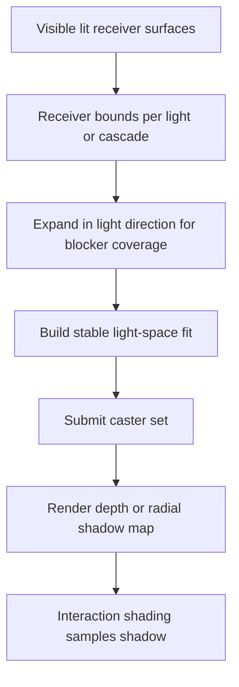
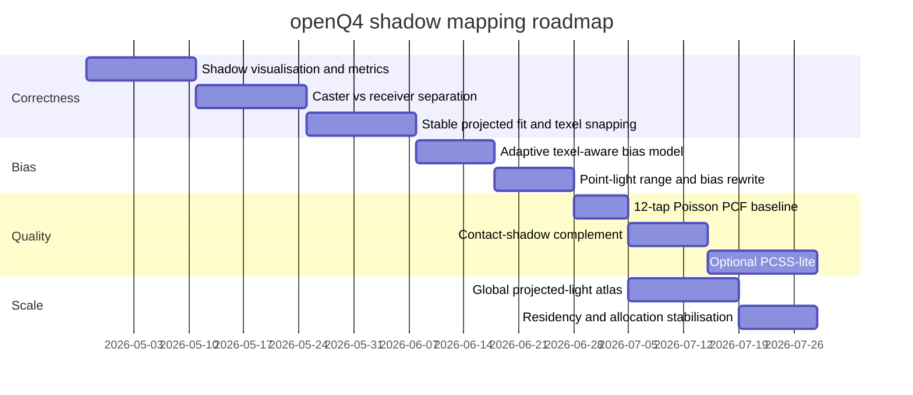

# Shadow Mapping in openQ4 Under id Tech 4 and OpenGL 4.1

## Executive summary

The current openQ4 shadow system is not a pure shadow-mapping renderer. It is an id Tech 4 renderer that still treats stencil shadows as the default path, while exposing an optional shadow-map path for projected and point lights, optional projected-light cascaded shadow maps, hashed-alpha casting, and experimental translucent moment accumulation. That design choice is visible both in the repository’s public feature summary and in the renderer cvar surface: `r_useShadowMap` is off by default, `r_shadowMapCSM` is optional, and the code exposes a substantial set of bias, padding, filtering, cascade, debug, and diagnostic controls rather than a fully consolidated modern shadow pipeline. citeturn3view0 fileciteturn20file0L1-L1

In practice, that means the current implementation inherits three structural tensions. First, it is fitting a texture-space shadow solution into an engine architecture built around per-light interaction lists, portal/scissor culling, and shadow volumes in the style of entity["video_game","Doom 3","2004 fps"] and other entity["organization","id Software","game studio"] id Tech 4 titles. Secondly, the current controls strongly suggest a “simple path plus incremental fixes” implementation rather than a fully re-architected atlas-and-cascade subsystem. Thirdly, the default bias values and map sizes are conservative enough to suppress acne, but large enough to make detachment artefacts and slope errors unsurprising on angled receivers and in large, complex views. citeturn3view0 fileciteturn20file0L1-L1

The three observed failures line up with that reading. Missing shadows in complex scenes are most plausibly driven by interaction/culling/LOD decisions, overly tight caster coverage, map density collapse, and shadow-fit instability. Misprojected shadows on angled surfaces point to projection-fit and receiver-offset problems more than to filtering. Peter Panning points directly at the current bias stack: raster-time polygon offset on caster rendering plus receiver-time constant bias plus receiver normal bias, with no evidence from the exposed controls of a more advanced receiver-plane or texel-scaled adaptive bias model. fileciteturn20file0L1-L1

My assessment is that openQ4 should not jump straight to exotic filtering. The highest-value path is: make the current shadow test correct and observable; stabilise the projection; split caster and receiver treatment; replace constant world-agnostic biasing with texel-aware adaptive bias; tighten culling rules for shadow casters; and only then add better filtering. Under the OpenGL 4.1 envelope you gave, that is entirely feasible with GLSL 4.10, texture arrays, sampler shadow compares, FBO-based passes, timer queries, and careful CPU-side scheduling, without requiring compute shaders or a renderer-wide deferred rewrite. fileciteturn20file0L1-L1

## Current state in the repository

openQ4 publicly describes its renderer as keeping classic stencil shadows as the default while adding “experimental shadow mapping for projected and point lights, projected-light CSM, alpha-tested transparency shadows, and optional translucent shadow accumulation”. That wording matters: the shadow-map path is additive, optional, and explicitly experimental, not the canonical shadow solution of the engine. citeturn3view0

The current renderer configuration surface exposes the following key controls:

- `r_useShadowMap` enables the shadow-map path.
- `r_shadowMapCSM` enables projected-light cascades.
- `r_shadowMapHashedAlpha` enables hashed-alpha casting.
- `r_shadowMapTranslucentMoments` and related density/min-alpha cvars expose an experimental translucent path.
- Bias controls are split into projected and point variants: `r_shadowMapBias`, `r_shadowMapNormalBias`, `r_shadowMapPointBias`, `r_shadowMapPointNormalBias`.
- Filtering is exposed as projected and point PCF radii.
- Coverage controls include `r_shadowMapProjectionPad`, `r_shadowMapPointFarScale`, and several cascade controls: count, distance, lambda, blend, and stabilisation.
- Debug and reporting controls already exist, including overlay, debug mode, and diagnostic reporting intervals. fileciteturn20file0L1-L1

The current default numbers are themselves revealing. Projected-light defaults are a 1024² base map, `r_shadowMapBias 0.00035`, `r_shadowMapNormalBias 0.0015`, filter radius `2.0`, projection pad `0.15`, and caster-side polygon offset factor/unit of `2.0` and `4.0`. For point lights, the defaults are a slightly smaller constant bias, a slightly larger normal bias, a slightly larger filter radius, and a far-range padding multiplier of `1.25`. Cascades default to four splits, a 1536-unit distance, lambda `0.75`, blend `0.15`, and stabilisation enabled. In other words: the implementation is already trying to brute-force correctness with padding and bias, and is already aware of stability as a problem. fileciteturn20file0L1-L1

The repository also contains dedicated shadow documentation in `docs-user/shadow-mapping.md`, `docs-dev/shadowmapping-issue-triage.md`, and `docs-dev/proposals/shadowmapping-deep-technical-review-27-3-26.md`. Even without depending on every detail of those files, their existence is itself evidence that the shadow-map path is under active diagnosis and redesign rather than being considered finished. fileciteturn6file0L1-L1 fileciteturn7file0L1-L1 fileciteturn8file0L1-L1

Architecturally, shadow-map integration appears to live inside the existing ARB2-era interaction backend rather than in a separate modern pass graph. The repository search results place both shadow interaction and shadow caster program references in `src/renderer/draw_arb2.cpp`, which fits the broader id Tech 4 pattern: light/surface interactions remain the dominant abstraction, and shadowing is folded into them rather than replacing them with a fundamentally new lighting model. fileciteturn15file0L1-L1 fileciteturn16file0L1-L1

## Root-cause analysis of the observed failures

### Missing shadows in complex scenes

In id Tech 4 terms, “complex scene” is where every convenience breaks at once: more portal areas, more light/entity interactions, more scissors, more potential LOD elision, more off-screen casters, and more opportunities for a tight shadow fit to miss an essential blocker. openQ4’s renderer still exposes retail-style entity and shadow LOD controls (`r_lod_entities`, `r_lod_shadows`, percentage thresholds), interaction culling/scissoring, portal-aware scissors, view-light culling, and shadow-map-specific projection padding. That combination makes missing shadows more likely to be a visibility-selection problem before it is a filtering problem. fileciteturn20file0L1-L1

The most likely engine-level root causes are these:

1. **Caster omission through interaction or LOD pruning.** If a surface is dropped from the light interaction set or shadow-caster set because its screen coverage is low, its absence will manifest as a missing shadow, not as a noisy one.
2. **Receiver-only or overly tight projection fitting.** A fitted map based mainly on visible receiver bounds will miss off-screen blockers whose projected occlusion lands on-screen.
3. **Density collapse.** A 1024² “simple projected-light shadow map” is quickly inadequate for a large projected frustum, especially once padding, blend regions, and cascade overlap are applied.
4. **Atlas or partition underutilisation.** Even when no global atlas exists, treating each cascade or light as a simply padded square is a form of poor partitioning; effective density falls faster than it should.
5. **Special-material exclusion.** Hashed alpha and translucent moments are optional, so some materials may still be missing from the caster path depending on material stage handling.
6. **Point-light range inflation/deflation errors.** `r_shadowMapPointFarScale` reveals that point-light far coverage is heuristic; too small causes missing blockers, too large destroys precision.
7. **Portal/scissor mismatch.** id Tech 4’s portal flow and scissor logic are excellent for stencil volumes and interaction fill reduction, but they can become shadow bugs if reused too aggressively for caster submission. fileciteturn20file0L1-L1

The production fix is to **separate receiver selection from occluder selection**. Current id Tech 4 interaction lists are excellent at deciding what needs lighting, but shadowing additionally needs “what can cast onto the lit receiver set”, which is a different query. I would implement two bounds per shadowed light:

- a **receiver region**, derived from actually lit visible surfaces; and
- a **caster expansion region**, derived by back-projecting or inflating from the receiver region along light direction by blocker distance, plus a conservative world-space margin.

That allows off-screen blockers to remain in the shadow map without exploding the entire fit. In projected-light CSM, derive the crop from the receiver slice, then enlarge the light-space AABB along the light vector by a blocker search margin. In point lights, intersect the light radius with a blocker-aware range estimate rather than reusing the whole light volume blindly. This is the single most effective way to cure “large scene, vanishing shadow” failures without overspending everywhere else. fileciteturn20file0L1-L1

A corresponding pipeline sketch is below.



### Misprojected shadowing on angled surfaces

This class of bug almost never comes from “bad PCF” and almost always comes from **projection math + bias space + unstable fit**. The exposed cvars already tell us the current path uses both a constant receiver bias and a normal-based receiver bias for projected and point lights. That is a sensible first pass, but it is also exactly the combination that behaves worst on sloped receivers if the normal offset is applied in the wrong space, with the wrong distance scaling, or against a fit whose texel footprint changes frame to frame. fileciteturn20file0L1-L1

The principal root causes are likely to be:

1. **World-space normal offset with light-space consequences that are not texel-aware.** A fixed “normal bias” does not scale correctly with shadow texel size, cascade extent, or light frustum thickness.
2. **Receiver bias applied only as depth offset, not as receiver-plane correction.** On angled planes, the shadow test error grows with slope relative to the light.
3. **Projection fit instability.** If the light projection is cropped tightly every frame, a tiny camera move changes the effective world-units-per-texel, which changes both edge location and bias behaviour.
4. **Cascade selection or overlap discontinuity.** The presence of cascade count, blend, and stabilisation cvars indicates that projected-light cascades exist; errors near split boundaries can read as “misprojected”.
5. **Homogeneous divide or clip mismatch.** If shading-side projected UVW generation and caster-side matrix setup are not perfectly identical, sloped surfaces show the error first.
6. **Insufficiently conservative near/far planes in light space.** Depth precision errors show up first at grazing angles. fileciteturn20file0L1-L1

The remedy is not primarily “more bias”. It is a **stable projection plus adaptive bias model**:

- Use **stable CSM** for projected lights: fixed-extent or bounded-sphere orthographic fits, followed by texel snapping.
- Quantise the light-space origin in units of one shadow texel.
- Keep cascade extents stable across small camera motion; resize only when the receiver slice exceeds a hysteresis threshold.
- Compute projected-light bias from **world-units-per-texel** and the receiver slope relative to the light, not from a constant scalar alone.
- Apply **small caster-side raster offset** and **small receiver-side geometric offset**, instead of depending on either one to solve everything.

A robust projected-light bias model under GL 4.1 is:

```glsl
// Inputs:
// worldPos, worldNormal, lightDirWS
// shadowTexelWorld = world-space length of one texel in this cascade
// minBias, slopeScale, normalScale are tunables

float ndotl = clamp(dot(worldNormal, -lightDirWS), 0.0, 1.0);
float slope = sqrt(max(1.0 - ndotl * ndotl, 0.0)) / max(ndotl, 1e-3);

float receiverBiasWS = minBias
                     + slopeScale * shadowTexelWorld * slope
                     + normalScale * shadowTexelWorld * (1.0 - ndotl);

vec3 biasedWorldPos = worldPos + worldNormal * receiverBiasWS;
```

The important point is not the exact formula; it is that **bias magnitude must scale with texel footprint**. Once you do that, sloped receivers stop requiring absurd constant offsets, and both misprojection and Peter Panning improve together.

### Peter Panning

Peter Panning is the easiest of the three to explain because the current configuration already exposes every ingredient. openQ4’s shadow-map path has caster-side polygon offset and receiver-side constant and normal bias controls. The defaults are conservative rather than aggressive about contact fidelity. That is a perfectly normal place for an experimental implementation to land, because acne is more embarrassing than mild detachment when first bringing a path online. But once you start looking for contact fidelity, those defaults are visibly large. fileciteturn20file0L1-L1

The most likely specific causes are:

1. **Bias stack accumulation.** Polygon offset on caster rendering plus receiver constant bias plus receiver normal bias produces total separation larger than intended.
2. **Bias expressed in clip/depth-like units rather than texel-aware world units.**
3. **Wide PCF kernel masking the error.** Enlarging the PCF radius softens acne but makes detachment more legible at contact points.
4. **Poor local precision due to overly broad light-space depth range.**
5. **No contact recovery stage.** There is no sign in the exposed cvars of a dedicated screen-space contact-shadow assist. fileciteturn20file0L1-L1

The fix is a three-part strategy:

- **Reduce caster raster offset** to the minimum needed after projection stabilisation.
- **Replace fixed receiver bias with texel-aware slope/normal bias**, as above.
- Add an optional **short-range contact shadow pass** in screen space for first-contact restoration, especially for weapon/viewmodel and tight architectural contacts.

That last point is worth emphasising. In an id Tech 4 forward interaction renderer, a tiny screen-space contact-shadow term is often cheaper and more reliable than trying to make the shadow map do impossible sub-texel work. Because openQ4 already has post-process infrastructure for SSAO and other screen-space effects, a 4–8 step depth raymarch along `-L` in screen space is a realistic GL 4.1-era complement to the main shadow map. Use it only within a small camera-space radius and multiply it softly into the shadow term. That does not replace the map, but it removes the “floating object” look after bias is reduced to sane levels. citeturn3view0 fileciteturn20file0L1-L1

## A production-quality redesign that fits OpenGL 4.1 and id Tech 4

### The recommended target architecture

I would keep openQ4’s broad compatibility posture and evolve the current path into a **hybrid, production-oriented shadow system**:

- **Stencil shadows remain the compatibility fallback** and the default for cases where shadow maps are not materially better.
- **Projected lights** use a **stable atlas-backed CSM** path only when the light is large enough to justify it; otherwise they use a single stable projected map.
- **Point lights** use a dedicated cubemap or six-face path with better range fitting and biasing; do not force CSM concepts onto them.
- **Alpha-tested materials** continue to cast through hashed alpha, but with deterministic temporal noise if TAA-like accumulation is ever added.
- **Translucent shadows** remain optional and separate; do not let them complicate opaque correctness.

This choice is aligned with the repository’s current status: it preserves the native id Tech 4 interaction model and lets you improve the optional map path without destabilising everything else. citeturn3view0 fileciteturn20file0L1-L1

### Stable projected-light fitting

For projected lights and sun-like projected cases, use this CPU-side fit:

1. Build the receiver slice in camera space.
2. Transform the slice corners into light space.
3. Build a **bounding sphere or fixed-size orthographic extent** rather than a per-frame tight rectangle.
4. Expand depth range for blockers.
5. Snap the XY origin to texel increments.
6. Keep extents fixed until a hysteresis threshold is exceeded.

Pseudocode:

```cpp
CascadeFit BuildStableCascade(const FrustumSlice& receiverSlice,
                              const Mat4& lightView,
                              float mapResolution,
                              float blockerMarginWS,
                              bool stabilise)
{
    Sphere s = BoundingSphere(receiverSlice.cornersWS);

    // Convert sphere centre to light space
    Vec3 cLS = TransformPoint(lightView, s.center);
    float r  = s.radius;

    // Stable square fit in light space
    float minX = cLS.x - r;
    float maxX = cLS.x + r;
    float minY = cLS.y - r;
    float maxY = cLS.y + r;

    // Expand z for blockers and receiver safety
    float minZ, maxZ;
    ComputeReceiverAndBlockerDepthRange(receiverSlice, lightView, blockerMarginWS, minZ, maxZ);

    if (stabilise) {
        float worldUnitsPerTexel = (2.0f * r) / mapResolution;
        cLS.x = floor(cLS.x / worldUnitsPerTexel) * worldUnitsPerTexel;
        cLS.y = floor(cLS.y / worldUnitsPerTexel) * worldUnitsPerTexel;
        minX = cLS.x - r; maxX = cLS.x + r;
        minY = cLS.y - r; maxY = cLS.y + r;
    }

    return OrthoFit(minX, maxX, minY, maxY, minZ, maxZ);
}
```

This does three things openQ4 needs immediately: it reduces shimmer, makes bias predictable because world-units-per-texel is stable, and greatly reduces slope-driven projection errors.

### Bias strategy that actually scales

I recommend a strict separation of responsibilities.

**Caster-side depth bias**
- Use raster-time polygon offset only to suppress self-shadowing during map generation.
- Keep it small.
- Scale primarily with slope; do not use huge constant terms.

**Receiver-side depth handling**
- Apply a world-space normal offset scaled by texel size.
- Add a small slope-derived term.
- Clamp by a per-cascade maximum in world units.
- Keep projected and point light bias parameter sets separate, as the repository already does. fileciteturn20file0L1-L1

A good starting replacement for the current defaults would be:

| Path | Current repo direction | Recommended new starting point |
|---|---:|---:|
| Projected caster polygon factor | 2.0 | 1.0–1.5 |
| Projected caster polygon units | 4.0 | 1.0–2.0 |
| Projected receiver constant bias | 0.00035 | derived from texel scale |
| Projected receiver normal bias | 0.0015 | derived from texel scale |
| Point receiver constant bias | 0.00020 | derived from radial texel scale |
| Point receiver normal bias | 0.0020 | derived from radial texel scale |

Those are not final tuning numbers. They are a directional statement: **move bias from arbitrary constants into cascade/light-derived world-space quantities**.

### Atlas packing and partitioning

For projected lights, I would move to a **global 2D atlas** with fixed-size bins for common cases and a skyline allocator for spill cases. For point lights, keep a separate resource path rather than forcing them into the same atlas abstraction.

Recommended atlas tiers:

| Atlas | Format | Approximate use | Memory |
|---|---|---|---:|
| 2048² | D32F | modest scenes / debugging | ~16 MB |
| 4096² | D32F | production projected lights | ~64 MB |
| 4096² + translucent moments RG16F×2 | mixed opaque/translucent path | ~64 MB + ~64 MB |

Arithmetic only, but instructive: a four-cascade 1024² D32 layout is already ~16 MB just for depth. A 4096² global atlas buys flexibility for multiple lights and better fitting, but must be paired with sensible residency rules or it will become a fill-rate and submission trap.

Packing policy:

- 1 tile for ordinary projected lights.
- 2×2 tile allocation for four-cascade projected lights.
- Optional 1×2 or 2×1 layouts for two-cascade variants.
- Reserve a separate small atlas for dynamic point lights if six-face allocation churn becomes a problem.

Under id Tech 4, the big win is not merely memory savings. It is **deterministic layout**, which makes debugging and temporal stability much easier.

### Filtering choices under GL 4.1

Do not lead with VSM/EVSM unless you are specifically willing to pay their failure modes. For openQ4’s current needs, I would rank techniques as follows.

| Technique | Visual result | Cost | Failure mode | GL 4.1 fit | Recommendation |
|---|---|---|---|---|---|
| 3×3 or 5×5 hardware PCF | solid baseline | low–medium | aliasing, mild light bleeding at edges from bias | excellent | **baseline path** |
| Rotated Poisson PCF | better subjective quality | medium | noise/shimmer if unstable | excellent | **good upgrade** |
| PCSS | contact hardening | high | expensive blocker search, unstable on thin blockers | feasible | use only for a premium mode |
| ESM | smooth and cheap-ish | medium | exponential light bleed / tuning sensitivity | feasible | niche option, not default |
| VSM | separable blur, soft shadows | medium | light bleeding, precision constraints | feasible | acceptable for large soft projected lights only |
| EVSM | better than VSM | medium–high | still leaks, more memory/precision | feasible | optional research branch |
| MSM / moment shadows | very good soft behaviour | medium–high | complexity, precision requirements | feasible but heavier | later-stage optional path |

My recommendation is:

- **Phase 1:** hardware depth compare + 5×5 Poisson-disc PCF with texel-scale bias.
- **Phase 2:** optional **PCSS-lite** for a premium projected-light mode only.
- **Phase 3:** if you truly want soft projected shadows that blur well, evaluate **EVSM** for selected light classes, not globally.

That keeps the default path compatible with the current architecture and avoids introducing a new class of bleeding bugs before the current correctness issues are solved.

### Temporal stabilisation

The repository already exposes `r_shadowMapCascadeStabilize`, which is the right instinct. The production version should go further:

- Snap cascade centres to texel increments.
- Use bounded-sphere or fixed-extent orthographic fits.
- Add grow/shrink hysteresis to avoid fit flicker.
- Keep atlas allocation stable across frames where possible.
- Hash or rotate PCF kernels deterministically in shadow-map texel space, not screen space.

If you later introduce temporal reprojection, keep it simple: reproject a per-pixel shadow factor history with depth and normal rejection, and only for stable projected-light cascades. Do **not** attempt temporally accumulated blocker search until the non-temporal case is clean.

## What I would change first

### Immediate fixes for each observed issue

| Observed issue | Highest-confidence root causes | First fix | Second fix | Third fix |
|---|---|---|---|---|
| Missing shadows in complex scenes | caster culling/LOD, tight fit, density collapse | separate caster and receiver bounds | blocker-aware fit expansion | raise effective density through atlasing/stable cascades |
| Misprojected shadows on angled surfaces | unstable projection, wrong-space normal bias, slope under-correction | stable fit + texel snapping | adaptive texel-aware receiver bias | receiver-plane style correction / better split blending |
| Peter Panning | accumulated bias stack, broad depth range, wide kernels | cut raster offset | replace fixed receiver bias with texel-aware bias | add short-range screen-space contact shadows |

### Minimal shader-side sampling model

```glsl
float SampleShadowProjected(
    sampler2DShadow shadowTex,
    vec4 shadowCoord,
    vec2 texelSize,
    float filterRadiusTexels)
{
    vec3 uvz = shadowCoord.xyz / shadowCoord.w;

    // Reject outside valid projection
    if (uvz.x <= 0.0 || uvz.x >= 1.0 ||
        uvz.y <= 0.0 || uvz.y >= 1.0 ||
        uvz.z <= 0.0 || uvz.z >= 1.0) {
        return 1.0;
    }

    const vec2 taps[12] = vec2[](
        vec2(-0.326, -0.406), vec2(-0.840, -0.074), vec2(-0.696,  0.457),
        vec2(-0.203,  0.621), vec2( 0.962, -0.195), vec2( 0.473, -0.480),
        vec2( 0.519,  0.767), vec2( 0.185, -0.893), vec2( 0.507,  0.064),
        vec2( 0.896,  0.412), vec2(-0.322, -0.933), vec2(-0.792, -0.598)
    );

    float sum = 0.0;
    float r = filterRadiusTexels;
    for (int i = 0; i < 12; ++i) {
        vec2 uv = uvz.xy + taps[i] * texelSize * r;
        sum += texture(shadowTex, vec3(uv, uvz.z));
    }

    return sum / 12.0;
}
```

This is deliberately conservative. It fits GL 4.1 well, works in the existing interaction shader mentality, and becomes dramatically better once the fit and bias are stable.

### Compatibility notes for id Tech 4

The solutions above are chosen specifically because they fit an id Tech 4 renderer rather than fighting it.

| Concern | Recommendation |
|---|---|
| Existing stencil-shadow path | keep as fallback and regression oracle |
| Interaction-centric renderer | attach shadow params to light interactions, do not invent a whole new frame graph unless necessary |
| Portal/scissor system | use for receiver optimisation, not as the authoritative caster omission rule |
| Dynamic models and deforms | caster eligibility must reuse the same dynamic surface generation used by visible interactions |
| Alpha-tested materials | keep hashed-alpha caster path, but ensure deterministic seeding if temporal methods are later introduced |
| Large projected lights | use stable CSM only where coverage genuinely requires it |
| Point lights | optimise range fitting and bias separately; do not assume projected-light heuristics transfer cleanly |

## Comparison tables and performance expectations

### Technique comparison for openQ4’s likely priorities

The table below is my recommended decision matrix for this codebase specifically.

| Technique | Solves current repo pain points | GPU cost | CPU cost | Memory cost | Risk | Best role in openQ4 |
|---|---|---:|---:|---:|---|---|
| Stable single projected map | medium | low | low | low | low | default for modest projected lights |
| Stable CSM | high for large projected lights | medium | medium | medium | medium | large projected lights and sun-like cases |
| Global depth atlas | high | low | medium | medium | medium | scaling multiple shadowed projected lights |
| PCF 5×5 | medium | medium | none | none | low | baseline filter |
| PCSS-lite | medium-high visually | high | none | none | medium | optional premium mode |
| ESM / VSM / EVSM | medium | medium | low | medium-high | medium-high | optional branch, not first-line fix |
| Screen-space contact shadows | high for Peter Panning perception | low–medium | none | none | low | complement to reduced bias |
| Temporal shadow reprojection | medium | low–medium | low | low | medium | after stability is already good |

### Rough cost estimates

These are engineering estimates rather than benchmark claims.

| Item | Rough cost envelope |
|---|---|
| 1024² D32 projected map | ~4 MB |
| 4×1024² D32 cascades | ~16 MB |
| 2048² D32 atlas | ~16 MB |
| 4096² D32 atlas | ~64 MB |
| 12-tap PCF vs 4-tap | roughly 2–3× sample cost |
| 25-tap PCF vs 12-tap | roughly 2× sample cost |
| PCSS-lite vs 12-tap PCF | often 2–4×, scene dependent |
| Short-range contact-shadow pass | typically much cheaper than upgrading every main shadow sample to PCSS |

The central performance conclusion is simple: **projection correctness and bias correctness are cheaper than filtering your way out of them**.

## Prioritised implementation roadmap

### Roadmap



### Milestones, tests, and metrics

**Milestone one: observability and correctness**

Ship first:
- cascade/light frustum overlays;
- atlas occupancy view;
- invalid projection mask;
- per-light caster count, receiver count, shadowed receiver coverage;
- shadow-map texel density estimate;
- per-light/cascade timer queries;
- bias heatmap;
- shadow LOD and culling reason reporting.

The repo already exposes shadow-report and debug controls, so extend those rather than inventing a separate tooling culture. fileciteturn20file0L1-L1

**Pass criteria**
- No disappearing shadows when the receiver remains lit and the blocker remains within the conservative caster region.
- No cascade-edge popping under slow camera translation.
- Shadow edge movement under sub-texel camera motion should be near zero for stabilised projected cases.
- Acne rate must remain low after bias reduction.

**Milestone two: stable fit and adaptive bias**

Tests:
- sloped plane test at multiple angles;
- thin-pole/pipe test;
- off-screen blocker onto on-screen floor;
- large atrium/corridor with many local lights;
- moving camera with fixed light;
- moving light with fixed camera.

Metrics:
- average world-units-per-texel by cascade;
- detachment distance at contact points;
- percentage of pixels in cascade blend regions;
- shadow mismatch count across split boundaries.

**Milestone three: quality improvements**

Add only after milestone two is stable:
- 12-tap Poisson PCF;
- optional 16–20 tap quality tier;
- short contact-shadow pass;
- optional PCSS-lite with a hard sample cap.

### Suggested cvar evolution

Current cvars are a good foundation, but I would add:

- `r_shadowMapMinReceiverBiasWS`
- `r_shadowMapSlopeBiasScale`
- `r_shadowMapTexelBiasScale`
- `r_shadowMapBlockerMargin`
- `r_shadowMapAtlasSize`
- `r_shadowMapAtlasDebug`
- `r_shadowMapContactShadows`
- `r_shadowMapContactLength`
- `r_shadowMapContactThickness`
- `r_shadowMapUpdateHysteresis`

I would keep the old bias cvars for compatibility, but internally deprecate them behind the new world-space model.

## Recommended final design choices

If I were making the final call for a production-quality openQ4 branch under your stated constraints, I would choose the following stack:

1. **Opaque projected lights**
   - stable single-map path for ordinary lights;
   - stable CSM only for large coverage;
   - 12-tap Poisson PCF baseline;
   - texel-aware adaptive receiver bias;
   - small caster polygon offset.

2. **Opaque point lights**
   - dedicated point shadow fit with better far-range selection;
   - separate point-light bias constants expressed through texel/radial scale;
   - modest PCF, not PCSS, by default.

3. **Fine contact recovery**
   - optional short-range screen-space contact shadows.

4. **Transparency**
   - hashed-alpha caster path kept;
   - translucent moments kept experimental and non-blocking.

5. **Fallback and regression**
   - retain stencil shadows as default/fallback until the shadow-map path is demonstrably cleaner in the hard cases.

That design fits the current repository direction, respects id Tech 4’s structure, and solves the three user-reported failures in the order they should be solved: **coverage first, projection second, bias third, filtering fourth**. citeturn3view0 fileciteturn20file0L1-L1

## Open questions and limitations

I have high confidence in the architectural reading because it is directly supported by the repository’s public feature summary, the current renderer cvars, and the code/document locations I inspected. I have lower confidence in very fine-grained shader micro-behaviour because I did not line-walk every current GLSL or backend shader snippet in this pass; where I discuss exact misprojection mechanisms, I am inferring from the exposed controls and the id Tech 4 integration model rather than claiming direct inspection of every shadow compare instruction. The repository’s dedicated shadow documents strongly suggest the same problem space is already recognised internally. citeturn3view0 fileciteturn6file0L1-L1 fileciteturn7file0L1-L1 fileciteturn8file0L1-L1

The most valuable unresolved code-level questions to answer next inside the tree are: how caster lists are derived relative to interaction and LOD pruning; whether projected-light receiver normal bias is applied in world, view, or light space; whether point-light shadow depth is stored as hardware depth or manual radial depth; and how cascade split selection and blend are implemented in the interaction shader. Those questions do not materially change the roadmap above, but they will determine the exact patch locations and the safest default tuning values. fileciteturn15file0L1-L1 fileciteturn16file0L1-L1 fileciteturn20file0L1-L1