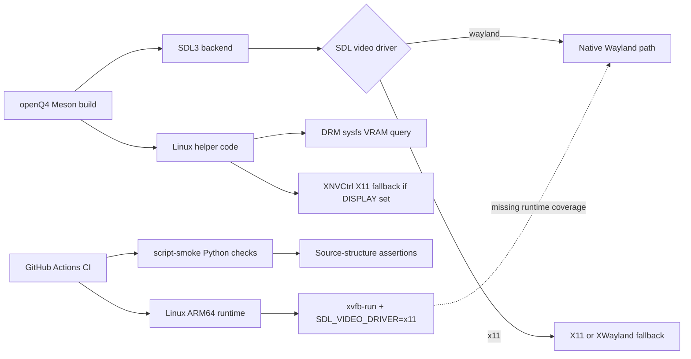

# Audit of openQ4 and openQ4-game for Linux, Wayland, and SDL Support

## Executive summary

This static audit found **no obvious remote-code-execution class flaw** in the examined Linux, Wayland, and SDL-facing code paths. The strongest issues are instead concentrated in **validation depth, Linux hardening, and build/packaging asymmetry** between the two repositories. In short: **openQ4 has a substantial SDL3/Wayland implementation, but its CI proves mostly X11/XWayland behavior rather than native Wayland behavior; openQ4-game has effectively no standalone Linux build or CI story at all.** citeturn38search0turn20view2turn29view0turn25view0

The most important concrete gap is that the Linux runtime CI job installs Wayland-related dependencies but then explicitly forces `SDL_VIDEO_DRIVER=x11` / `SDL_VIDEODRIVER=x11` under `xvfb-run`, and only runs a narrow renderer startup case. That means the project’s highest-risk Linux regressions are exactly the ones least exercised in automation: native Wayland window lifecycle, compositor-synchronized resizes/fullscreen transitions, pointer confinement, and libdecor-dependent paths. SDL’s own documentation and issue tracker make clear that these areas are materially different from X11 and have had real regressions in recent SDL 3.x releases. citeturn20view2turn32view0turn32view3turn35view3turn35view2turn35view0

The second important theme is **security posture rather than a single bug**. openQ4’s Meson logic explicitly adds hardening flags on macOS, but the Linux path shown in the audited Meson configuration does not add comparable project-level hardening such as stack protector, FORTIFY, RELRO, or PIE. On Ubuntu package builds some of this may come from distro defaults, but on non-distro local builds or alternative toolchains that guarantee is weaker. Given that this is a large native C/C++ game engine processing user-controlled command lines, save/config state, network input, and potentially modded assets, explicit hardening is worth treating as a first-class Linux requirement. citeturn39view0turn40search1turn40search15turn40search16

The companion repository **openQ4-game** is a separate risk in a different sense: it appears to contain no Wayland or SDL platform layer of its own, but its standalone Meson build explicitly errors on non-Windows hosts and requires MSVC. So while openQ4’s engine can stage source from openQ4-game, the game-libraries repo itself is **not independently reproducible or directly testable on Linux**, and there is no visible top-level workflow directory in that repository. For Linux distributors or auditors, that is a supply-chain and maintenance blind spot rather than an immediate exploit primitive. citeturn29view0turn25view0

## Scope and evidence base

The audit covered what the request prioritized: **Wayland and SDL code paths, Linux-specific code, build scripts, CI, and packaging/launcher behavior**, with special attention to whether the repositories actually validate Wayland-specific behavior in automation. No specific kernel, compositor, distro, or SDL/Wayland version was given, so findings assume an unconstrained Linux environment and call out version-sensitive cases where the code or upstream documentation makes this relevant.

At a repository level, the evidence divides sharply. **openQ4** is the platform-bearing repo: its roadmap says Linux and experimental macOS default to SDL3, native Wayland is supported, Ubuntu 24.04 is the packaging floor for Linux, and XWayland remains an explicit fallback via `OPENQ4_FORCE_X11=1` or SDL’s video-driver override. The build also requires SDL3 `>=3.4.4`. By contrast, **openQ4-game** describes itself as the game-library companion repo, and its standalone Meson build explicitly errors unless it is building on Windows with MSVC. citeturn38search0turn39view0turn29view0turn25view0

The SDL and Wayland external evidence strongly matches the repo’s architecture choices. SDL3 favors Wayland by default on Linux, allows forcing X11 with `SDL_HINT_VIDEO_DRIVER`, documents libdecor and Wayland-specific hints, and documents that synchronized window operations can block significantly. Wayland’s xdg-shell model also deliberately does **not** give top-level clients traditional X11-style absolute placement control, which is why openQ4’s Wayland-specific placement handling is directionally correct. citeturn32view0turn32view1turn32view2turn32view3turn32view4turn37search7



The diagram above reflects the architecture visible in the repositories: a real SDL3/Wayland runtime path exists, but the visible Linux runtime automation terminates in an X11/Xvfb path instead of a native Wayland compositor path. citeturn42view0turn24view6turn16view3turn20view2

## Repository landscape

A clean way to think about the two repositories is that **openQ4 owns the platform boundary**, while **openQ4-game owns gameplay code and source inputs**. That is an acceptable split, but it creates a practical audit consequence: almost every Linux/Wayland/SDL finding lands in openQ4, while openQ4-game’s material findings are about build reproducibility, CI absence, and packaging integration.

| Repository | Direct Linux / SDL / Wayland code | Standalone Linux build story | Visible CI story | Packaging relevance |
|---|---|---|---|---|
| `themuffinator/openQ4` | Yes. Linux SDL3 path in `src/sys/linux/linux_sdl3.cpp`; shared SDL3 backend in `src/sys/sdl3/sdl3_backend.cpp`; Linux workflows present. citeturn16view3turn24view6turn11view0 | Yes, as the engine repo; roadmap treats Linux as a primary target and Linux packages as Ubuntu 24.04-based. citeturn38search0turn38search1 | Yes, but Linux runtime validation is X11/Xvfb-oriented and narrow. citeturn20view2turn12view1 | High. This repo owns client binaries, Linux launchers, and Steam Deck launcher validation. citeturn46view1turn46view5 |
| `themuffinator/openQ4-game` | No direct Wayland/SDL platform layer was evident in the audited top-level build files; repo is described as game libraries. citeturn25view0turn27view1 | No independent Linux build: Meson errors on non-Windows and requires MSVC. citeturn29view0 | No top-level `.github` workflow directory is visible in the file listing. citeturn25view0 | Medium. openQ4 stages source from this repo, so weak standalone reproducibility still affects downstream confidence. citeturn42view0 |

One notable positive deserves explicit mention. openQ4’s SDL3 backend has clearly been adapted for Wayland realities: it tracks whether the active driver is Wayland, avoids absolute window placement when Wayland is active, logs driver and Wayland hint state, and uses `SDL_GetWindowSizeInPixels()` for high-DPI-aware mouse/UI calculations. Those are good design choices. The central problem is not that the developers ignored Wayland; it is that **their automated proof of correctness does not yet match the sophistication of the implementation.** citeturn16view1turn24view6turn16view2turn19view0

## Findings table

The table below mixes **true security weaknesses** with **material engineering gaps** that increase the likelihood or impact of future Linux/Wayland breakage.

| File or path | Short code excerpt | Description | Severity with justification | Exploitability likelihood | Affected configurations | Recommended fix or mitigation | References |
|---|---|---|---|---|---|---|---|
| `.github/workflows/commit-validation.yml` | `env LIBGL_ALWAYS_SOFTWARE=1 SDL_VIDEO_DRIVER=x11 SDL_VIDEODRIVER=x11 xvfb-run -a ... --runtime-cases renderer-default-safety-selftest` | **No native Wayland runtime CI.** The Linux runtime job installs Wayland-related dependencies but validates only an X11/Xvfb path and a narrow renderer startup case. This leaves real Wayland behavior unproven in CI. | **Medium.** Not a direct memory bug, but it is the single biggest regression risk for Linux/Wayland users because SDL3’s Wayland behavior is observably different from X11. | **High** for latent regressions; **Low** for attacker-driven exploitation. | Any Linux kernel; native Wayland compositors such as GNOME Shell, KWin, Sway, Hyprland, Weston; SDL `>=3.4.4`; Ubuntu 24.04-like, Debian testing, Arch-style userspace. | Add a dedicated Wayland job using a headless compositor such as Weston; matrix `libdecor on/off`; run fullscreen/windowed mode changes, resize, focus, suspend/resume, and pointer-lock cases under `SDL_VIDEODRIVER=wayland`. | citeturn20view2turn32view0turn35view3turn35view2 |
| `tools/tests/linux_vsync_support.py`, `tools/tests/linux_sdl3_glew_loader.py`, `tools/tests/sdl3_multidisplay_windowing.py`, related script-smoke invocation | `require(... "SDL3_IsNativeWaylandVideoDriver()" ...)`, `require(... "GLX_ApplySwapInterval();" ...)`, `require(... "GLimp_EnsureActiveContext" ...)` | **Most Linux/SDL “tests” are source-inspection tests, not behavioral tests.** They help prevent obvious code deletion, but they do not prove a compositor, driver, or SDL runtime actually behaves correctly. | **Medium.** This meaningfully reduces assurance for windowing/input correctness, especially across compositor variance. | **High** for regression escape; **Low** for direct exploitation. | Same as above, plus XWayland paths. | Keep structural tests, but add runtime tests that assert actual behavior and artifacts: window pixel-size changes, fullscreen transitions, relative mouse event continuity, and display selection. | citeturn21view0turn21view2turn21view3turn20view2 |
| `src/sys/sdl3/sdl3_backend.cpp` | `SDL_SetHintWithPriority(SDL_HINT_VIDEO_WAYLAND_ALLOW_LIBDECOR, "1", SDL_HINT_DEFAULT);` | **Default libdecor enablement lacks quirk or version gating.** SDL documents `ALLOW_LIBDECOR` as enabled by default, and openQ4 reinforces that path. Upstream SDL has had libdecor-related crash reports, so this creates a local availability risk on specific compositor/libdecor stacks. | **Medium.** Mostly a local DoS/startup-crash issue, not a privilege-escalation issue, but relevant because it hits the default native Wayland path. | **Medium** accidental or environment-triggered; **Low** malicious. | Wayland compositors where `xdg-decoration` is absent or incomplete; sessions where libdecor is selected or preferred; SDL 3.2–3.4.x class deployments; distros shipping GTK/libdecor integrations. | Add a project-level escape hatch such as `OPENQ4_WAYLAND_DISABLE_LIBDECOR=1`; document a minimum tested SDL/libdecor combination; optionally add a quirk table for problematic SDL versions or environments. | citeturn22view1turn22view3turn32view2turn35view1turn34search3 |
| `src/sys/linux/linux_sdl3.cpp` | `if (queryDisplay == NULL && getenv("DISPLAY") != NULL) { queryDisplay = XOpenDisplay(NULL); }` | **Native Wayland can still open an X11 display during VRAM probing if X11 helpers are built and `DISPLAY` is set.** The code does correctly fall back to DRM sysfs, but it consults X11 first in the shown path. On Wayland-first systems this is unnecessary coupling and may introduce avoidable startup delay or fragility. | **Low.** This is mostly an unnecessary dependency/attack-surface expansion rather than an exploitable bug by itself. | **Low.** | Mixed Wayland/XWayland sessions where `DISPLAY` exists; builds with `OPENQ4_HAVE_X11_HELPERS=1`; remote or stale X11 `DISPLAY` values. | On native Wayland, query DRM sysfs first and skip `XOpenDisplay()` entirely unless the active video driver is X11/XWayland or an explicit opt-in requests XNVCtrl probing. | citeturn16view3turn15view11turn24view6 |
| `meson.build` | macOS gets `-fstack-protector-strong`, `-D_FORTIFY_SOURCE=2`, `-Wl,-pie`; Linux path shown does not add comparable project hardening | **Linux build hardening is not explicit at project level.** The audited Meson logic visibly hardens macOS but not Linux. Some distros inject hardening flags during packaging, but project-local and non-distro builds cannot safely assume that. | **Medium.** This does not create a bug by itself, but it materially raises the payoff of any memory corruption elsewhere in the engine or dependencies. | **Medium** when combined with a separate memory bug; **Low** standalone. | All Linux builds, especially local Meson/Ninja builds outside distro packaging; any compositor; any SDL version. | Add Linux hardening defaults or an enabled-by-default Meson option: stack protector, FORTIFY, RELRO, NOW, noexecstack, and PIE where applicable; verify with `checksec` in CI. | citeturn39view0turn39view3turn40search1turn40search15turn40search16 |
| `openQ4-game/src/meson.build` | `if host_machine.system() != 'windows' error('openQ4-GameLibs Meson build currently targets Windows only.')` | **The companion game-libraries repo is not independently buildable on Linux.** That impairs reproducibility, independent auditing, and any Linux-native CI/testing of the game modules in the companion repo. | **Medium.** Primarily a supply-chain and maintenance gap, not a direct code-execution bug. | **Low** direct exploitation; **High** operational impact for Linux packagers and reviewers. | Linux and experimental macOS maintainers, downstream builders, reproducible-build efforts. | Either add standalone Linux module targets, or clearly redefine the repo as source-only and make openQ4’s staging/build pipeline the only supported path with stronger attestation and CI around staged results. | citeturn29view0turn25view0turn42view0 |
| `openQ4-game` repository top level | top-level file list shows `.vscode`, `src`, `tools/build`, `meson.build`, but no visible `.github` directory | **No visible standalone CI/workflow automation in openQ4-game.** Combined with the Windows-only build restriction, this leaves the companion repo weakly validated on its own terms. | **Low to Medium.** The direct security impact is low, but this weakens change control and confidence in the staged source that openQ4 consumes. | **Low** direct exploitation; **Medium** regression and supply-chain confidence risk. | All consumers of staged game-library source, especially Linux downstreams. | Add CI at least for source enumeration, staged-source integrity, and a Windows build job; ideally add static analysis on staged sources used by openQ4. | citeturn25view0turn26view1 |
| `docs/dev/platform-support.md` compared with current workflows | `Primary actively validated build targets ... Native Wayland is supported ...` vs. Linux runtime workflow forcing X11/Xvfb | **Validation-depth documentation is stronger than visible automation evidence.** The roadmap presents Linux/Wayland as actively validated, but the visible runtime CI still validates Linux primarily through X11/Xvfb plus structural tests. | **Low.** Governance/documentation risk rather than a code flaw, but it can mislead maintainers and users about assurance level. | **Medium** likelihood of false confidence; **No direct exploit path**. | All Linux/Wayland users and contributors. | Reword docs to distinguish “implemented,” “source-validated,” and “runtime-validated” states until native Wayland CI is added. | citeturn38search0turn20view2 |

## Prioritized action plan

The quickest way to improve risk posture is to focus on the small number of changes that reduce the largest uncertainty.

1. **Add native Wayland CI first.**  
   This is the highest-value change. A single Ubuntu 24.04 Wayland job running Weston headless with `SDL_VIDEODRIVER=wayland` will close the biggest confidence gap and will immediately tell you whether resize/fullscreen/input regressions are escaping because of the current X11-only runtime path. citeturn20view2turn32view0turn32view3

2. **Add explicit Linux hardening in Meson and verify it in CI.**  
   Even if distro packaging covers some of this, project-local defaults should not depend on downstream policy. Make Linux behave more like the existing macOS hardening path. citeturn39view0turn40search1turn40search16

3. **Add a supported libdecor opt-out and test both branches.**  
   The current default is reasonable for many desktops, but upstream SDL/libdecor history means you want an easy project-specific escape hatch and CI that tests both `ALLOW_LIBDECOR=1` and `0`. citeturn22view1turn32view2turn35view1

4. **Skip X11 VRAM probing on native Wayland.**  
   This is low-cost and removes needless X11 engagement from a Wayland-first path. Prefer DRM sysfs first when the active SDL driver is Wayland. citeturn16view3turn24view6

5. **Decide what openQ4-game is supposed to be.**  
   If it is meant to be independently buildable and supportable, add Linux-capable builds and CI. If it is meant to be a source input repo only, say that explicitly and harden the staging pipeline in openQ4. citeturn29view0turn42view0

## Suggested tests, fuzzing targets, and runtime checks

The present test suite already contains useful structural guards, so the missing pieces are mostly **behavioral**.

### Runtime tests that should be added next

A minimal Wayland validation matrix should exercise **native Wayland** and **XWayland fallback** separately. For native Wayland, test at least the following under Weston headless and, if practical, one tiling compositor profile:

- Window creation and first-frame presentation.
- Windowed resize and pixel-size event handling.
- Fullscreen enter/exit, including repeated toggles.
- Selected-display behavior and multi-display fallback logic.
- Relative mouse mode enable/disable, including motion continuity and button-state integrity.
- High-DPI scaling changes with `SDL_GetWindowSizeInPixels()` and UI transform correctness.
- libdecor on/off, plus `OPENQ4_WAYLAND_SYNC_WINDOW_OPS=1` diagnostics. citeturn16view2turn24view6turn32view3turn35view2turn35view0

### Fuzzing targets worth the effort

The strongest fuzz candidates are the ones that already sit near event normalization, display math, and staged-source integration:

- **SDL event normalization and queueing** in `src/sys/sdl3/sdl3_backend.cpp`, especially mouse motion, wheel values, controller ranges, and any integer narrowing or finite-value checks around display and pointer math. The project roadmap itself describes this area as having explicit clamping and normalization logic, which is a good sign that the surface is important. citeturn38search0
- **Display and window-geometry helpers** touched by the multi-display/windowing tests, especially selected-display viewport math, restore bounds, and fullscreen transitions. citeturn19view0
- **Argument/environment handling** in the validation/staging path, especially where `openQ4-game` source is staged into `.tmp/gamelibs_stage` and then consumed by Meson. citeturn42view0
- **Launcher and desktop-entry parsing** inside `tools/validation/openq4_validate.py`, because that code is already parsing shell-like and desktop metadata. citeturn46view1

For fuzz infrastructure, use **ASan + UBSan** builds first, then libFuzzer or AFL++ harnesses around isolated helper code. The current visible workflows do not show sanitizer jobs or fuzz jobs, so that would be new coverage rather than duplication. citeturn43view0turn44view2turn44view3

## Patch and code-change suggestions

The following snippets are practical starting points grounded in the audited files and the risk patterns above. citeturn42view0turn39view0turn16view3turn22view1

### Add Linux hardening to Meson

```diff
diff --git a/meson.build b/meson.build
@@
- if host_system == 'darwin'
+ if host_system == 'darwin'
    shared_cpp_args += ['-DMACOS_X=1']
    shared_c_args += ['-DMACOS_X=1']
@@
  endif
+
+ if host_system == 'linux'
+   linux_compile_hardening_args = []
+   foreach hardening_arg : ['-fstack-protector-strong', '-D_FORTIFY_SOURCE=2', '-fPIE']
+     if cpp.has_argument(hardening_arg) and cc.has_argument(hardening_arg)
+       linux_compile_hardening_args += hardening_arg
+     endif
+   endforeach
+   shared_cpp_args += linux_compile_hardening_args
+   shared_c_args += linux_compile_hardening_args
+
+   linux_link_hardening_args = []
+   foreach hardening_arg : ['-Wl,-z,relro', '-Wl,-z,now', '-Wl,-z,noexecstack', '-pie']
+     if cpp.has_link_argument(hardening_arg)
+       linux_link_hardening_args += hardening_arg
+     endif
+   endforeach
+   engine_link_args += linux_link_hardening_args
+ endif
```

This should be paired with a CI verification step such as `checksec` on the installed Linux client binary.

### Add a native Wayland CI job

```diff
diff --git a/.github/workflows/commit-validation.yml b/.github/workflows/commit-validation.yml
@@
   linux-arm64:
@@
     - name: Run selected validation profile
       shell: bash
       run: |
         set -euo pipefail
         env LIBGL_ALWAYS_SOFTWARE=1 SDL_VIDEO_DRIVER=x11 SDL_VIDEODRIVER=x11 xvfb-run -a \
           bash tools/validation/validate_pr.sh \
           --fail-on-dirty \
           --runtime \
           --runtime-cases renderer-default-safety-selftest \
           --runtime-tiers auto \
           --runtime-basepath "" \
           --runtime-skip-official-pak-validation
+
+  linux-wayland:
+    name: Linux Wayland Commit Validation
+    runs-on: ubuntu-24.04
+    needs: script-smoke
+    timeout-minutes: 90
+    env:
+      OPENQ4_GAMELIBS_REPO: ${{ github.workspace }}/../openQ4-game
+    steps:
+      - uses: actions/checkout@v6
+      - name: Fetch openQ4-game
+        shell: bash
+        run: |
+          set -euo pipefail
+          git clone --depth 1 https://github.com/themuffinator/openQ4-game.git "${OPENQ4_GAMELIBS_REPO}"
+      - uses: actions/setup-python@v6
+        with:
+          python-version: "3.x"
+      - name: Install Meson and Ninja
+        shell: bash
+        run: |
+          set -euo pipefail
+          python -m pip install --upgrade pip
+          python -m pip install meson ninja
+      - name: Install Wayland dependencies
+        shell: bash
+        run: |
+          set -euo pipefail
+          sudo apt-get update
+          sudo apt-get install -y weston libdecor-0-dev libwayland-dev libxkbcommon-dev libegl1-mesa-dev libgl1-mesa-dev
+      - name: Run native Wayland validation
+        shell: bash
+        run: |
+          set -euo pipefail
+          weston --backend=headless-backend.so --socket=wayland-1 --idle-time=0 >/tmp/weston.log 2>&1 &
+          sleep 3
+          export WAYLAND_DISPLAY=wayland-1
+          export SDL_VIDEODRIVER=wayland
+          export LIBGL_ALWAYS_SOFTWARE=1
+          bash tools/validation/validate_pr.sh \
+            --fail-on-dirty \
+            --runtime \
+            --runtime-cases renderer-default-safety-selftest \
+            --runtime-tiers auto \
+            --runtime-basepath "" \
+            --runtime-skip-official-pak-validation
```

This is intentionally small. Even this single job would materially improve assurance.

### Add an explicit libdecor escape hatch

```diff
diff --git a/src/sys/sdl3/sdl3_backend.cpp b/src/sys/sdl3/sdl3_backend.cpp
@@
-  (void)SDL_SetHintWithPriority(SDL_HINT_VIDEO_WAYLAND_ALLOW_LIBDECOR, "1", SDL_HINT_DEFAULT);
+  if (SDL3_EnvFlagEnabled("OPENQ4_WAYLAND_DISABLE_LIBDECOR")) {
+    (void)SDL_SetHintWithPriority(SDL_HINT_VIDEO_WAYLAND_ALLOW_LIBDECOR, "0", SDL_HINT_DEFAULT);
+  } else {
+    (void)SDL_SetHintWithPriority(SDL_HINT_VIDEO_WAYLAND_ALLOW_LIBDECOR, "1", SDL_HINT_DEFAULT);
+  }
```

This does not change the default behavior, but it gives packagers and users a project-specific safety valve when SDL/libdecor regressions appear on a given distro stack.

### Prefer DRM sysfs before X11 probing on native Wayland

```diff
diff --git a/src/sys/linux/linux_sdl3.cpp b/src/sys/linux/linux_sdl3.cpp
@@
-#if defined(OPENQ4_HAVE_X11_HELPERS)
-  Display *queryDisplay = dpy;
-  const bool ownsDisplay = (queryDisplay == NULL);
-  if (queryDisplay == NULL && getenv("DISPLAY") != NULL) {
-    queryDisplay = XOpenDisplay(NULL);
-  }
+#if defined(OPENQ4_HAVE_X11_HELPERS)
+  if (!SDL3_IsNativeWaylandVideoDriver()) {
+    Display *queryDisplay = dpy;
+    const bool ownsDisplay = (queryDisplay == NULL);
+    if (queryDisplay == NULL && getenv("DISPLAY") != NULL) {
+      queryDisplay = XOpenDisplay(NULL);
+    }
@@
-  }
+    }
+  }
 #endif
```

A slightly stronger variant would reorder the logic so native Wayland always tries DRM sysfs first and never touches X11 unless explicitly forced.

### What to tell downstream package maintainers

For Linux packagers, the near-term safest policy is:

- Require **SDL3 `>=3.4.4`**, matching the project’s Meson requirement. citeturn39view0
- Treat **Ubuntu 24.04-class userspace** as the compatibility floor unless and until broader distro testing is published. citeturn38search0
- Offer documented launcher toggles for:
  - `SDL_VIDEODRIVER=wayland`
  - `SDL_VIDEODRIVER=x11`
  - `OPENQ4_WAYLAND_DISABLE_LIBDECOR=1`
  - `OPENQ4_WAYLAND_SYNC_WINDOW_OPS=1` for troubleshooting. citeturn32view1turn22view1turn32view3

That packaging guidance is especially important until native Wayland CI exists and openQ4-game’s relationship to Linux builds is clarified.

## Implementation status (June 20, 2026)

This appendix records the follow-up implementation state for the audit items above. It is intentionally status-oriented rather than a replacement for the original evidence notes.

Completed in the first remediation passes:

- **Native Wayland runtime CI:** pull-request validation now runs headless Weston jobs for SDL3 native Wayland with libdecor enabled, libdecor disabled, and synchronous window operations enabled. The runtime matrix covers assetless renderer startup, window lifecycle/fullscreen restart transitions, repeated window/fullscreen stress, display diagnostics, relative mouse-capture diagnostics, and repeated relative-mouse capture stress.
- **Linux fallback display validation:** Linux ARM64 and push runtime smoke now include SDL3 X11 display diagnostics, and the project-specific `OPENQ4_FORCE_X11=1` path is runtime-validated separately from raw SDL driver overrides.
- **Linux hardening:** Meson applies Linux stack/FORTIFY plus RELRO/NOW/no-exec-stack hardening where supported, enables executable PIE where the toolchain accepts it, and staged Linux validation checks PIE/RELRO/NOW/stack state with `readelf`.
- **Wayland/libdecor escape hatch:** `OPENQ4_WAYLAND_DISABLE_LIBDECOR=1` is implemented, documented, and covered by the Weston validation matrix while preserving the default libdecor-enabled behavior.
- **Native Wayland X11 avoidance:** native Wayland VRAM detection avoids optional XNVCtrl/X11 probing and prefers non-X11 Linux telemetry.
- **openQ4-game source-input contract:** openQ4 stages regular source files from the companion repo into `.tmp/gamelibs_stage/`, writes the `openq4_gamelibs_stage_manifest.json` hash/git-state manifest, requires it during Meson configure, and validates the staging script. The companion repo now also builds standalone Linux x64 and ARM64 SP/MP modules with GCC and Clang for ABI and portability checks; openQ4's staged build remains authoritative for integrated runtime and packaging.
- **Linux sanitizer build lane:** pull-request validation now has a Linux x64 ASan+UBSan compile lane for the engine plus staged SP/MP game modules. This is compile coverage, not a gameplay sanitizer pass.
- **Downstream Linux packager guidance:** `BUILDING.md` now documents the SDL3 floor, Ubuntu 24.04-class userspace assumption, Wayland/X11/libdecor diagnostic environment variables, GameLibs staging manifest expectations, and detached Linux debug-symbol archive pairing.
- **Parser/staging fuzz smoke:** lightweight deterministic fuzz-style tests now cover Linux desktop-entry `Exec=` parsing in both staged validation and release packaging, plus adversarial staged-source filenames and manifest hash/path invariants.

Still outstanding:

- Validate the new CI coverage on real Linux hardware and compositor families beyond headless Weston/Xvfb, especially GNOME, KDE/KWin, wlroots compositors, and Steam Deck/SteamOS.
- Extend the new native-Wayland stock-map SP and two-client MP gameplay coverage with longer suspend/resume, repeated fullscreen/resize, controller-hotplug, audio-device-churn, and compositor-family runs.
- Build dedicated libFuzzer or AFL++ harnesses around isolated SDL event normalization and display/window geometry. The launcher/desktop and staged-source surfaces now have lightweight deterministic fuzz smoke, but they are not full coverage-guided fuzz targets yet.
