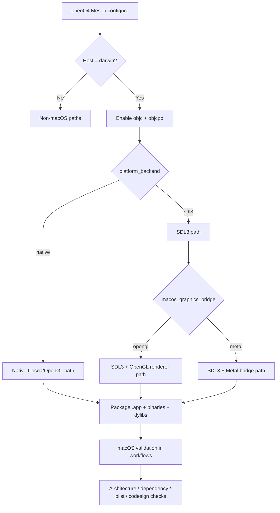
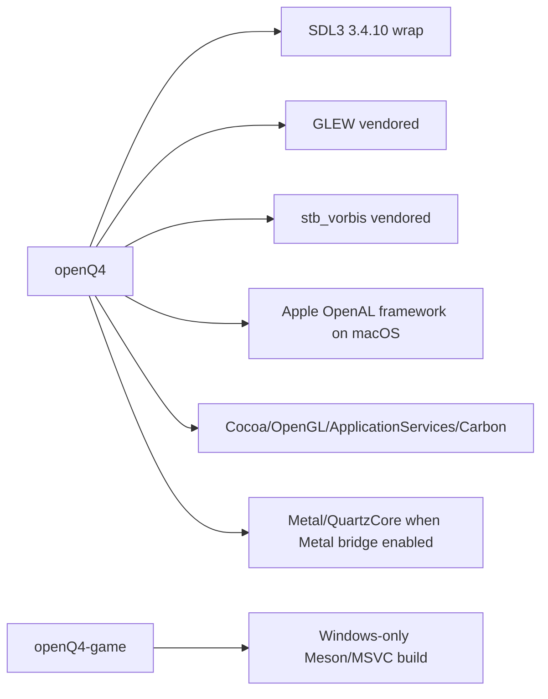
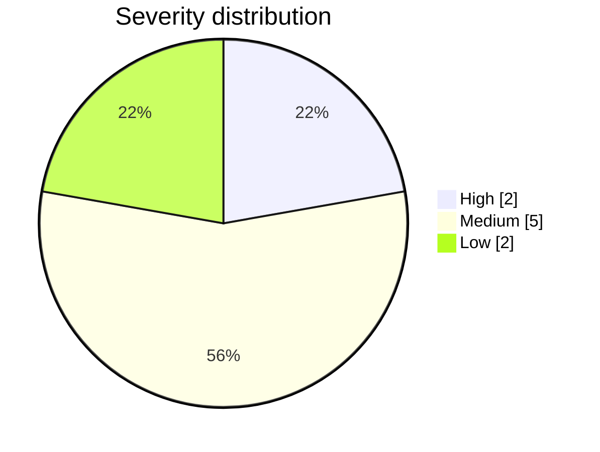

# Deep Analysis of macOS Support Gaps in openQ4 and openQ4-game

## Executive summary

This review examined **only** the two requested repositories, **themuffinator/openQ4** and **themuffinator/openQ4-game**, and focused on static evidence in their current GitHub source trees as of **2026-06-20**. A direct `git clone` was not available in this environment, so the analysis was performed from the repositories’ live file trees, source files, and workflow definitions. No other GitHub repositories were used. citeturn16view0turn31search0

The split between the two repositories is stark. **openQ4** already contains substantial macOS-specific engineering: native macOS source files under `src/sys/osx`, a separate SDL3-based macOS path, a Metal bridge option, macOS bundle packaging, and multiple macOS GitHub Actions workflows for commit validation, push verification, debug bring-up, and release packaging. It also has useful hardening checks around package structure, install names, architecture, dependency locality, quarantine extended attributes, and signature verification. citeturn16view0turn15view5turn15view3turn14view5turn14view4turn14view6turn41view2turn22view6turn23view1

However, the **most important production gaps in openQ4 are not compile-time gaps but distribution and platform-longevity gaps**. The release pipeline creates **arm64-only** macOS `.tar.gz` artifacts, uses **ad hoc code signing** rather than a Developer ID identity, and shows **no notarization or stapling steps**. Apple’s current macOS distribution guidance for software distributed outside the App Store centers Developer ID signing, hardened runtime, and notarization; those steps are not present in the observed release flow. This is the single biggest practical blocker for first-class macOS support. citeturn14view3turn37view4turn37view5turn22view0turn21view1turn37view0turn37view1turn32search0turn32search1turn32search8turn33search1turn33search11

By contrast, **openQ4-game currently has no real standalone macOS build support at all**. Its Meson build explicitly errors on non-Windows hosts, requires MSVC, defines `_WINDOWS` / `WIN32`, and its README says Windows is the “primary and only supported build workflow.” That means the companion game-libraries repo is itself a major macOS support gap, even if `openQ4` can ingest its sources and build the game modules in a larger workspace flow. citeturn30view6turn31search0

From a security perspective, I did **not** find evidence of an obvious remote-code-execution bug in the inspected macOS paths. The main security concerns are instead: distribution trust failures from non-notarized/ad-hoc-signed binaries; continued reliance on deprecated Apple frameworks such as **OpenGL**, **OpenAL**, and legacy AppKit alert APIs; and a couple of local-execution surfaces where the code intentionally opens external URLs or starts external processes without a narrow allowlist. These deserve remediation, but they are secondary to the release/signing problem and the Windows-only state of `openQ4-game`. citeturn25view5turn26view7turn27view1turn27view2turn32search14turn36search0turn32search2

## Scope and method

The review looked for the items you requested: macOS-specific code paths, conditional compilation, build scripts, CI jobs, packaging, framework usage, entitlements and signing, runtime behaviors, third-party dependency choices, and security-sensitive patterns. The primary source of truth was the repositories’ current code and workflow files; Apple remediation guidance came from Apple’s developer documentation and release notes. Because project policy documents for supported macOS versions were not found, unsupported or unspecified version claims are labeled as **observed**, not **declared**. The observed macOS minimum in build and bundle metadata is **11.0**. citeturn15view5turn23view5turn32search1

The strongest static macOS signals in **openQ4** are:

- macOS platform source selection in `tools/build/meson_sources.py`, which splits native Darwin sources from SDL3-based Darwin sources. citeturn16view0
- Meson logic for `host_system == 'darwin'`, Objective-C / Objective-C++ language enablement, `-mmacosx-version-min=11.0`, and conditional selection of a Metal bridge. citeturn15view5turn15view3
- Apple framework linkage to `Cocoa`, `OpenGL`, `ApplicationServices`, `Carbon`, `Metal`, `QuartzCore`, and `OpenAL` depending on path and feature selection. citeturn15view3turn35view0
- Release and validation workflows that package an `.app`, check `Info.plist` and `PkgInfo`, verify install names and `otool` dependencies, and validate signatures. citeturn14view3turn37view2turn41view0turn41view2

The strongest static macOS signals in **openQ4-game** are negative ones: the README says Windows is the only supported build flow, and `src/meson.build` enforces Windows + MSVC only. citeturn31search0turn30view6

## macOS support map

### Build and runtime topology



The repository is not “macOS-unaware.” It has two distinct Darwin platform source sets. The **native** path uses files such as `src/sys/osx/macosx_glimp.mm`, `macosx_event.mm`, `macosx_misc.mm`, and `macosx_sys.mm`; the **SDL3** path uses `src/sys/osx/macosx_sdl3.cpp` and `macosx_sdl3_main.cpp` plus shared POSIX sources. Meson conditionally enables Objective-C and Objective-C++ on Darwin and enforces `macos_graphics_bridge=metal` only when `platform_backend=sdl3`. citeturn16view0turn15view5

The framework map is similarly explicit. On Darwin, `openQ4` links `Cocoa`, `OpenGL`, `ApplicationServices`, and `Carbon` in the general macOS path; when the Metal bridge is selected, it additionally links `Metal` and `QuartzCore`. For audio on macOS, the Meson build chooses Apple’s `OpenAL` framework instead of the `openal-soft-prebuilt` fallback used elsewhere. citeturn15view3turn35view0



The third-party dependency picture matters for macOS support. `SDL3` is pulled via a Meson wrap pinned to **3.4.10**. `GLEW` and `stb_vorbis` are vendored. The `openal-soft-prebuilt` subtree visibly contains a `lib/win64` layout and readme aimed at Windows DLL routing, while the Darwin build explicitly uses Apple’s OpenAL framework instead. That avoids one portability problem, but it also ties macOS audio to a deprecated Apple framework. citeturn34view1turn34view5turn35view0

### CI and release posture

`openQ4` has meaningful macOS CI coverage today. The repository contains dedicated workflow files including `macos-debug.yml`, `commit-validation.yml`, `push-verification.yml`, and `manual-release.yml`, each with macOS jobs on `macos-15`. The release matrix builds **macOS ARM64 OpenGL** and **macOS ARM64 Metal** variants. citeturn10view0turn14view6turn14view5turn14view4turn14view3

That said, the observed release posture is **arm64-only** for macOS and uses **`.tar.gz`** archives rather than a notarized `.dmg` or signed `.pkg`. The release pipeline expects output names like `openq4-…-macos-arm64-opengl.tar.gz` and `openq4-…-macos-arm64-metal.tar.gz`. I did not find `notarytool`, `stapler`, or Developer ID workflow steps in the release workflow. citeturn37view4turn37view5turn37view0turn37view1turn37view6

By contrast, `openQ4-game` presents no macOS CI posture at all in the inspected project surface. Its README states that Windows is the “primary and only supported build workflow,” and `src/meson.build` hard-errors on any non-Windows host or non-MSVC compiler. citeturn31search0turn30view6

### Findings overview

| Severity | Count |
|---|---:|
| High | 2 |
| Medium | 5 |
| Low | 2 |



## Prioritized findings table

| Issue ID | Category | Affected files and paths | Description | Severity | Reproducible steps or detection method | Evidence | Recommended remediation | Estimated effort | References |
|---|---|---|---|---|---|---|---|---|---|
| OQ4-MAC-001 | security / packaging / compatibility | `openQ4/tools/build/package_nightly.py`; `openQ4/.github/workflows/manual-release.yml` | macOS release artifacts are **ad hoc signed**, not Developer ID signed, and no notarization or stapling steps were found. This is the most material macOS distribution gap because Gatekeeper trust and default-run experience depend on proper outside-App-Store signing and notarization. | High | Inspect packaging script for signing command; inspect release workflow for `notarytool`, `stapler`, or Developer ID identity references. | `package_nightly.py` uses short snippet `--sign - --timestamp=none` in `ad_hoc_sign_macos_payload`; release workflow verifies signatures but shows no notarization steps. `manual-release.yml` also has no `notarytool` / `stapler` matches. citeturn22view0turn37view2turn37view0turn37view1 | Replace ad hoc signing with **Developer ID Application** signing in release jobs only. Enable **Hardened Runtime**, sign nested code first, sign the app bundle last, submit with **notarytool**, wait for success, and **staple** the result. Add CI assertions that `codesign -dv` shows the expected authority and that `spctl --assess` and `xcrun stapler validate` pass. | M | Apple distribution and notarization guidance: citeturn32search0turn32search1turn32search8turn33search1turn33search18 |
| OQ4-MAC-002 | build / compatibility | `openQ4-game/src/meson.build`; `openQ4-game/README.md` | `openQ4-game` is **Windows-only** as a standalone repository. This undercuts macOS support for the overall workspace because the companion game-library repo cannot itself be built or validated on macOS. | High | Inspect `src/meson.build` for platform/compiler guards and README for supported workflows. | `src/meson.build` errors on non-Windows hosts and requires MSVC; README says Windows is the “primary and only supported build workflow.” citeturn30view6turn31search0 | Port `openQ4-game` Meson logic to support Darwin and Clang: replace MSVC-only flags and defines, remove Windows-only host guard, parameterize symbol export behavior for `.dylib`, and add at least one macOS CI build. Ideally, align module naming and install-name policy with `openQ4` packaging checks. | L | Repository evidence: citeturn30view6turn31search0 |
| OQ4-MAC-003 | build / compatibility | `openQ4/.github/workflows/manual-release.yml`; `openQ4/.github/workflows/push-verification.yml`; `openQ4/.github/workflows/commit-validation.yml` | macOS CI and release coverage are **ARM64-only**. There is no observed Intel macOS or universal-binary release path, despite the project otherwise carrying mature macOS logic. | Medium | Inspect macOS matrix entries in workflows; look for `x86_64`, `universal`, or Intel runner coverage. | Release matrix contains only `macOS ARM64 OpenGL` and `macOS ARM64 Metal`; validation jobs run on `macos-15`; no Intel release artifact names were found. citeturn14view3turn14view4turn14view5turn37view5 | Decide policy explicitly: **arm64-only**, **separate x86_64**, or **universal2**. If Intel support is desired, add a self-hosted Intel runner or a universal-binary workflow that lipo-combines identical release variants and validates both architectures with `lipo -archs`. Publish the support policy in README and release notes. | M | Apple distribution guidance and repo evidence: citeturn32search1turn14view3turn37view5 |
| OQ4-MAC-004 | compatibility / other | `openQ4/meson.build`; `openQ4/src/sys/osx/macosx_glimp.mm`; `openQ4/src/sys/osx/macosx_sys.mm` | The primary native macOS path still depends on **deprecated Apple APIs/frameworks**: `OpenGL`, `Carbon`, `NSOpenGL`, `OpenAL`, and `NSRunAlertPanel`. This is a platform-longevity risk even if current builds still work. | Medium | Inspect Meson Darwin framework list and macOS source files for deprecated APIs; cross-check Apple docs. | Meson links `Cocoa`, `OpenGL`, `ApplicationServices`, `Carbon`; `macosx_glimp.mm` uses `NSOpenGL`; `macosx_sys.mm` calls `NSRunAlertPanel`; macOS build uses Apple `OpenAL`. citeturn15view3turn25view5turn26view7turn35view0 | Treat this as a migration program, not a one-line fix. Prefer the SDL3 + Metal bridge as the modern path; isolate the native OpenGL path behind a legacy build option; replace deprecated AppKit alert functions with `NSAlert`; evaluate replacing Apple OpenAL with a maintained cross-platform backend or fully owning OpenAL Soft on macOS if licensing and packaging permit. | L | Apple deprecation references: citeturn32search14turn32search2turn32search23turn36search0 |
| OQ4-MAC-005 | packaging / security | `openQ4/tools/build/package_nightly.py`; `openQ4/.github/workflows/manual-release.yml` | No **entitlements file** or **hardened-runtime configuration** was observed in the release path. That blocks or complicates a correct notarization posture and leaves no documented exception model for future runtime needs. | Medium | Search packaging code and workflows for `entitlement`, Hardened Runtime, or explicit signing options beyond ad hoc signing. | Packaging search returned no entitlements references; signing is ad hoc only; workflow shows no Developer ID / hardened-runtime configuration. citeturn21view6turn22view0turn37view6 | Add a minimal `.entitlements` file only if required by runtime behavior; otherwise keep entitlements minimal and rely on default Hardened Runtime protections. Document the decision and validate with notarization CI. If future JIT or library-validation exceptions are needed, add them deliberately rather than ad hoc. | M | Apple Hardened Runtime / entitlements docs: citeturn33search1turn33search3turn33search17turn33search11 |
| OQ4-MAC-006 | security | `openQ4/src/sys/osx/macosx_misc.mm` | External process launching on macOS uses `execvp` / `posix_spawnp` with inherited environment and PATH-based resolution when parsing command lines. If mod content, scripts, or user-controlled config can influence these launch strings, the app can run unintended binaries in the current user context. | Medium | Inspect `Sys_DoStartProcess` and helpers for shelling out, path validation, environment handling, and resolution behavior. | `macosx_misc.mm` contains short snippets `execvp( argv[0], argv )` and `posix_spawnp( … argv[0] … environment )`; it validates control characters but does not impose a path allowlist or bundle-based launcher policy. citeturn27view1 | Replace generic PATH search with one of: absolute-path-only execution, bundle-relative helper execution, or a signed-helper allowlist. Reject shell-style command strings for release builds. Add a regression test that a PATH-prepended rogue binary cannot be selected. | M | Apple hardened-runtime and sandbox context: citeturn33search1turn33search6 |
| OQ4-MAC-007 | security / other | `openQ4/src/sys/osx/macosx_misc.mm` | `OpenURL` accepts any syntactically valid scheme and passes it to `NSWorkspace openURL:`. That is better than blindly shelling out, but it still permits launching arbitrary custom scheme handlers if the URL source is attacker-influenced. | Low | Inspect URL validation logic and open callsite. | `OpenURL` checks for a “safe scheme” syntactically, then calls `openURL: nsURL`; it does not restrict to `https`, `http`, or another small allowlist. citeturn27view1turn27view2turn27view4 | Replace the generic scheme test with an allowlist such as `https`, optionally `http`, and maybe `mailto` if needed. Log and reject all others in production builds. | S | Repository evidence: citeturn27view1turn27view2 |
| OQ4-MAC-008 | packaging / compatibility | `openQ4/.github/workflows/manual-release.yml`; `openQ4/tools/build/package_nightly.py` | macOS release packaging is archive-centric (`.tar.gz`) rather than using a signed/stapled distribution artifact such as a notarized `.dmg` or signed `.pkg`. This is not intrinsically invalid, but it creates a rougher user experience and leaves trust UX entirely dependent on the inner app signature state. | Medium | Inspect release workflow and packaging defaults for macOS archive format and artifact naming. | Packaging defaults `macos` to `tar.gz`; release workflow expects `…-macos-arm64-*.tar.gz` artifacts. citeturn21view3turn37view4turn37view5 | After proper Developer ID signing and notarization are in place, add a final distribution layer: either a notarized `.dmg` for drag-and-drop installation or a signed `.pkg` if installer semantics are desired. Validate the final artifact, not just the inner app bundle. | M | Apple distribution docs: citeturn32search1turn32search8turn33search11 |
| OQ4-MAC-009 | security / other | `openQ4/tools/build/package_nightly.py` | No App Sandbox adoption was observed. For direct distribution this is not mandatory, but it means the app runs with normal user-level file access instead of reduced blast radius. Because target distribution mode is unspecified, this is a **low-priority strategic security note**, not a release blocker. | Low | Search for entitlements / sandbox configuration; compare with Apple guidance. | Packaging code contains bundle metadata and xattr handling but no sandbox entitlement configuration. citeturn23view3turn21view6 | If Mac App Store distribution is ever planned, adopt App Sandbox and container migration early. If direct distribution remains the only target, document why sandboxing is intentionally not used and what file-access expectations the game requires. | M | Apple App Sandbox docs: citeturn33search0turn33search2turn33search6turn33search11 |

## Detailed analysis of the highest-priority issues

### Distribution trust is the real macOS blocker

The packaging code is sophisticated enough to create a real `.app` bundle, generate `Info.plist`, write `PkgInfo`, copy the client binary into `Contents/MacOS/openQ4`, strip quarantine attributes, and validate the archive layout. It even verifies signatures in CI. Those are all signs of a team that has moved beyond a “just ship a binary” posture. citeturn21view5turn21view7turn22view6turn23view1turn37view2turn41view0turn41view2

But the exact signing model is what keeps this from being production-grade macOS distribution. The observed signing command is effectively:

```text
codesign --force --sign - --timestamp=none
```

That is ad hoc signing, not Developer ID signing. In the same reviewed release flow, I found no `notarytool`, no stapling, and no Developer ID identity material. Apple’s current guidance for software distributed outside the Mac App Store points directly at **Developer ID** and **notarization**, with the **Hardened Runtime** forming part of that story. citeturn22view0turn37view0turn37view1turn37view6turn32search0turn32search1turn32search8turn33search1turn33search11

That has two practical consequences. First, end-user installation and first launch will be much rougher than they need to be. Second, the present signature-validation logic in CI is narrower than it looks, because `codesign --verify --strict` can still pass for ad hoc signatures. The workflow is verifying “is there a structurally valid signature,” not “is this a correctly trusted Developer ID + notarized distribution artifact.” citeturn37view2turn32search8

### openQ4-game is the biggest structural gap

The engine repo can clearly build on macOS, but the companion game-libraries repo cannot, at least not as a standalone project. `openQ4-game/src/meson.build` explicitly stops on non-Windows hosts and non-MSVC compilers, and defines Windows-only macros such as `_WINDOWS` and `WIN32`. The README reinforces that by saying Windows is the only supported workflow and by describing `.dll` outputs. citeturn30view6turn31search0

A short representative excerpt is:

```text
host_machine.system() != 'windows'
```

followed by an error that the build currently targets Windows only. That means macOS support is currently “borrowed” indirectly through `openQ4`’s larger workspace logic rather than existing as a property of both repositories. If the project goal is to make macOS support durable and auditable, this should be removed as a structural inconsistency. citeturn30view6

### The native macOS path still carries legacy Apple APIs

The repository is trying to mitigate Apple’s deprecation direction by offering a Metal bridge on the SDL3 path, but the native path still links and uses APIs that Apple has deprecated or moved away from for years: `OpenGL`, `Carbon`, `NSOpenGL`, `NSRunAlertPanel`, and the Apple `OpenAL` framework. Apple’s own docs and release notes are clear that OpenGL is deprecated, `NSRunAlertPanel` is deprecated in favor of `NSAlert`, and OpenAL remains only for compatibility purposes. citeturn15view3turn25view5turn26view7turn35view0turn32search14turn32search2turn32search23turn36search0

Representative short excerpts:

```text
modules: ['Cocoa', 'OpenGL', 'ApplicationServices', 'Carbon']
```

```text
NSRunAlertPanel(@"openQ4 Error", …)
```

These are not instant breakages, but they are exactly the kind of platform debt that tends to turn into sudden compatibility incidents on major macOS transitions. In practice, the SDL3 + Metal bridge should be treated as the future-facing path, while the native Cocoa/OpenGL path should be compartmentalized as legacy support. citeturn15view3turn26view7turn32search6

### Local execution surfaces deserve guardrails

The reviewed macOS code does make some effort to avoid obviously unsafe behavior. For example, `Sys_DoStartProcess` has command parsing and control-character rejection, and `OpenURL` ensures the input is URL-shaped before passing it to AppKit. That is better than shell interpolation. citeturn26view6turn27view1

Still, two call paths remain worth tightening:

```text
posix_spawnp( … argv[0] … environment )
```

```text
[[ NSWorkspace sharedWorkspace ] openURL: nsURL]
```

The first inherits the process environment and uses PATH-based lookup for `argv[0]` in one branch. The second allows any custom URL scheme that passes the current coarse validation. Neither looks like a catastrophic bug in isolation, but both are classic “unexpected local behavior” surfaces if content or configuration can influence the arguments. They should move to explicit allowlists. citeturn27view1turn27view2

## Regression tests and automated checks

The project already has a good foundation for macOS validation. The next step is to turn the current macOS awareness into a release-quality security and compatibility program. The recommendations below are intentionally concrete.

### Release pipeline checks

Add a **release-only signing lane** that performs the following in order: sign nested dylibs and helper binaries with **Developer ID Application**, sign the app bundle, submit with **notarytool**, wait for success, staple the result, then validate the final artifact with `spctl --assess` and `xcrun stapler validate`. This should be separate from debug and verification lanes so that unsigned or ad hoc-signed internal artifacts remain possible for bring-up, but official releases are always fully trusted. Apple’s notarization and hardened-runtime docs should be the implementation baseline. citeturn32search0turn32search1turn32search8turn33search1turn33search18

Suggested macOS release assertions:

- `codesign -dv --verbose=4 openQ4.app` must contain the expected **Developer ID Application** identity.
- `spctl --assess --type execute -vv openQ4.app` must succeed.
- `xcrun notarytool submit … --wait` must succeed.
- `xcrun stapler validate openQ4.app` or the final `.dmg` / `.pkg` must succeed.
- The release artifact must be either a stapled `.dmg` or a signed/notarized `.pkg`, not just an inner `.app` inside a tarball. citeturn32search0turn32search8turn33search18

### macOS matrix expansion

If Intel Macs are in scope, add either a **self-hosted Intel macOS runner** or a **universal2 artifact lane**. Then add validation jobs that explicitly test both OpenGL and Metal variants across the supported architecture policy. If Intel is *not* in scope, make that policy explicit in README and releases so users do not infer broader support than actually exists. The current observed minimum system version is 11.0, but that is an implementation detail, not a published support statement. citeturn14view3turn15view5turn23view5

Suggested tests:

- `lipo -archs` on every release binary.
- Launch smoke tests on the oldest supported macOS and the latest stable macOS.
- Assetless renderer smoke tests for both OpenGL and Metal.
- App bundle launch from a quarantined download location after notarization. citeturn14view6turn37view5

### Static analysis and linting rules

Add repository-level checks that fail on new uses of deprecated Apple APIs or unsafe launch behavior. A small set of Semgrep or custom grep rules would catch most regressions quickly.

Recommended patterns to flag:

- `NSRunAlertPanel`
- `NSOpenGL`
- `dependency('appleframeworks', modules: ['OpenAL'])`
- `Carbon` in Darwin framework lists
- `execvp(`, `posix_spawnp(`, `system(`, `popen(`
- `openURL:` without an allowlisted scheme check
- `tmpnam`, `mktemp`, `mkstemp` misuse
- new `.entitlements` additions without review
- release workflows missing `notarytool` / `stapler` on tag builds. citeturn26view7turn25view5turn35view0turn27view1turn27view2

A minimal Semgrep-style policy set could include:
- “no deprecated AppKit alert APIs”
- “no PATH-searched process spawn in released macOS code”
- “no broad URL scheme launch”
- “no ad hoc signing in release workflows”
- “no macOS release artifact without notarization step”

### Repository alignment work

`openQ4` and `openQ4-game` should stop presenting contradictory platform stories. The cleanest medium-term fix is to make `openQ4-game` independently buildable on Darwin with Clang and have it emit macOS game modules whose naming and install-name behavior match the packaging assertions already present in `openQ4`. That gives you a single coherent answer to “does this workspace support macOS,” rather than a conditional answer based on which repo is doing the build orchestration. citeturn30view6turn41view0

### What is already good and should be preserved

Several existing controls are worth keeping exactly because they reduce macOS packaging surprises:

- quarantine xattr stripping and validation
- symlink rejection in archives
- `Info.plist` and `PkgInfo` validation
- `otool` dependency locality checks
- explicit install-name checks for game modules
- architecture checks with `lipo`
- macOS-specific CI lanes for debug, push verification, commit validation, and release. citeturn22view6turn23view1turn21view5turn21view7turn41view0turn41view2turn14view4turn14view5turn14view6

Those controls show that the project already has the right instincts. The next phase is to connect them to Apple’s modern distribution model and to remove the Windows-only bottleneck in `openQ4-game`.